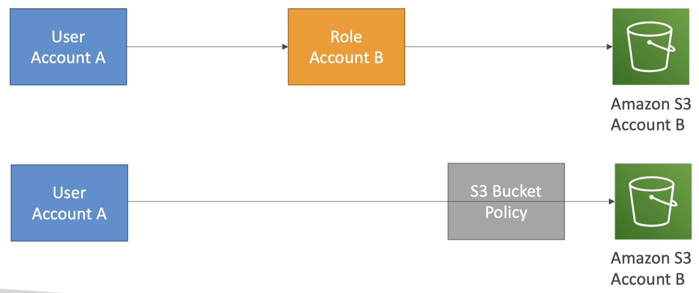

## Notes

### IAM Policies Deep Dive
- Anatomy of a policy: JSON doc with Effect, Action, Resource, Conditions, Policy Variables
- Explicit DENY has precedence over ALLOW
- Best practice: use least privilege for maximum security
  - Access Advisor: See permissions granted and when last accessed
  - Access Analyzer: Analyze resources that are shared with external entity

Examples:
https://docs.aws.amazon.com/IAM/latest/UserGuide/access_policies_examples.html

One example shows how you might create an identity-based policy that allows EBS volume owners to attach or detach their EBS volumes defined using the tag VolumeUser to EC2 instances that are tagged as development instances (Department=Development).

```json
{
    "Version": "2012-10-17",
    "Statement": [
        {
            "Effect": "Allow",
            "Action": [
                "ec2:AttachVolume",
                "ec2:DetachVolume"
            ],
            "Resource": "arn:aws:ec2:*:*:instance/*",
            "Condition": {
                "StringEquals": {"aws:ResourceTag/Department": "Development"}
            }   
        },
        {
            "Effect": "Allow",
            "Action": [
                "ec2:AttachVolume",
                "ec2:DetachVolume"
            ],
            "Resource": "arn:aws:ec2:*:*:volume/*",
            "Condition": {
                "StringEquals": {"aws:ResourceTag/VolumeUser": "${aws:username}"}
            }
        }   
    ]
}
```

### IAM Policies Conditions
`"Condition" : { "{condition-operator}" : { "{condition-key}" : "{condition-value}" }}`

Operators:
- String (StringEquals, StringNotEquals, StringLike…)
  - `"Condition": {"StringEquals": {"aws:PrincipalTag/job-category": "iamuser-admin"}}`
  - `"Condition": {"StringLike": {"s3:prefix": [ "", "home/", "home/${aws:username}/" ]}}`
- Numeric (NumericEquals, NumericNotEquals, NumericLessThan…)
- Date (DateEquals, DateNotEquals, DateLessThan…)
- Boolean (Bool):
  - `"Condition": {"Bool": {"aws:SecureTransport": "true"}}`
  - `"Condition": {"Bool": {"aws:MultiFactorAuthPresent": "true"}}`
- (Not)IpAddress:
  - `"Condition": {"IpAddress": {"aws:SourceIp": "203.0.113.0/24"}}`
- ArnEquals, ArnLike
- Null: `"Condition":{"Null":{"aws:TokenIssueTime":"true"}}`

### IAM Policies Variables and Tags

Example: ${aws:username}
- `"Resource": ["arn:aws:s3:::mybucket/${aws:username}/*"]`

AWS Specific:
- aws:CurrentTime, aws:TokenIssueTime, aws:principaltype, aws:SecureTransport, aws:SourceIp, aws:userid, ec2:SourceInstanceARN 

Service Specific:
- s3:prefix, s3:max-keys, s3:x-amz-acl, sns:Endpoint, sns:Protocol… 

Tag Based:
- iam:ResourceTag/key-name, aws:PrincipalTag/key-name…

### IAM Roles vs Resource Based Policies
- Attach a policy to a resource (example: S3 bucket policy) versus attaching of a using a role as a proxy



- When you assume a role (user, application or service), you give up your original permissions and take the permissions assigned to the role
- When using a resource-based policy, the principal doesn’t have to give up any permissions
- Example: User in account A needs to scan a DynamoDB table in Account A and dump it in an S3 bucket in Account B.

### IAM Permission Boundaries
- IAM Permission Boundaries are supported for users and roles (not groups)
- Advanced feature to use a managed policy to set the maximum permissions an IAM entity can get.
- Can be used in combinations of AWS Organizations SCP

### IAM Access Analyzer

- Find out which resources are shared externally
  - S3 Buckets
  - IAM Roles
  - KMS Keys
  - Lambda Functions and Layers
  - SQS queues
  - Secrets Manager Secrets
- Define Zone of Trust = AWS Account or AWS Organization
- Access outside zone of trusts => findings

- IAM Access Analyzer Policy Validation
  - Validates your policy against IAM policy grammar and best practices
  - General warnings, security warnings, errors, suggestions
  - Provides actionable recommendations

- IAM Access Analyzer Policy Generation
  - Generates IAM policy based on access activity
  - CloudTrail logs is reviewed to generate the policy with the fine-grained permissions and the appropriate Actions and Services
  - Reviews CloudTrail logs for up to 90 days


