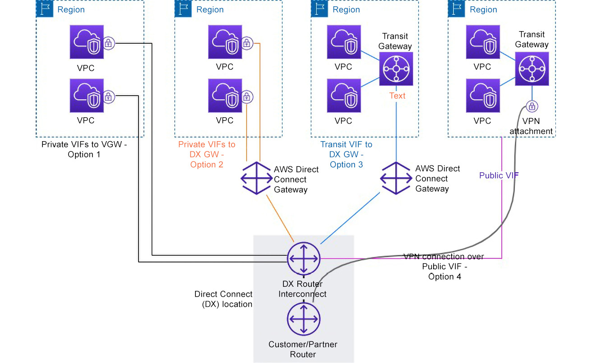

## Designing Networks for Complex Organizations

- Establishing virtual private network (VPN) connections
- Introducing AWS Direct Connect (DX)
- Introducing AWS Storage Gateway
- Leveraging virtual private cloud (VPC) endpoints
- Introducing AWS Transit Gateway

### Establishing VPN Connections

#### AWS Managed VPN
This is a fully managed service that provides an Internet Protocol Security (IPsec) VPN connection over the internet from your on-premises network equipment to AWS-managed network equipment attached to your AWS VPC.

WS Managed VPN offers both dynamic and static routing options. Dynamic routing leverages Border Gateway Protocol (BGP) to pass routing information between the VGW on AWS and your on-premises CGW.

IPsec and BGP connections must be terminated on the same CGW device(s). Both the BGP-advertised and static route information tell gateways on each side which tunnels are available to re-route traffic in case of failure.

AWS Managed VPN is a great approach when you need to connect one on-premises location with your AWS environment.

#### AWS VPN CloudHub
AWS VPN CloudHub is a hub-and-spoke VPN solution to securely connect multiple branch offices together and a VPC on AWS. It leverages the AWS Managed VPN service, but instead of creating CGWs for a single on-premises location, you create as many CGWs as you have remote branches/offices that need a VPN connection and connect all of them to the same VGW on AWS.

For instance, on the hub-and-spoke model represented in the previous diagram, one of your on-premises environments could connect to AWS using an AWS DX connection while the other two on-premises locations use a VPN connection over the internet.

#### Software VPN
You can select between several partner solutions or open-source solutions that provide VPN software appliances that can run on Amazon Elastic Compute Cloud (EC2) instances.

### Introducing AWS DX
AWS DX offers the right alternative by offering low latency and consistent bandwidth connectivity between your on-premises infrastructure and AWS.

A DX connection ties one end of the connection to your on-premises router and the other end to a virtual interface (VIF) on AWS.

There are three different types of VIFs: 
- public VIFs: used to connect to AWS services’ public endpoints
- private VIFs: used to connect to AWS services’ private endpoints
- transit VIFs: Transit VIFs allow you to end the connection on a TGW.

The following diagram shows an overview of end-to-end (E2E) connectivity when setting up an AWS DX link between your on-premises and AWS environments:
  

Complex organizations adopt either a private VIF to DX GW (Option 2) or a transit VIF to DX GW (Option 3) or sometimes a combination of the two, essentially because an AWS DX GW and a TGW make their life so much easier. A VPN connection over a public VIF (Option 4) can be used to enforce E2E encryption as an extra security measure over public VIFs when MACsec (IEEE 802.1AE Media Access Control (MAC) security standard) encryption over DX is not available at your preferred DX location.

### Introducing AWS Storage Gateway
AWS Storage Gateway is a service that provides a series of solutions to expand your storage infrastructure into the AWS cloud for purposes such as data migration, file shares, backup, and archiving. It uses standard protocols to access AWS storage services such as Amazon Simple Storage Service (S3), Amazon S3 Glacier, Amazon Elastic Block Store (EBS) snapshots, and Amazon FSx.

There are three different flavors of Storage Gateway as listed here:
- File Gateway
- Volume Gateway
- Tape Gateway

#### File Gateway

Network File System (NFS) and Server Message Block (SMB) 

S3 File Gateway does a one-to-one mapping of your files to S3 objects and stores the file metadata (for example, Portable Operating System Interface (POSIX) file access control lists (ACLs)) in the S3 object metadata. 

#### Volume Gateway
Volume Gateway allows you to create storage volumes on S3 that offer a block storage interface accessible from your on-premises environment through the standard Internet Small Computer Systems Interface (iSCSI) protocol.

See the following diagram for an illustration of how Volume Gateway works with cached volumes:

With stored volumes, as illustrated in Figure 2.10, you retain your data entirely on-premises for low-latency access. The backup copy is performed asynchronously through Amazon EBS snapshots on Amazon S3:

#### Tape Gateway
Tape Gateway offers a virtual tape library (VTL) service backed by storage on Amazon S3 and accessible on-premises through the standard iSCSI protocol.

As illustrated in the following diagram, Tape Gateway provides a VTL infrastructure that scales seamlessly, without the burden of having to operate or maintain the tape infrastructure on-premises.

### Leveraging VPC Endpoints
AWS offers a highly available and scalable technology called AWS PrivateLink. AWS PrivateLink enables you to privately connect any of your VPCs either to the supported AWS services or to VPC endpoint services.

To use AWS PrivateLink, you simply create a VPC endpoint that will serve as an entry point to reach the destination service. This is illustrated in Figure:

There are currently three types of endpoints, as outlined here:
- Interface endpoints: 
  - Interface endpoints, powered by AWS PrivateLink, are entry points for the traffic targeting a supported AWS service or a VPC endpoint service.
    

- Gateway Load Balancer (GWLB) endpoints: 
  - GWLB endpoints, powered by AWS PrivateLink, provide private connectivity to your gateway load balancers. A GWLB endpoint effectively consists of an ENI with a private IP address taken from the address range associated with the subnet in which it is created. 
    

- Gateway endpoints:
  - A gateway endpoint is the first type of endpoint that launched on AWS, and it has been supporting connectivity to only two AWS services ever since: Amazon S3 and Amazon DynamoDB.
    

### Introducing AWS Transit Gateway
AWS Transit Gateway is a central hub construct to interconnect multiple VPCs on AWS and on-premises networks together.

AWS Transit Gateway is a regional network construct, so in the case where you need to operate in more than one AWS region, you would end up with (at least) one TGW in each region.

network address translation (NAT)