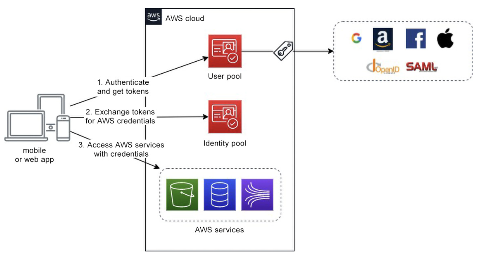
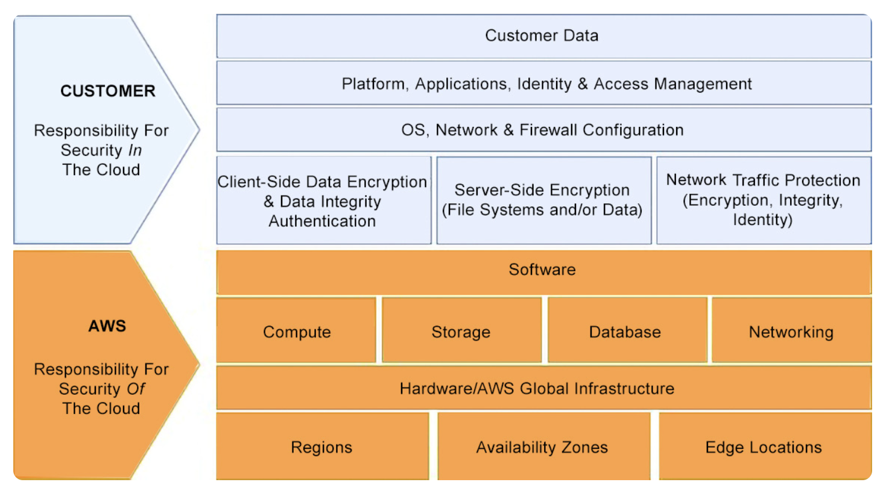
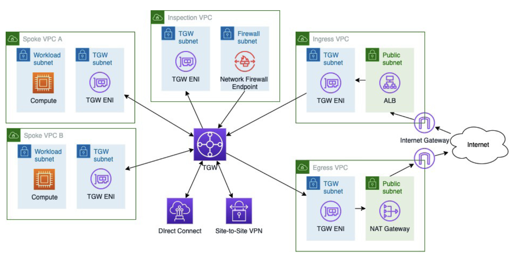

# Security Requirements and Controls

**Elastic Compute Cloud (EC2)**
**Simple Storage Service (S3)**
**Identity provider (IdP)**
**Relational Database Service (RDS)**
**Single sign-on (SSO)**
**Infrastructure-as-a-Service (IaaS)**
**Distributed denial-of-service (DDoS)**
**Availability Zone (AZ)**
**AWS transit gateway (TGW)** 云网络中枢
**Open Systems Interconnection (OSI)**
**Elastic Load Balancing (ELB)**

- Managing identity and access
- Protecting your infrastructure
- Protecting your data
- Detecting incidents
- Responding to incidents

### Managing identity and access

#### IAM Users and Roles
Identity and access management (IAM) is used to define and control who can access which resources in an AWS environment.

- IAM provides two types of entities— `users` and `roles`—for this purpose. 

1. IAM users are allowed access to AWS resources either through the AWS Management Console (by providing a username and password) and/or programmatically (using an access key and a secret access key) from the command- line interface (CLI) or one of the AWS software development kits (SDKs).

One such notable exception is, for instance, if you need to create Amazon Simple Email Service (SES) Simple Mail Transfer Protocol (SMTP) credentials for sending emails via SMTP—this can only be achieved by an **IAM user**.

2. IAM roles are the standard mechanism through which AWS services call each other’s application programming interfaces (APIs). It is also recommended to use IAM roles to invoke any AWS service APIs when calling them from your own application.

#### AWS Service Roles
AWS service roles allow AWS services to access resources in other AWS services on your behalf.

- Creating a service-linked role using the AWS CLI

```bash
aws iam create-service-linked-role \
--aws-service-name SERVICE- NAME.amazonaws.com \
--description "My service-linked role to support Service XYZ"
```

- Create a service-linked role for Amazon Relational Database Service (RDS)

```bash
aws iam create-service-linked-role \
--aws-service-name rds.amazonaws.com \
--description "My service-linked role to support RDS"
```

**Case 1:**Unfortunately, in such cases, you have to do the heavy lifting, which service-linked roles do in the background for you. 
1. Create a trust policy

```bash
aws iam create-role \
--role-name MyServiceRole \
--assume-role- policy-document file://MyServiceRole-Trust-Policy.json
```

2. Created a role to be assumed by Amazon EC2 instances

```json
{
  "Version": "2012-10-17",
  "Statement": {
    "Effect": "Allow",
    "Principal": {"Service": "ec2.amazonaws.com"},
    "Action": "sts:AssumeRole"
  }
}
```
3. Attach a permissions policy to the role so that the trust‐ed service has the right privileges for performing its tas

```bash 
aws iam put-role-policy \
--role-name MyServiceRole \
--policy-name MyServicePolicy \
--policy-document file://MyService-Policy.json
```

**Case 2:** Suppose you want to grant an Amazon EC2 instance permissions to access Amazon S3 to list the contents of a specific bucket.

```json
{
  "Version": "2012-10-17",
  "Statement": {
    "Effect": "Allow",
    "Action": "s3:ListBucket",
    "Resource": "arn:aws:s3:::my_bucket"
  }
}
```

The first command is to create an instance profile and the second one is to add the role to the instance profile.

```bash
aws iam create-instance-profile --instance-profile-name MyEC2Profile
aws iam add-role-to-instance-profile --instance-profile-name MyEC2Profile --role-name MyServiceRole  
```

#### Using Federation for Access Control and Authentication

The figure presents an overview of Amazon Cognito in the following diagram:



### Protecting your infrastructure

The shared responsibility model:



If you are using an `Infrastructure-as-a-Service (IaaS) layer service` such as Amazon EC2, you must ensure that the `virtual machines (VMs)` you create on top of it are secure, that is, make sure the `operating system (OS)` is patched to the latest level of security.

#### Protecting the Network
Protecting your `virtual networks (virtual private clouds (VPCs) or subnets)` on AWS is still good practice and a must-do. It is recommended to apply multiple levels of control for both inbound and outbound traffic. This typically includes using subnets, route tables, NFW, web application firewalls (WAFs), security groups (stateful firewalls), and network access control lists (ACLs) (stateless firewalls).

Illustration of a centralized setup with TGW and inspection via Network Firewall (NFW):


#### Protecting the Compute

**Performing Vulnerability Assessments**
Amazon Machine Images (AMIs) used to launch those instances, your containers, the container images used to run those containers, and so on.

**Reducing the Attack Surface**
Leverage the industry best practices and recommendations for hardening OSes and software, such as the resources from the Center for Internet Security (CIS).
Check your application’s code for common vulnerabilities and exposures (CVEs), using tools such as Amazon CodeGuru or third-party code analyzers.

**Leveraging Managed Services**
Using managed services—for instance, Amazon RDS or Amazon Elastic Container Service (ECS)—you can delegate as many of the administrative and security maintenance tasks to AWS as possible, reducing your maintenance tasks.

**Automating the Protection**
Automate the deployment of compute resources, taking an infrastructure-as-code (IaC) approach and using AWS CloudFormation or equivalent technology. Then, also automate configuration management tasks, using either built-in solutions such as AWS Systems Manager or third-party solutions if you are used to these (such as Chef, Ansible, and so on), or any combination of them.

#### Protecting Data
**Data Classification**
Data classification consists of categorizing the data to be processed according to its criticality and sensitivity.

**Protecting Data at Rest**
The first task is to protect the data at rest, that is, where it is stored. AWS best practices recommend that you encrypt the data—no exception.

Many AWS services (storage, compute, and others) integrate with AWS Key Management Service (KMS), which they use for cryptographic operations (such as generating data keys, data encryption, and decryption).

A notable exception is Amazon S3, which not only uses KMS for encryption but, for historical reasons, also has its own built-in server-side encryption mechanism (SSE-S3).


**AWS KMS and AWS CloudHSM**
When to Use AWS CloudHSM? 
- First, you need to consider whether you have an actual use case for AWS CloudHSM.
- The second consideration to make concerns costs. When using AWS CloudHSM, you have to set up a cluster composed of two or more HSMs for resiliency purposes. 
- The third consideration is that AWS KMS, as with any other AWS service, has some associated quotas, among which are the number of concurrent cryptographic operations that can be performed within a specific AWS Region at any one time in a given AWS account.


### Detecting Incidents

**Picking the Right Tool for the Right Task**
- First, activate AWS CloudTrail on all your accounts. AWS CloudTrail logs keep a record of all activity (such as who made what request, at what time, and from which IP address) that took place within your account, whether the related actions come from the AWS Management Console, the AWS CLI, or by using AWS SDKs.
- Second, leverage AWS Config to continuously monitor and record any configuration change in your AWS resources.
- Third, turn on automatic threat detection with Amazon GuardDuty to identify any malicious activity across your organization. GuardDuty leverages machine learning (ML) techniques to analyze all events coming through your CloudTrail logs, Amazon VPC Flow Logs, and Domain Name System (DNS) logs.
- Finally, leverage AWS Security Hub as the central place to aggregate, organize, and prioritize your security alerts or findings.


### Responding to Incidents

how can you achieve an effective response strategy on AWS?
- First, consider a situation where an incident is caused due to a configuration policy violation.
- consider a different situation where an incident is caused by a security policy violation.