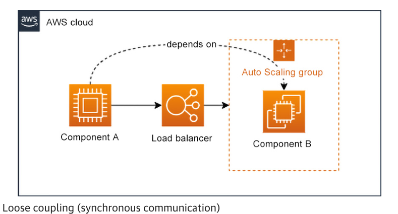

## Meeting Reliability Requirements

#### Ensuring Business Continuity

- **Disaster recovery (DR)** is the process that tackles both the prevention of a disaster and the recovery from a disaster.
   - DR objectives are usually described with two specific KPIs: the recovery time objective (RTO) and the recovery point objective (RPO). 

- **High availability (HA)** addresses how a workload can keep functioning even though some of its components are impacted by a failure.

### Reliability Design Principles

**Principle 1 – Automatically Recover from Failure**
The idea is to monitor the KPIs of your workloads and trigger any necessary processing when one or more thresholds are breached.

**Principle 2 – Test Recovery Procedures**

**Principle 3 – Scale Horizontally to Increase Aggregate Workload Availability**

**Principle 4 – Stop guessing capacity**

**Principle 5 – Manage Change in Automation**

### Foundational Requirements

**Resource Constraints**
Resource constraints can be further split into two types: `service quotas` and `environmental constraints`.
- service quotas are default predefined values on each AWS account – on the one hand, to protect you from over-provisioning AWS resources, and on the other hand, to protect the AWS cloud from abuse.
- environmental constraints refers to the constraints imposed by the physical resources supporting the AWS infrastructure. 

**Network Topology**

**Using Highly Available Network Connectivity for Your Public Endpoints**
Depending on the AWS services or third-party components that you decide to use, make sure that their availability service-level agreements (SLAs) and deployment models match the requirements of your network connectivity. 

The following presents a brief overview of some of those networking building blocks:

**Amazon Route 53**, an AWS DNS service, is both scalable and highly available out of the box. It provides domain name resolution, registration, and health checks. It is built as a globally distributed service that provides consistent and reliable DNS service, independently of local or regional network conditions. Route 53 uses Anycast routing technology to ensure requests are answered from the optimal location depending on network conditions. Route 53 will then provide the route to your AWS resources, such as EC2 instances, Elastic Load Balancing (ELB) load balancers, or Amazon S3 buckets. It can also be used to route requests to resources outside of AWS.

**Amazon CloudFront** is an AWS CDN service. It distributes your content across multiple edge locations across the AWS global network. It can significantly reduce the network latency by delivering content closer to the end users, improve the availability of your content thanks to the distributed nature of the service, and also limit access to your origin servers thanks to edge and regional caches. It is highly available due to its distributed nature.

The **ELB service** provides various types of load balancers: Classic Load Balancer (CLB), Application Load Balancer (ALB), Network Load Balancer (NLB), and Gateway Load Balancer (GWLB). The ELB service allows you to load balance IP-based traffic across multiple Availability Zones (AZs) within any given Region. The first three types (CLB, ALB, and NLB) offer an SLA of 99.99% availability. The availability of an SLA for the fourth type of load balancer (GWLB) actually depends on how you deploy the service since it relies on your implementation of third-party appliances.

**AWS Global Accelerator** is another service that builds on top of the Amazon global network. If you need to provide a service to end users globally, Global Accelerator offers a way to deliver that service through a set of static IP addresses and from the optimal endpoint based on your user’s location. Those IP addresses remain the same globally, but Global Accelerator will find out the optimal regional resource that can deliver the service. Those regional resources could be ALBs or NLBs, EC2 instances, or elastic IP addresses. It is also well suited for cross-region failover scenarios (single-region failover scenarios are usually better served by ELB load balancers). It is worth noting that, unlike CloudFront, Global Accelerator can also process non-HTTP requests.

**Provisioning Redundant Connectivity between Your AWS and On-Premises Environments**

The two major private connectivity options are AWS Managed VPN and AWS DX.

- When using AWS Managed VPN, it is highly recommended to connect your Virtual Gateway (VGW) or AWS TGW to two separate Customer Gateways (CGWs) on your end. By doing so, you establish two separate VPN connections, and if one of your on-premises devices fails, all traffic will be automatically redirected to the second VPN. A single VPN connection allows for 1.25 Gbps of bandwidth; however, when using TGW, you can leverage Equal Cost Multi-Path (ECMP) to route traffic across multiple tunnels in parallel, up to 50 Gbps, which is useful when you need to scale beyond the 1.25 Gbps of a single VPN connection.
- When using AWS DX, it is recommended to have at least two separate connections at two different DX locations. It will provide resiliency against connectivity failure due to a device failure, a network cable cut, or an entire location failure. You can increase the level of reliability of your DX setup further by adding more connections to additional DX locations.

**Ensuring IPv4 Subnet Allocation Accounts for Expansion and Availability**
Note that the largest IPv4 CIDR block you can create on AWS is a /16 block, providing 65536 IP addresses.

**Using Hub-and-Spoke Topologies Instead of a Many-to-Many Mesh**
Hub-and-spoke topology is highly recommended if you plan to either connect multiple VPCs to each other or multiple VPCs to an on-premises environment.

**Enforcing Non-Overlapping Private IPv4 Address Ranges Where Private Networks Are Interconnected**

It is best to plan for non-overlapping address spaces to avoid running into trouble when interconnecting multiple address spaces (VPCs and on-premises environments).

### Designing for Failure

- Designing Your Workload Service Architecture

- Designing Interactions in a Distributed System to Prevent Failures

  - Identifying Which Kind of Distributed System Is Required. One of the hardest things to handle with distributed systems is time constraints. 
  - Implementing Loosely Coupled Dependencies. In a distributed system, what you want to avoid at all costs is that a component’s failure has a ripple effect and causes a disruption of other components until the entire system fails. So, rule #1 for the solutions architect when designing distributed systems is to loosely couple components that depend on each other.

   

   Loose coupling two components means that you add an intermediate processing step, acting as a decoupling mechanism between the two. But the end-to-end communication could still take place synchronously. As illustrated in the following diagram, think of a load balancer, such as an ELB load balancer, between a client and a group of servers, for instance. A client making a request is loosely coupled to each server behind the load balancer, yet the communication happens synchronously.

  - Making All Responses Idempotent. A system is said to be idempotent if a given request made multiple times leads to the same result as that same request made exactly once.

  - Doing Constant Work.

- Designing Interactions in a Distributed System to Mitigate or Withstand Failures
  
  - The following best practices will help you limit the impact of failures on your workload:
    - Implementing Graceful Degradation to Transform Applicable Hard Dependencies into Soft Dependencies
    - Throttling Requests.
    - Controlling and Limiting Retry Calls
    - Failing Fast and Limiting Queues
    - Setting Client Timeouts
    - Making Services Stateless Where Possible

### Change Management

**Monitoring Workload Resources**
How do you go about monitoring on AWS then?
- **Generation** – Monitoring all components of your workload
  - using either Amazon CloudWatch or third-party solutions if you prefer.
  - You can also leverage additional logs, such as the following:
    - VPC Flow Logs to analyze network traffic in and out of your VPCs
    - AWS CloudTrail to find out about any activity on your accounts that involves AWS service API calls, including actions taken through the AWS Management Console, AWS SDKs, and command-line tools
  
- **Aggregation** – Defining and calculating metrics
- **Real-time processing and alarming** – Sending notifications and automating responses
- **Storage and analytics** – Keeping logs for further analysis
  - An often-overlooked part of the monitoring process is data management.

**Monitoring End-to-End Tracing of Requests through Your System**

**Designing Your Workload to Adapt to Changes in Demand**
- Using Automation When Obtaining or Scaling Resources.
  - AWS provides a number of mechanisms to scale resources. When using serverless AWS services, such as, for instance, Amazon S3, AWS Lambda, or Amazon DynamoDB (on-demand throughput), your resources scale automatically with the demand on your behalf. On the other hand, AWS Auto Scaling lets you automatically scale a number of resources and services, among which are Amazon EC2, Amazon ECS, Amazon DynamoDB (provisioned throughput), and Amazon Aurora. 
- Obtaining Resources upon Detection of Impairment
- Obtaining Resources to Satisfy the Demand
- Load Testing Your Workload

