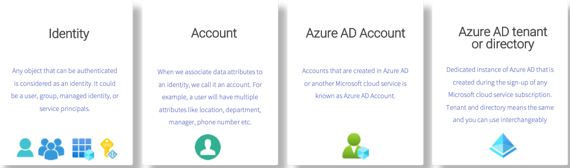
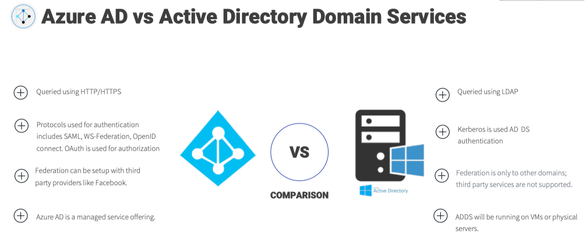
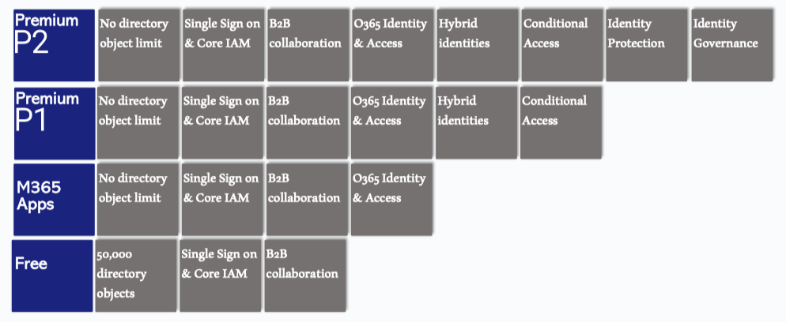
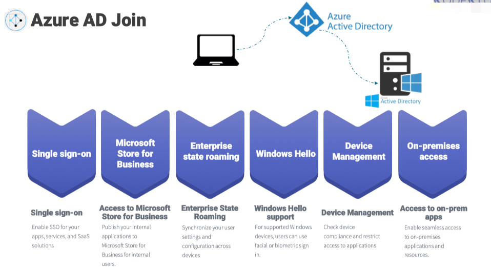
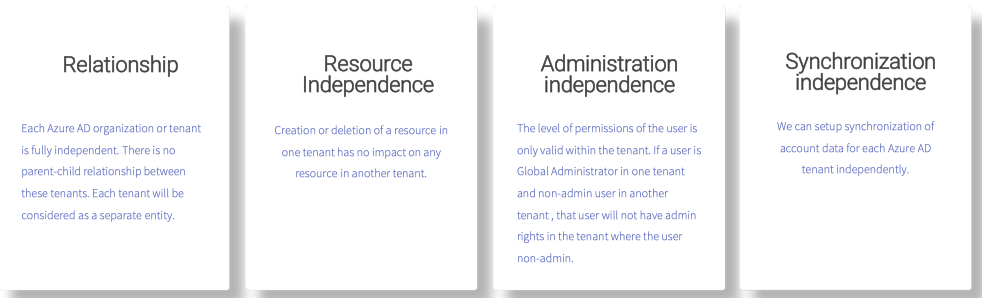
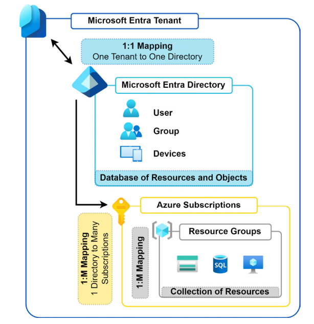
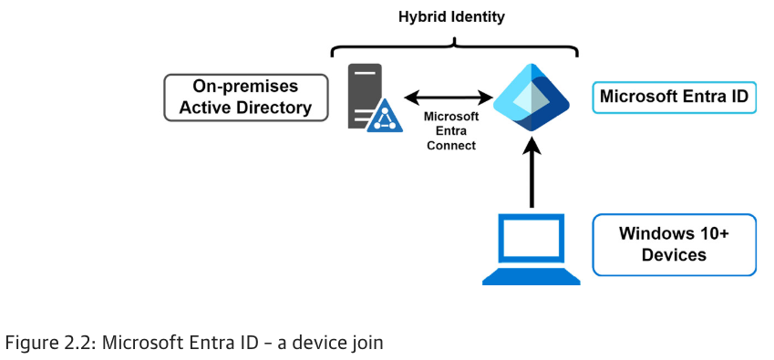

## Identity: Azure Active Directory

### 1.1 Azure Active Directory

Azure Active Directory (Azure AD) is a cloud-based identity and access management service. It allows you to manage user identities and access to resources in Azure.

#### Benefits of Azure AD

- **SSO to Cloud and On-Premises Applications**: Users can access multiple applications with a single set of credentials. 
  - Single Sign-On (SSO) 
- **Easily Extend On-Premises Active Directory to the Cloud**: Azure AD allows administrators to synchronize users, groups, passwords, and devices across both on-premises and the cloud.
- **Cross-Platform Support**: Azure AD supports a wide range of devices and operating systems.
- **Increase Security of Your On-Premises Applications**: Azure AD Application Proxy service to access your on-premises applications via a secured remote access.
- **Better Monitoring and Data Protection**: Azure AD provides a comprehensive set of monitoring and data protection features.
- **Self-Service Capabilities**: Users can reset their own passwords and manage their own profiles.
  - Self-Service Password Reset by which users can reset their own passwords


#### Concepts
- **Identity** An object that can interact with Azure AD and get authenticated is called an identity.
- **Account** Any identity that has data associated with it is called an account.
- **Azure AD Account** Usually known as work or school accounts, these accounts are provisioned in Azure AD or via other cloud services such as Office 365, etc.
- **Azure Subscription** An account can have multiple subscriptions that can be used to create isolated environments and billing boundaries.
- **Azure AD Tenant/Directory** The term tenant means a single instance of Azure AD denoting a single organization.



#### Active Directory Domain Services (AD DS)

Active Directory Domain Services (AD DS) is a service that provides a centralized directory of objects and services that can be used to manage your organization's identity and access management. The primary focus of AD DS is to work as a directory service.

The following are some of the key differences that make Azure AD different from AD DS:
- **Hierarchy** A flat structure is used by Azure AD to represent or provision the users and groups. Therefore, organizational units (OUs) and Group Policy objects (GPOs), which exist in AD DS, do not exist in Azure AD.
- **Federation Services** Azure AD supports Federation Services as an authentication method, and you can further integrate with third-party providers such as Twitter, Facebook, etc. On the other hand, in the case of AD DS, we can set up federation with another domain controller or forest only, and third-party integration is not supported.
- **Lack of LDAP** In AD DS, we used a protocol called LDAP to query users, groups, or objects in Active Directory. In the case of Azure AD, since this is an HTTP/HTTPS-based service, we will be using the REST API for querying instead of LDAP.
- **Lack of Kerberos** AD DS deployment uses Kerberos authentication; however, Azure AD uses HTTP/HTTPS protocols like SAML, OpenID Connect for authentication, OAuth for authorization, and SAML. Developers can choose any of these communication protocols while they design security for their applications.
- **Management** Azure AD is a managed service, and it is an underlying infrastructure; the availability is managed by Microsoft. If AD DS is deployed on an Azure Windows virtual machine, the configuration, management, virtual machine patching, updates, upgrades, and other maintenance tasks should be taken care by the end customer.
  


#### Azure AD: Licensing

Azure AD offers a lot of add-on features more than legacy identity and management solutions.
- Azure Active Directory Free
- Azure Active Directory Microsoft 365 Apps
- Azure Active Directory Premium P1
- Azure Active Directory Premium P2



#### Custom Domains in Azure AD
Every tenant will have two properties that make it unique from other tenants created by other organizations (tenant ID and the tenant initial domain).
- `<yourdomainname>.onmicrosoft.com`

### 1.2 Users and Groups

- Users
  - Bulk operations: let you download a CSV template where you add users you want to create, delete, or invite. Using bulk operation, we can easily work on these operations rather than doing one by one.
- Groups
  - Groups types: security groups and Microsoft 365 groups
    - Security groups: These groups serve the same function as traditional on-premises groups, which is to secure objects within a directory. In this case, it is to secure objects within Microsoft Entra.
    - Microsoft 365 groups: These groups are used to provide a group of people access to a collection of shared resources that is not limited to Microsoft Entra ID but also includes shared mailboxes, calendars, SharePoint libraries, and other Microsoft 365-related services.
  - Assignment types: assigned, dynamic user, and dynamic device

### Azure AD Roles
Azure AD roles are used to manage the permissions that can be assigned to users.

https://learn.microsoft.com/en-us/entra/identity/role-based-access-control/permissions-reference

### Azure AD Join
Joining and registering devices to Azure AD

- **Single Sign-On** This is the primary feature of AD Join; you can sign-in to any of your applications and services without a username and password prompt. 
- **Enterprise Client Roaming** The settings are synchronized across devices that are joined to Azure AD.
- **Microsoft Store for Business** Joining your device and signing-in to the store with work or school accounts gives you a customized catalog of applications that are shared by your organization.
- **Windows Hello** This provides you with biometric authentication using facial recognition or fingerprints to access corporate resources and sign-in to devices. 
- **Block Access** Administrators can enforce policies and devices that do not meet the requirements can be easily blocked.




### Self-Service Password Reset
Self-service password reset (SSPR) allows users to reset their passwords using a set of authentication methods set by the cloud administrators. Self-service password reset is always enabled to administrators to avoid lock-out scenarios. Admins need to use two authentication methods for password reset.

- Enabling SSPR: Cloud administrators need to enable SSPR options for users or groups as this option is not enabled by default.
- Authentication Methods: The administrator can choose the number of authentication methods required to reset the password and the number of methods available for users.
- Users will be requested to register for SSPR during next sign in where they can enable their reset methods.

### Multi tenant environments




### Notes




#### AUs have the following prerequisites:
- A Microsoft Entra ID P1 license is required for each AU administrator
- A Microsoft Entra ID Free license is required for AU members
- A privileged role administrator or global administrator is required for configuration

AUs (Administrative units) can be created via the Azure portal or PowerShell.

**Create an administrative unit**

- Use the **New-MgDirectoryAdministrativeUnit** command to create a new administrative unit.

```powershell
$params = @{
    DisplayName = "Seattle District Technical Schools"
    Description = "Seattle district technical schools administration"
    Visibility = "HiddenMembership"
}
$adminUnitObj = New-MgDirectoryAdministrativeUnit -BodyParameter $params
```

### Microsoft Entra Join

The following diagram illustrates a device-to-Microsoft Entra ID join connection, demonstrating how the connection is made from the device to Microsoft Entra ID. Entra ID can then form a hybrid connection to an on-premises Active Directory system, with synchronization occurring between the platforms through the Microsoft Entra Connect service.



**Scenarios**
Microsoft Entra join can be used in various scenarios like:
- You want to transition to cloud-based infrastructure using Microsoft Entra ID and MDM like Intune.
- You can't use an on-premises domain join, for example, if you need to get mobile devices such as tablets and phones under control.
- Your users primarily need to access Microsoft 365 or other software as a service (SaaS) apps integrated with Microsoft Entra ID.
- You want to manage a group of users in Microsoft Entra ID instead of in Active Directory. This scenario can apply, for example, to seasonal workers, contractors, or students.
- You want to provide joining capabilities to workers who work from home or are in remote branch offices with limited on-premises infrastructure.

**Device Settings**
- Users may join devices to Microsoft Entra
- Users may register their devices with Entra ID
- Require Multi-Factor Authentication to register or join devices with Microsoft Entra
- Maximum number of devices per user
- Manage Additional local administrators on all Microsoft Entra joined devices
- Enable Microsoft Entra Local Administrator Password Solution (LAPS)
- Restrict users from recovering the BitLocker key(s) for their owned devices
  


