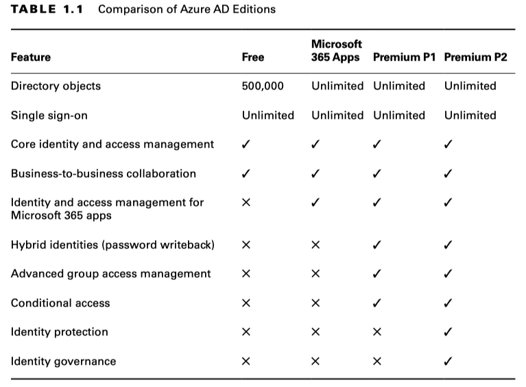

## Identity: Azure Active Directory

### 1.1 Azure Active Directory

Azure Active Directory (Azure AD) is a cloud-based identity and access management service. It allows you to manage user identities and access to resources in Azure.

#### Benefits of Azure AD

- **SSO to Cloud and On-Premises Applications**: Users can access multiple applications with a single set of credentials. 
  - Single Sign-On (SSO) 
- **Easily Extend On-Premises Active Directory to the Cloud**: Azure AD allows administrators to synchronize users, groups, passwords, and devices across both on-premises and the cloud.
- **Cross-Platform Support**: Azure AD supports a wide range of devices and operating systems.
- **Increase Security of Your On-Premises Applications**: Azure AD Application Proxy service to access your on-premises applications via a secured remote access.
- **Better Monitoring and Data Protection**: Azure AD provides a comprehensive set of monitoring and data protection features.
- **Self-Service Capabilities**: Users can reset their own passwords and manage their own profiles.
  - Self-Service Password Reset by which users can reset their own passwords

#### Concepts
- **Identity** An object that can interact with Azure AD and get authenticated is called an identity.
- **Account** Any identity that has data associated with it is called an account.
- **Azure AD Account** Usually known as work or school accounts, these accounts are provisioned in Azure AD or via other cloud services such as Office 365, etc.
- **Azure Subscription** An account can have multiple subscriptions that can be used to create isolated environments and billing boundaries.
- **Azure AD Tenant/Directory** The term tenant means a single instance of Azure AD denoting a single organization.

#### Active Directory Domain Services (AD DS)

Active Directory Domain Services (AD DS) is a service that provides a centralized directory of objects and services that can be used to manage your organization's identity and access management. The primary focus of AD DS is to work as a directory service.

The following are some of the key differences that make Azure AD different from AD DS:
- **Hierarchy** A flat structure is used by Azure AD to represent or provision the users and groups. Therefore, organizational units (OUs) and Group Policy objects (GPOs), which exist in AD DS, do not exist in Azure AD.
- **Federation Services** Azure AD supports Federation Services as an authentication method, and you can further integrate with third-party providers such as Twitter, Facebook, etc. On the other hand, in the case of AD DS, we can set up federation with another domain controller or forest only, and third-party integration is not supported.
- **Lack of LDAP** In AD DS, we used a protocol called LDAP to query users, groups, or objects in Active Directory. In the case of Azure AD, since this is an HTTP/HTTPS-based service, we will be using the REST API for querying instead of LDAP.
- **Lack of Kerberos** AD DS deployment uses Kerberos authentication; however, Azure AD uses HTTP/HTTPS protocols like SAML, OpenID Connect for authentication, OAuth for authorization, and SAML. Developers can choose any of these communication protocols while they design security for their applications.
- **Management** Azure AD is a managed service, and it is an underlying infrastructure; the availability is managed by Microsoft. If AD DS is deployed on an Azure Windows virtual machine, the configuration, management, virtual machine patching, updates, upgrades, and other maintenance tasks should be taken care by the end customer.

#### Azure AD: Licensing

Azure AD offers a lot of add-on features more than legacy identity and management solutions.
- Azure Active Directory Free
- Azure Active Directory Microsoft 365 Apps
- Azure Active Directory Premium P1
- Azure Active Directory Premium P2

#### Custom Domains in Azure AD
Every tenant will have two properties that make it unique from other tenants created by other organizations (tenant ID and the tenant initial domain).
- `<yourdomainname>.onmicrosoft.com`

### 1.2 Users and Groups

- Users
- Groups

### Azure AD Roles
Azure AD roles are used to manage the permissions that can be assigned to users.

https://learn.microsoft.com/en-us/entra/identity/role-based-access-control/permissions-reference

### Azure AD Join

- **Single Sign-On** This is the primary feature of AD Join; you can sign-in to any of your applications and services without a username and password prompt. 
- **Enterprise Client Roaming** The settings are synchronized across devices that are joined to Azure AD.
- **Microsoft Store for Business** Joining your device and signing-in to the store with work or school accounts gives you a customized catalog of applications that are shared by your organization.
- **Windows Hello** This provides you with biometric authentication using facial recognition or fingerprints to access corporate resources and sign-in to devices. 
- **Block Access** Administrators can enforce policies and devices that do not meet the requirements can be easily blocked.

### Self-Service Password Reset
Self-service password reset (SSPR) allows users to reset their passwords using a set of authentication methods set by the cloud administrators. Self-service password reset is always enabled to administrators to avoid lock-out scenarios. Admins need to use two authentication methods for password reset.

- Enabling SSPR: Cloud administrators need to enable SSPR options for users or groups as this option is not enabled by default.
- Authentication Methods: The administrator can choose the number of authentication methods required to reset the password and the number of methods available for users.