## Compliance and Cloud Governance

### Azure Regions

Azure regions are geographical locations where the data is stored and processed.

- Regions offer flexibility for customers to deploy resources to regions that are close to their customers.
- Regions ensure data residency for customers.
- Regions offer compliance and resiliency options.
- When you deploy a resource in Azure, in most cases you will be asked to choose a region.
- Certain services are region specific, and the availability is limited to some regions when they are launched. Gradually, Microsoft will expand the service to other regions.
- Services like Azure AD, Azure Traffic Manager, and Azure DNS do not require a region. The region for these resources will be shown as Global in the Azure portal.
- Each Azure region is paired with another region within the same geography to form regional pairs.

**Regional Pairs**
An `Azure geography` is defined as an area of the world that consists of one or more Azure regions.

Similarly, the European Union has the `General Data Protection Regulation (GDPR)` where organizations cannot store personal data of the EU citizens outside EU member states.

Azure pairs one region with another region within the same geography. Regional pairs play a vital role in business continuity and disaster recovery (BCDR).

The following are some of the focus points about Azure regional pairs:
- Physical Separation: Three hundred miles is the preferred distance between datacenters that are part of the regional pair;
- Replication: Services like storage accounts provide georedundant storage (GRS). Using GRS, your data will be replicated to the paired region and thus provide reliability.
- Recovery Order
- Serialized Updates
- Data Residency
 

### Azure Accounts and Subscriptions

**Azure Accounts**: Subscriptions will always be mapped to an account. Any identity that is part of Azure AD or a directory trusted by Azure AD is referred to as an Azure account.

**Azure Subscriptions**: The user who created the Azure account is called the Account Administrator, and a user can have multiple subscriptions inside an account.

By default, only the **account administrator** will have access to the newly created subscription. If you would like to grant access to others, Microsoft recommends that you use **RBAC (role-based access control)** for granting access to users and external partners to your Azure resources.

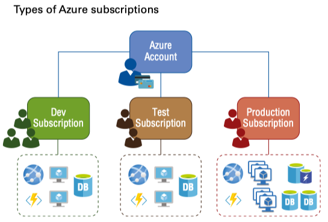

#### Getting a Subscription
- Enterprise Agreements (EAs)
- Web Direct
- Reseller
- Partners

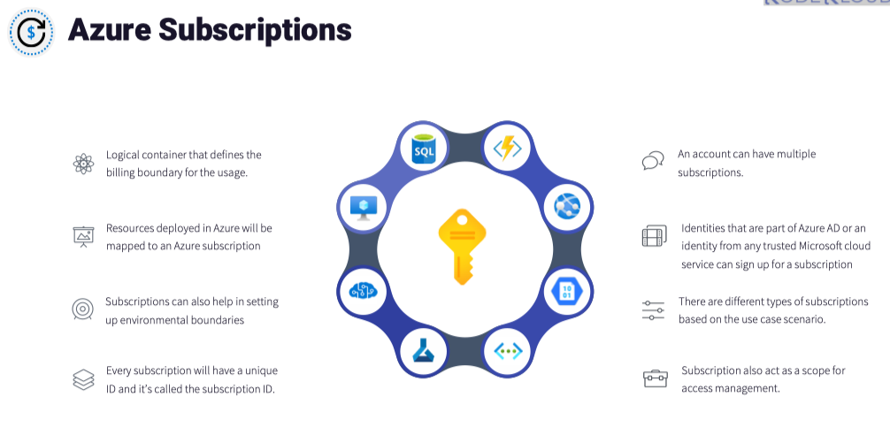

#### Subscription Metering
- Free subscription
- Pay-As-You-Go
- Enterprise Agreement
- Azure for Students

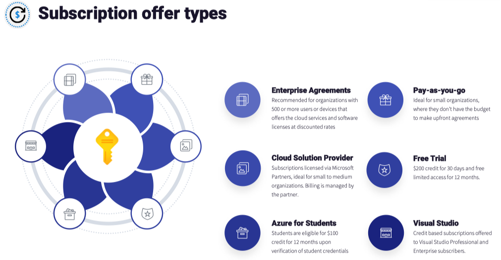

### Azure Cost Management
Azure Cost Management is the go tool for performing your billing administrative tasks and for monitoring costs.

Azure Cost Management + Billing is a suite of tools designed to assist in the analysis, management, and cost optimization of Azure workloads.


**Cost Saving Techniques**
- Reservations: Reserved instances (RIs), or reservations, can be used by customers to save costs on selected services.
- Azure Hybrid Benefit: You can bring your own Windows Server or SQL Server or Linux licenses to use on Azure Virtual Machine, Azure SQL Database, and Azure Managed Instances.
- Azure Credits and Dev/Test Subscriptions
- Azure Regions
- Budgets
- Pricing Calculator

### Resource Groups
A resource group is a container used for the logical organization of resources in Azure.


### Management Groups
Using management groups, you can logically group subscriptions.

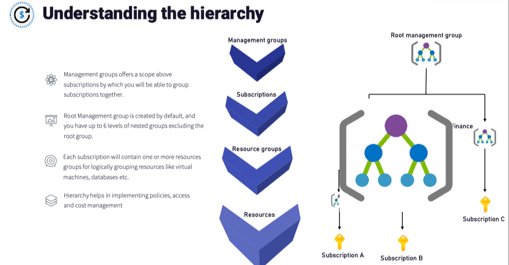

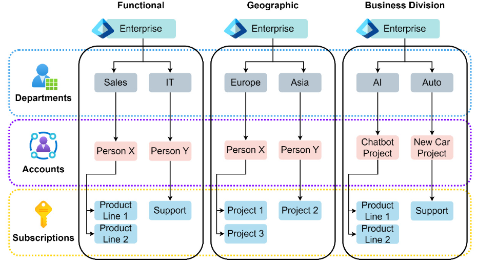

### Azure Policy
Azure Policy constantly runs evaluations or scans on your resources to make sure they are compliant. Azure Policy can stop new resources from breaking the compliance requirements. Azure Policy cannot delete resources that are noncompliant.

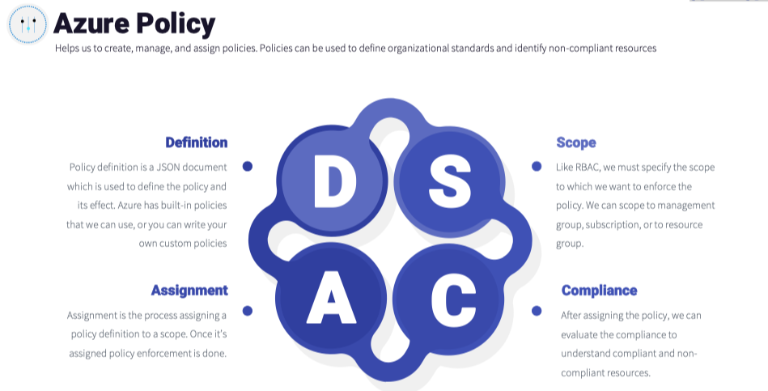

Key features of Azure Policy include the following:
- Compliance and Enforcement: 
  - You can leverage the built-in policies or build custom policies to ensure that the compliance requirements are met.
- Apply Policies at Scale: 
  - You can apply policies at the management group level so that the policy is inherited to all subscriptions that are part of the management group.
- Mitigation and Remediation:
  
There are lot of **built-in policies** that come with the Azure Policy service. Nevertheless, administrators can always build custom policies to match your organizational requirements. Some of the use cases of Azure policies are as follows:
- Control the resource types that your organization can deploy to Azure.
- Restrict the deployment of virtual machines to a specific set of SKUs.
- Limit the deployment of resources to selected regions only.
- Enforce required tags and its value to resources during deployment.
- Audit that Azure Backup service is enabled for all virtual machines.

#### Implementing Azure Policy
Implementing an Azure policy comprises three main parts:
- Policy Definition
  - The definition is a JSON manifest that describes what action will be taken by the policy if it’s assigned. The policy contains the condition and effect.
- Policy Assignment and Scope
  - Supported scopes include management groups, subscriptions, and resource groups.
- Policy Evaluation

#### Implementing Initiatives
Using initiatives, you can chain or combine multiple policies, assign them on a scope, and manage them.

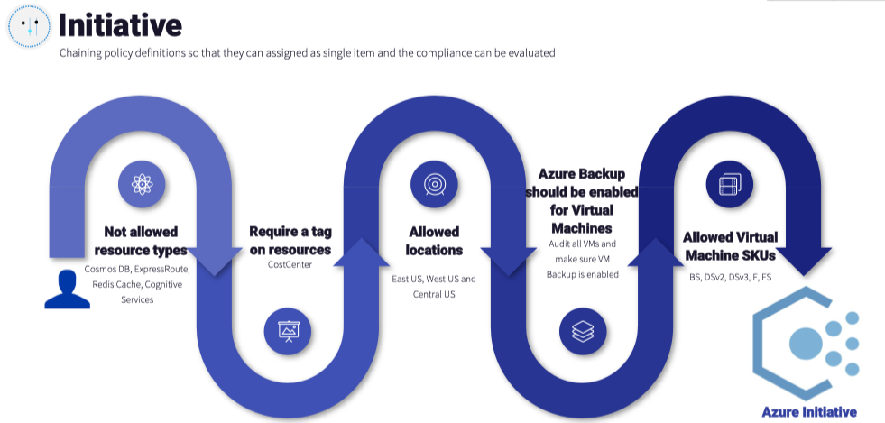


### Role-Based Access Control
Role-based access control (RBAC) is used for the access management of cloud resources. RBAC has built-in roles that provide fine-grained access management of resources.

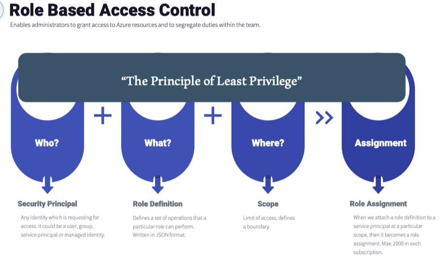

The following are some of the use case scenarios of Azure RBAC:
- Allow a user to perform all actions on resources
- Allow a group to manage virtual machines
- Allow a user to work as a help-desk agent and open cases with Microsoft Support
- Allow an application to manage IP addresses

RBAC assignment is all about the three Ws (who, what, and where): in simple terms, to whom you want to give the permission (who), the set of permissions you are providing (what), and the scope to which this role is assigned (where). Let’s comprehend these concepts.
- Security Principal (Who)
- Role Definition (What)
  - This definition is defined in a JSON file.
  - in Azure CLI, you can use `az role definition list --name Owner` to see the same output.
- Scope (Where)

In the figure illustrates how the security principal, role definition, and scope are combined to create a role assignment.
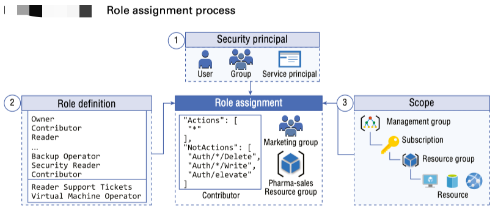

#### Azure RBAC Roles
There are four Azure fundamental roles that you should be aware of:
- Owner: 
  - Has full access to the scope to which this is assigned; also as an Owner you can delegate access to other users.
- Contributor: 
  - Has the same level of resource permissions as Owner; however, Contributor cannot delegate access to others.
- Reader: 
  - Assigns a read-only role
- User Access Administrator: 
  - Can delegate access to other users; however, this role cannot manage any resources.

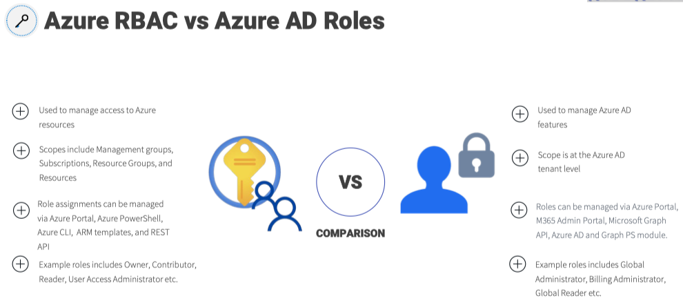

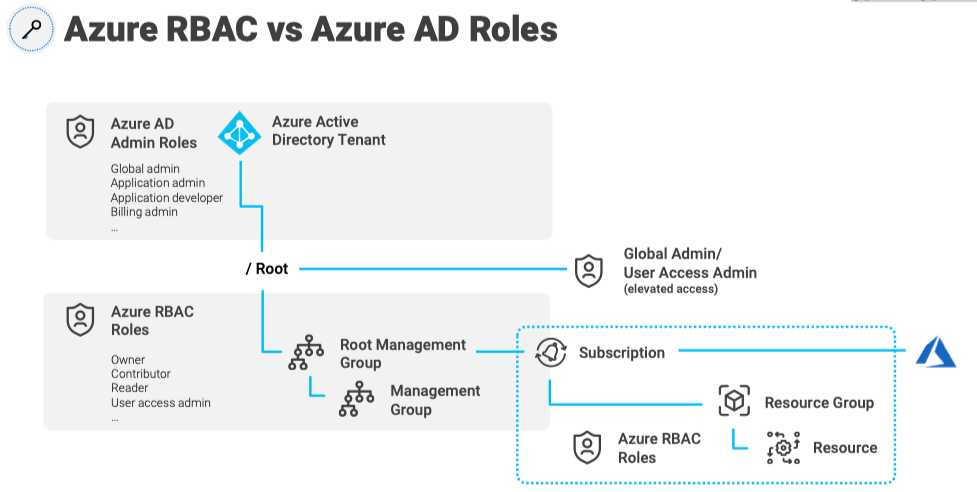

RBAC is a general term used for restricting access to users, based on a role. It works on the `Just Enough Access (JEA)` concept, where a specific user/group will be provided the minimum access required to perform their specific job on a specific resource. Custom roles can only be created and updated by a user who has the following role assigned: `Microsoft.Authorization/roleDefinitions/write` permissions.


**A role definition consists of three main elements:**
- **Actions**: These are the operations that can be performed on Azure resources, such as read, write, delete, and manage access. Actions are represented in string format, which contains the resource provider and the resource type, like Microsoft.Storage/storageAccounts/write.
- **NotActions**: These are the operations that are explicitly denied, even if they are included in the Actions section. This is useful for creating custom roles with a limited set of permissions.
- **AssignableScopes**: This defines the scope within which the role definition can be assigned to users, groups, or applications. The scope can be a subscription, resource group, or a specific resource.


#### In summary, RBAC consists of three main sections:
- **Security principal**: Selects who is going to have access
- **Role**: Selects what type of access is going to be assigned to the security principal
- **Scope**: Selects the resource that the user and the role will be applied to

#### Custom RBAC Roles
You can create custom RBAC roles to meet your specific needs.

- Custom RBAC roles can be used to create fine tuned roles for your environment, if the built-in roles doesn’t meet your specific needs
- Custom roles can be created from Azure Portal, Azure PowerShell, Azure CLI and REST API
- Each directory can have up to 5000 custom roles
- We can assign custom roles to users, groups, and service principals to any scope; same way we work with built-in roles.

#### Role Assignment

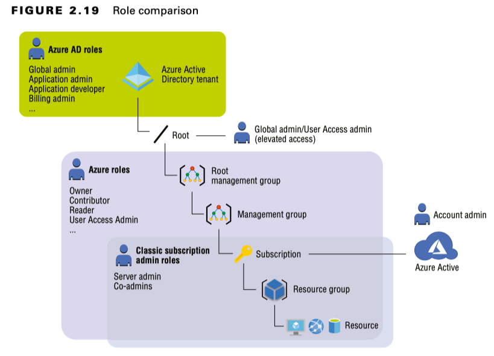

**Creating a Custom Role Using PowerShell**

```powershell
Get-AzRoleDefinition | FT  # List all roles

Get-AzResourceProvider | FT # List all resource providers
```

If you need to clone a built-in role and modify the JSON with the permissions in which you are interested, you can use the following command:

```powershell
Get-AzRoleDefinition -Name "Owner" | ConvertTo-Json | Out-File "Owner.json"
```

**Example of Role Assignment**

Suppose you want to grant read-only access to a user named John for a specific resource group in Azure. You can create a role assignment by associating the Reader role definition with the user John and setting the scope to the desired resource group. This way, John will have read-only access to all resources within that resource group.


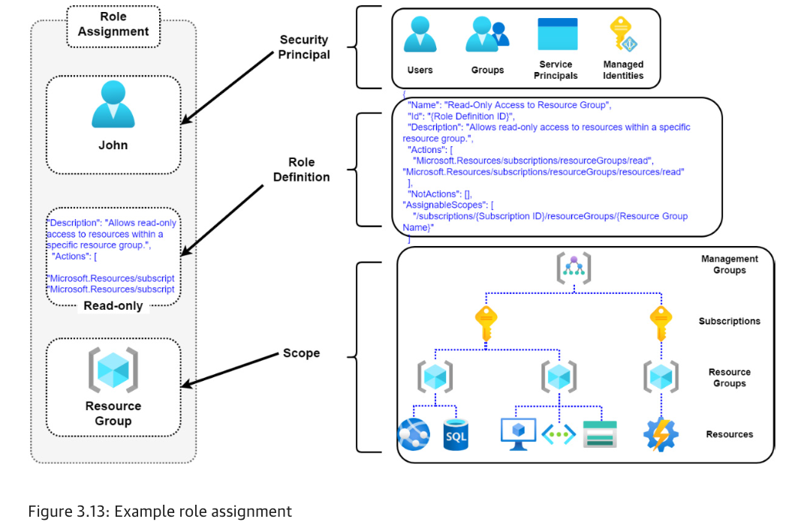

### Resource Locks
In Azure, administrators can use locks to lock a subscription, resource group, or resource from getting deleted or modified. The lock will override any permission that is granted to you via RBAC.

There are two lock levels: CanNotDelete and ReadOnly.
- **CanNotDelete** means that users are restricted from deleting the resource; however, the resource can be modified.
- **ReadOnly**, means you will be able to read the resource; deletion or modification of the resource is not permitted.

To create or delete locks, you need to be Owner or User Access Administrator. If you are using custom roles, then `Microsoft.Authorization/*` or `Microsoft.Authorization/ locks/*` should be there in your actions section.

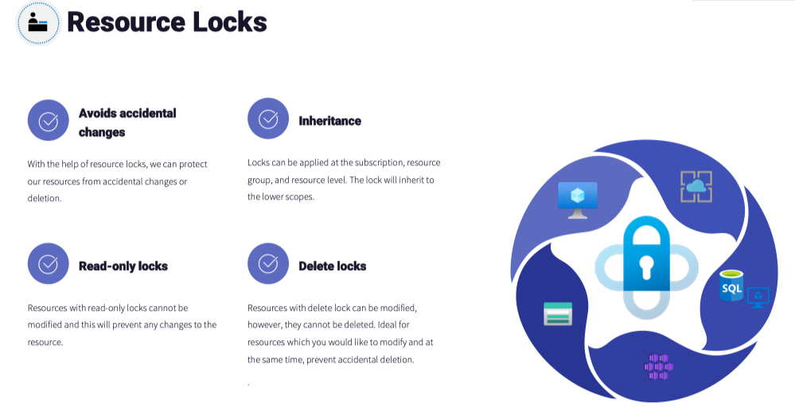

**Permissions Required for Creating or Deleting Locks**

- Built-In Azure Roles
  - If your preference is to use a predefined Azure role, then either of the following will be suitable: **Owner** or **User Access Administrator**
- Custom Azure Roles
  - If you are using a custom role, then you need to include the following actions in the role definition:
    - `Microsoft.Authorization/*`
    - `Microsoft.Authorization/locks/*`


### Resource Tags
Resource tags can be used to logically organize the resources in your environment. Each tag comprises a key-value pair, where you will be adding a name and a corresponding value.

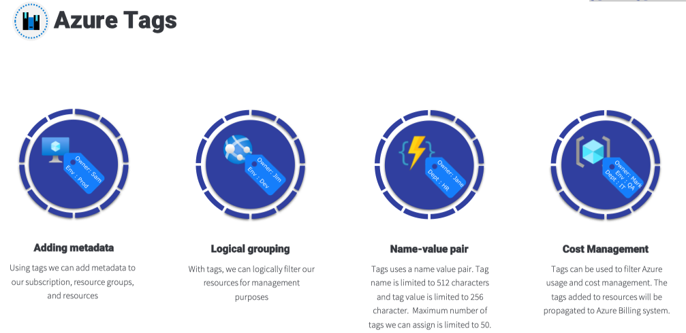

Tags in Azure are metadata labels that can be assigned to resources, resource groups, and subscriptions to help users organize, categorize, and manage their cloud resources more effectively. Tags are key-value pairs that provide additional information about the resources and can be used for various purposes, such as tracking ownership, managing cost allocation, and enforcing governance policies.


### Relationship Between Microsoft Entra and Subscriptions

A Microsoft Entra tenant can have a 1:M (one to many) relationship with subscriptions (meaning it can be associated with multiple subscriptions), but a subscription can only have a 1:1 relationship with a tenant (meaning one subscription can only be associated with one tenant). 

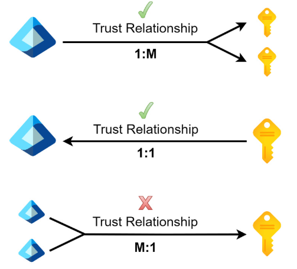

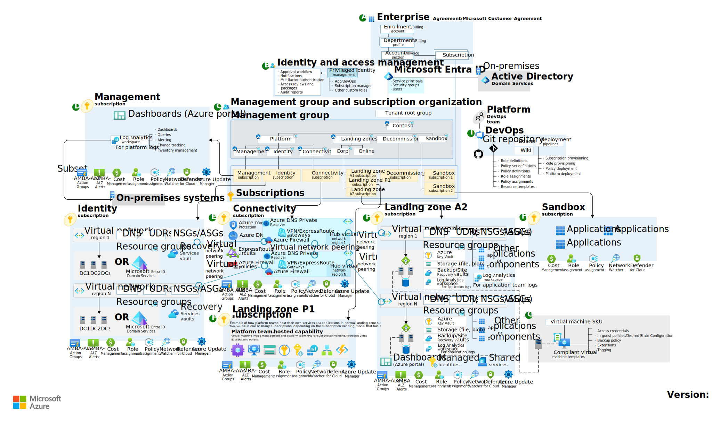


#### Azure Policy versus RBAC

Both Azure Policy and role-based access control (RBAC) contribute to controlling governance within Azure. While both create methods of controlling access, there is often confusion between the two. The differences between them are distinguished for clarity, as follows:

- Azure Policy focuses on resource properties for existing resources and resources being deployed. Azure Policy is used for the enforcement of governance standards within the Azure platform.
- RBAC focuses on user actions at different scopes. RBAC contributes to governance by enforcing permissions at the service principal layer.