## Virtual Networking

### Virtual Networks
In Azure, virtual networks represent your own network in the cloud. Working with the Azure VNet service is similar to working with a traditional network in your on-premises environment.

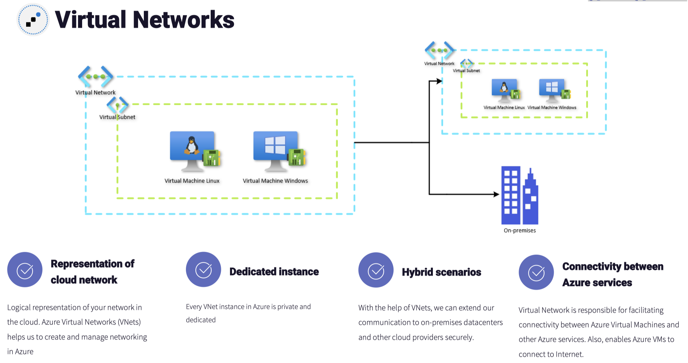

VNet Concepts:
- **Address Space:** The term address space might not be new for administrators who handle on-premises networking.
  - In Azure, using public and private (RFC 1918) addresses, you must specify an address space for your virtual network whenever you create one. The IP address for your resources will be assigned from this address space.
- **Subnets**: Using subnets, you create one or more subnetworks by segmenting your virtual network.
  - At the subnet level, you can configure network security groups (NSGs) to secure your workloads.
  - The CIDR block for the subnet is decided based on how many hosts or servers you want to deploy to the subnet.
- **Regions**
- **Subscription**: In a subscription, you can have multiple virtual networks scoped to different regions. This linkage to the subscription helps in billing the organization for different networking-related charges.
  - For example, if you have a virtual network with the name VNet-1, then the resource ID will be as follows: `/subscriptions/{subscription-id}/resourceGroups/{resource-group-name}/providers/Microsoft.Network/virtualNetworks/VNet-1`

### IP Addressing

#### Static and Dynamic Addressing
IP addresses can be assigned or allocated in two ways, statically or dynamically.

Though dynamic IP address allocation with DNS labels can help tackle changing IP addresses, static IP allocation is recommended for the following scenarios:
- Apps or services that require a static IP address for IP address–based security models
- TLS/SSL certificates linked to a specific IP address
- Firewalls that are using IP-based filtering rules
- Domain controllers or DNS servers

#### Private IP Addresses
Private IP addresses are used for facilitating private communications within your Azure resources and with on-premises resources if you are using a VPN or ExpressRoute connection.

Private IP addresses can be associated with a network interface card (NIC) of the virtual machines, internal load balancers, and application gateways.

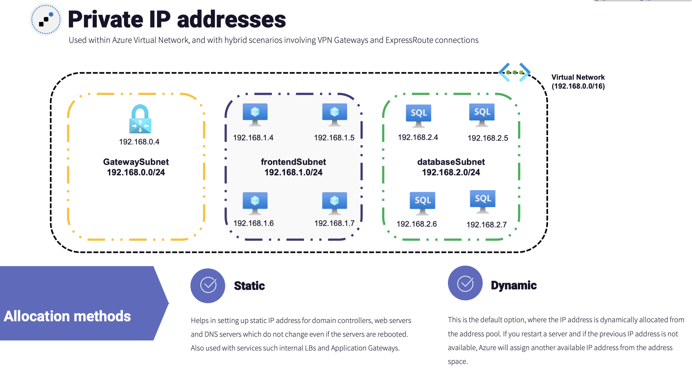

#### Public IP Address
Public IP addresses are associated with a virtual machine NIC, public load balancer, VPN gateways, application gateways, and any other resource that can be accessed from the Internet.

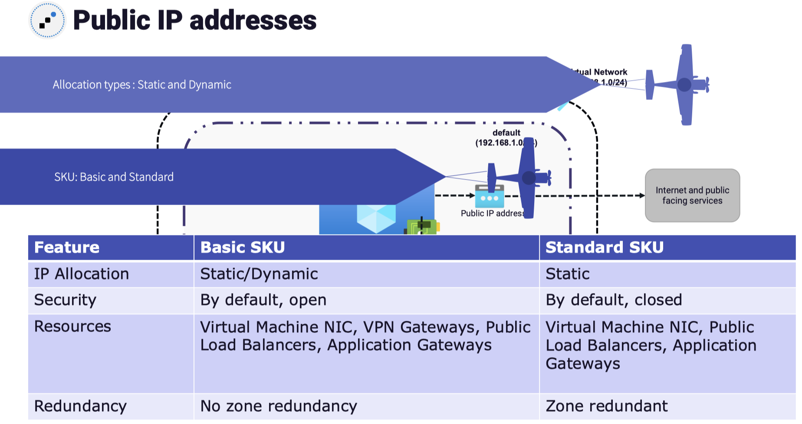

### Network Routes
There are two types of network routes in Azure: system routes and user-defined routes (UDR).

#### System Routes
Whenever we create a VM, the VM will be able to communicate with the Internet without setting up any routes.

The traffic between virtual machines, the Internet, and the on-premises infrastructure are routed using the system routes. Scenarios where system routes are used for packet routing include the following:
- When you deploy multiple VMs to the same subnet, the communication between these VMs is done using system routes.
- The communication between VMs in different subnets in the same virtual network.
- Access to the Internet from VMs.
- ExpressRoute and site-to-site connections via VPN gateway.

One thing to note here is the communication from the Internet to the servers is always blocked using the network security groups.

The system routes are stored in a routing table and with the help of these routes the traffic can be routed with the virtual networks, the Internet, and the on-premises infrastructure. Users can always override these rules and stop any of the communications that come as part of the system route.

#### User-Defined Routes
Users can always override these routes using user-defined routes (UDRs).

Network virtual appliance (NVA)

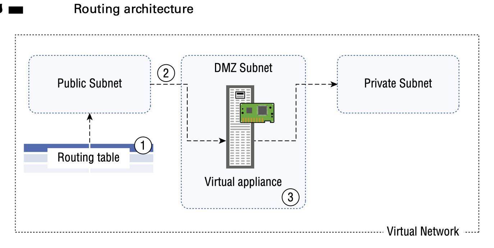

The following are the steps to force the traffic to route through the NVA:
1. Create a routing table.
2. By adding a custom route, you can direct the traffic from a public subnet to the NVA.
3. Finally, associate the route table to the subnet.

### Service Endpoints

Using a service endpoint, the VM will be able to communicate with the storage service securely using its private IP address as the source IP address, as shown in Figure.

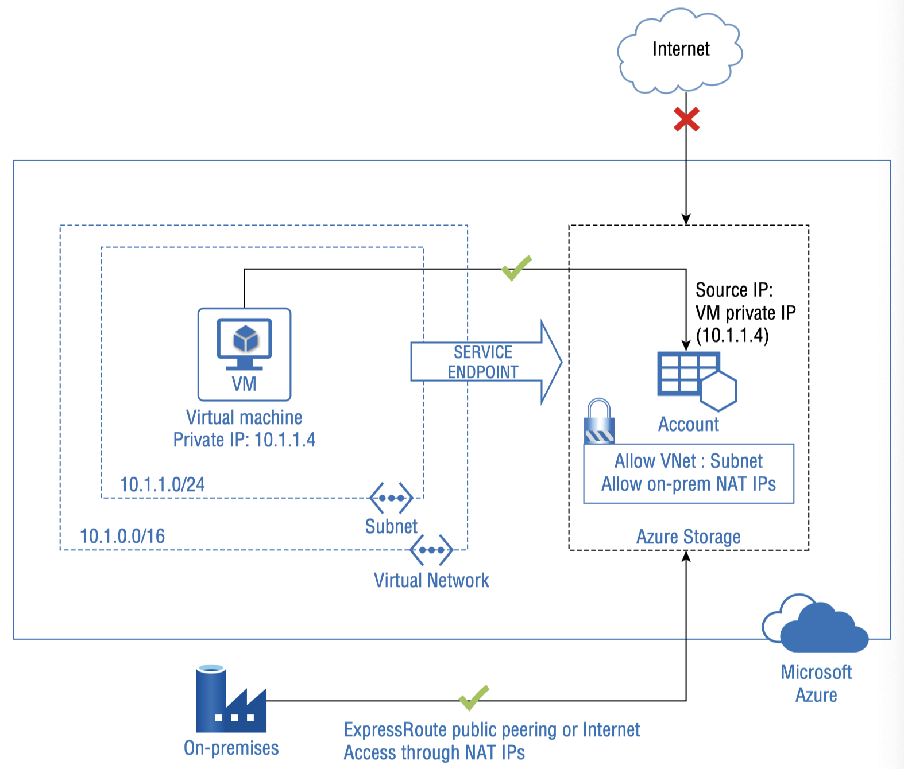

Supported services:
- **Azure Storage**: This is supported in all Azure regions and is generally available. Using this endpoint, you can establish an optimal route to the Azure Storage service. 
- **Azure SQL Database and Azure Synapse Analytics (formerly Azure Data Warehouse)**: Service endpoints can be used to communicate with the databases in Azure SQL Database or databases in Azure SQL Data Warehouse in a secure manner. 
- **Azure Database for PostgreSQL and MySQL servers**: This enables you to communicate from your virtual network to PostgreSQL and MySQL servers deployed in Azure.
- **Azure Cosmos DB**: Using service endpoints, you can let the resources deployed in your virtual network communicate with the Cosmos DB. 
- **Azure Key Vault**: This is available in all Azure regions. By enabling service endpoints, you can limit the communication to the key vault. Only requests from the allowed subnets are permitted to access the key vault; the rest of the requests will be denied.
- **Azure Service Bus and Event Hubs**: Service endpoints for Service Bus and Event Hub facilitates secure access to messaging capabilities from workloads such as virtual machines that are deployed in the virtual network.

### Private Endpoints

By implementing private endpoints, Azure PaaS services will get a private IP address on your virtual network.

Private endpoints can be used to connect Azure PaaS using a private link. A private link is a global service and has no regional restrictions.

- **Private connectivity**: You can connect to resources over a Microsoft network that are deployed in different Azure regions. As no public Internet is involved in these connections, a complete private connectivity is established.
- **Hybrid connections and peered networks**: You can access the resources that are connected via private links from on-premises infrastructure via VPN or ExpressRoute connections. If the resources are deployed in cloud, you can use peered networks as well. As the network is hosted by Microsoft, you don’t need to set up public peering or Internet gateways. This is not possible in the case of service endpoints.
- **Enhances security**: The access is limited to only selected resources and eliminates a data exfiltration threat.
- **Seamless integration**: Since the PaaS resources get an IP address from the virtual network, the connectivity will be seamless and with low latency.

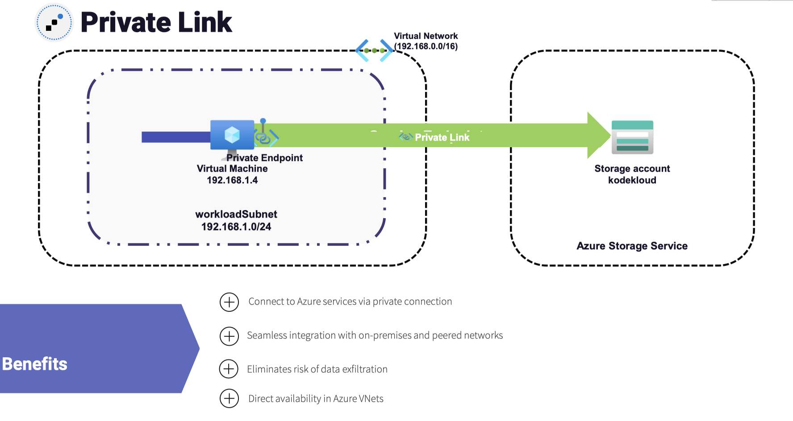

### Azure DNS

In Azure, Azure DNS is used to host DNS zones for providing name resolution.

Let’s take a look at the benefits of using Azure DNS:
- Reliability and performance
- Security
- Ease of use
- Private domains
- Alias records

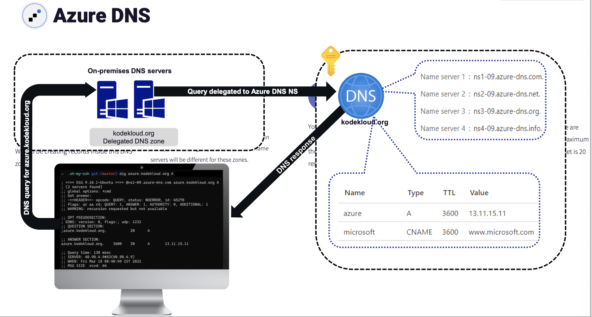

#### Record Management
Azure DNS supports all common DNS record types including A, AAAA, MX, CAA, CNAME, PTR, SOA, SRV, and TXT records.

Record sets are also supported in Azure; these are useful in cases where you would like to create more than one DNS record in a single shot referencing a given name and type.

While creating records, you can also specify the time-to-live (TTL). This value specifies how long the clients can cache this record before contacting the DNS server again for resolving the query. By default, this value is set to 3600 seconds or 1 hour.

#### Private DNS Zones
Using Azure Private DNS, the resources in your virtual network will be able to use the DNS service for name resolution. By default, Azure makes dynamic DNS updates to a zone that is provided by Azure.

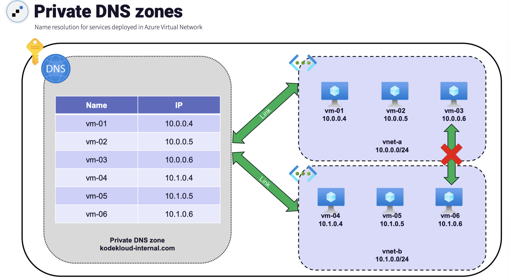

### Network Security Groups

Network security groups are a functionality in Azure used to filter and limit inbound and outbound traffic; in other words, they are similar to firewalls.

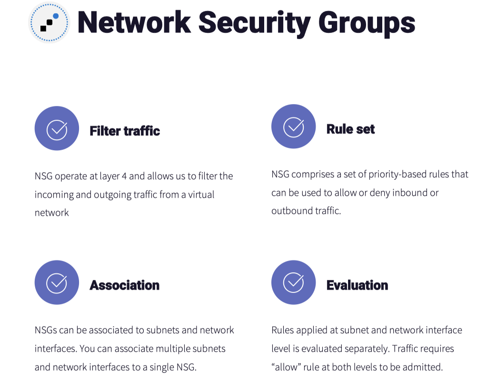

Each VM uses its network interface for communication with the resources in Azure, on-premises, and on the Internet. NSGs can be associated with a subnet, or a network interface based on your requirement. NSGs are reusable, which means you can have multiple NICs or subnet associations to a single NSG.

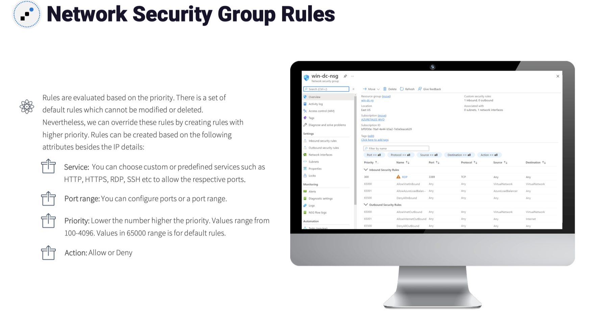

#### NSG Concepts
- Subnets: Protected screened subnets can be created by assigning an NSG to subnets. You can protect all the workloads in a subnet by associating NSGs.
- Network Interfaces: All traffic that flows through the NIC will be evaluated based on the NSG rules.
- NSG Rules: An NSG is a collection of security groups that can be used to filter inbound and outbound traffic of subnets and NIC.

Rules can be created by specifying the following parameters:
- Name
- Priority
- Port
- Protocol
- Source
- Destination
- Action

**Inbound rules**: By default, there will be three inbound security rules (allow virtual network traffic, allow load balancer traffic, deny all other traffic) added to an NSG when you create NSG. All inbound traffic except the traffic from virtual network and Azure load balancer is not allowed.

**Outbound rules**: By default, there will be three rules: allow outbound traffic to the Internet and virtual network and deny all other traffic.

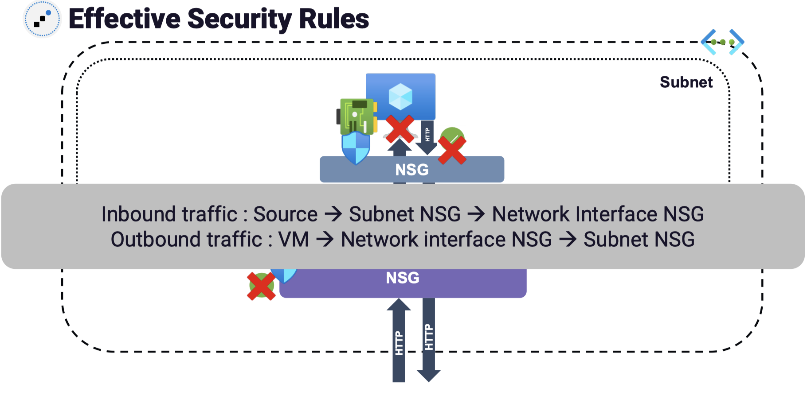

### Azure Firewall
Azure Firewall is a firewall-as-a-service offering from Microsoft Azure. It is a managed, cloud-based security solution that protects the workloads we have deployed in Azure virtual networks.

The main difference is that NSG operates at layers 3 and 4 of the OSI layer; on the other hand, Azure Firewall works at layers 7 and 4.

The following are the features of Azure Firewall:
- High-availability
- Zone redundant
- Scalability
- Filtering rules
- Threat intelligence
- Multiple public IP addresses

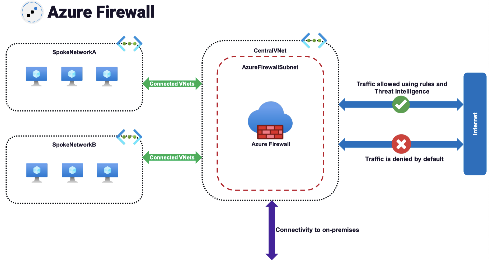
#### Azure Firewall Rules

- **NAT Rules** NAT rules are used to configure destination network address translation (DNAT) for translating and filtering the inbound traffic coming to our subnets. Using a NAT rule collection, you will be able to translate a public IP and port to a private IP and port.
    - Name
    - Protocol
    - Source Address
    - Destination Address
    - Destination Port
    - Translated address
    - Translated port

- **Network Rules** A network rule should be in place for any non-HTTP/S traffic to be allowed through the firewall. For a source to communicate with a destination deployed behind a firewall, you need to have a network rule configured from the source to the destination.
    - Name
    - Protocol
    - Source Address
    - Destination Address
    - Destination Port

- **Application Rules** Application rules can be used to define the set of domain names that can be accessed by the resources deployed in the subnet.
    - Name
    - Source Address
    - Protocol and port
    - Target FQDN

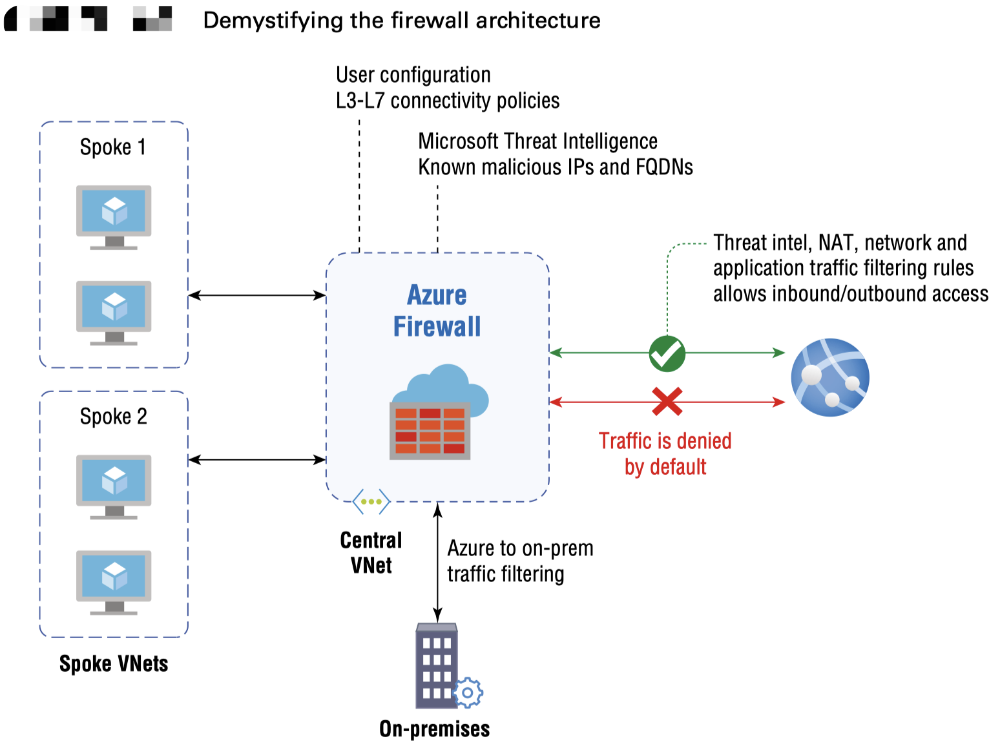

