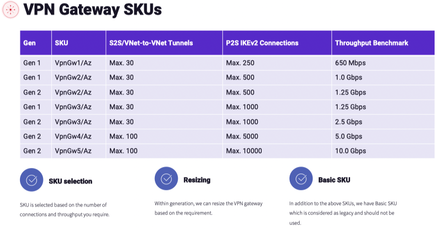
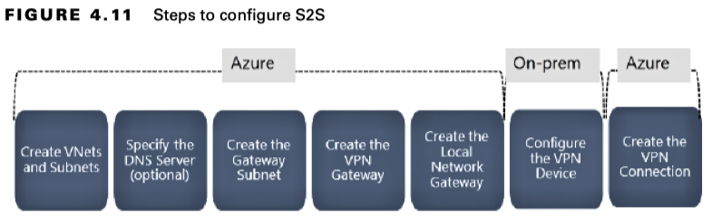

## Connectivity in Azure

## Azure-to-Azure Connectivity
Azure-to-Azure connectivity refers to connectivity between two Azure virtual networks in the same region or different regions.

All resources deployed in a virtual network will be able to communicate with the Internet by default. This means the resource can initiate the connection to the Internet to get the time, download updates, etc.

By default, **each virtual network**, regardless of whether they are in the same region or different regions, **cannot** communicate with each other unless you have one of the following methods established. Each virtual network will be an isolated network like you used to have on-premises. In on-premises, you used routers to connect two networks and enable communication; in Azure you have different methods available to enable this connection.

In the figure, you can see that the `jumpbox` VM deployed in the `jumpBoxSubnet` of `vnet01` cannot communicate with `vnet-02`. The `vnet-02` has two subnets, `WebTier` and `DataTier`, each holding `web-vm` and `database-vm`, respectively. The `web-vm` and `database-vm` are able to communicate with each other as they are in the same virtual network. Your goal is to let the `jumpbox` VM communicate with `web-vm`.

#### Internet 

The Internet is the easiest, least secure, and least preferred implementation to connect two Azure sites or virtual networks.
- In this case, you can associate public IP addresses to your jumpbox VM and web-vm, and they will be able to communicate with each other over the Internet. This process is similar to deploying a VM with public IP addresses, and you connect from a local machine. Similarly, you can connect to web-vm and initiate a connection to the public IP address of the web-vm, or vice versa.
- Opening the connectivity to the Internet opens a vector for attack. You could leverage firewalls or an NSG to filter the communication.

When we discuss communication between Azure resources, this is the least preferred method. In fact, it is not even considered as an option due to the security concerns.

#### Virtual Network Peering

This is one of the widely adopted methods to connect virtual networks because of its simplicity and ease of implementation. Enabling virtual network peering opens a channel for flawless connectivity between virtual networks. Once you establish the peering, the resources in the connected virtual networks will be able to communicate with each other as if they are part of the same virtual network.

There are two types of peering: 
- **Regional virtual network peering**: If you peer networks that are in the same Azure region, you call it regional virtual network peering.
- **Global virtual network peering**: If you peer networks that are in different Azure regions, you call it global virtual network peering. However, you cannot peer Azure public cloud and government cloud regions. You can establish peering between the same regions in the government cloud.

- In the figure, you can see that two virtual networks in East US with address spaces `10.0.0.0/16` and `192.168.0.0/16` are connected to each other via **regional virtual network peering**, as they are part of the same region.

- There is a third virtual network deployed in West US with the address space `172.16.0.0/16`. This virtual network is peered with a virtual network in East US via **global virtual network peering**. It is called global virtual network peering as the virtual networks are located in two different regions.

The following are the benefits of using peering for connecting your virtual networks:
- Private network: Peering uses a private network to send the traffic between peered networks. For communication, the Microsoft backbone network is used, and the public Internet is not required.
- Low latency
- Easier implementation
- Connectivity
- Seamless
- No downtime

**Nontransitivity**
Virtual network peering is called non-transitive. This means that if you have three virtual networks, A, B, and C, and you peer A with B and B with C, it does not mean that A is peered with C. You need to peer A with C directly to have connectivity between A and C.

**Implementing Virtual Network Peering**

When you are implementing cross-subscription peering, make sure that you have permissions on both subscriptions to manage the virtual network and the peering. In the case of cross-subscription and cross-tenant peering, the administrator of the peer network should at least grant you a Network Contributor role. Without this role, you will not be able to create a reciprocal connection on the other peer.

#### VPN Gateway
A virtual private network (VPN) gateway is popular for sending encrypted traffic between the Azure virtual network and on-premises datacenter over the public Internet. There is also another use case for these virtual network gateways, which is sending encrypted traffic between Azure virtual networks.

Each virtual network can have only one VPN gateway, and you can establish multiple connections to the gateway. Each connection shares the bandwidth allocated for the VPN gateways.

A VPN gateway can be used to establish three types of connectivity:
- Site-to-site: Helps in connecting on-premises datacenter to cloud
- Point-to-site: Helps in connecting individual devices to an Azure virtual network
- VNet-to-VNet: Establishes a connection between Azure virtual networks

**For VNet-to-VNet connectivity**, you need to create virtual network gateway to establish a VPN connection, and each virtual network gateway comprises two or more VMs managed by Azure. These VMs are deployed to a dedicated subnet within your virtual network called the gateway subnet. 

The VMs are managed by Azure, and you don’t have the permission to customize or configure them. These VMs are responsible for maintaining the routing rules and running the gateway services. VPN gateways can also be deployed to availability zones; this can help you overcome connectivity issues when there are any zonal-level failures in an Azure region.

**VPN Gateway Types**
- **Route-based VPN**: the route-based VPN relies on the routing table or IP forwarding rules you configure to force the packets the respective tunnels interfaces. It’s the responsibility of the tunnel interfaces to encrypt and decrypt traffic that comes in and out of the tunnel. Any to any traffic selectors are configured on the route-based VPNs.
- **Policy-based VPN**: The policies comprise the address prefix combinations based on your on-premises and Azure virtual network address spaces. Unlike route-based VPNs, the traffic selector is defined using an access list. There are certain limitations when it comes to policy-based VPN.
  - As discussed, there are different pricing tiers of VPN, and policy-based VPN is not supported in the Basic SKU of the VPN gateway. Second, you can have only one tunnel, and your connections are limited to only site-to-site connections and certain configurations where you cannot control or modify the path the traffic will flow through. For most scenarios, you should prefer route-based VPNs.

**SKU**
VPN gateway tiers are classified based on the number of connections, throughput, and features.

**High Availability**
When you create a VPN gateway, you will be asked to choose how to configure HA in the VPN gateways.

There are two options by which you can implement HA in VPN gateways:
- **Active-Standby**: In Azure, each VPN gateway is configured in an active-standby configuration with the combination of two instances.
  - During an event of any planned maintenance or unplanned interruptions to the active instance, Azure will automatically fail over to a standby instance. Once the failover is completed, the standby will resume all S2S and virtual network-to-virtual network connections. The IP address of the VPN gateway will remain the same. There will be a small interruption during the failover process.
  
  Figure 4.8 shows how the active-standby configuration is set up for a virtual network-to-virtual network and on-premises gateway.

    

  Active-standby is the default configuration whenever you create a VPN gateway; this can be changed to active-active by changing Enable Active-Active Mode to Enabled.

- **Active-Active**

Here each instance will have its own public IP address on both sides of the virtual network. You need to let each instance know about the other two peers for establishing two tunnels. In the case of on-premises, you need to set up both of your VPN devices with the public IP addresses of the gateway instances.

In an active-active configuration, the traffic is routed concurrently through both tunnels.

**Implementing Virtual Network-to-Virtual Network Connectivity Using VPN Gateways**
These steps are relevant for establishing the connection. The following are the steps required:
1. **Create virtual networks and subnets**: You need to set up your virtual networks and subnets to host the workloads.
2. **DNS server**: This is an optional step; you can skip this if name resolution is not required.
3. **Create gateway subnet**: Before you deploy the VPN gateway, you need to add a dedicated subnet to the virtual networks you want to connect. This subnet is for hosting the VPN gateway instances, and a CIDR block of /27 or /28 would suffice. The name of the subnet should be GatewaySubnet.
4. **Create connection**: You need to create a connection from the VPN gateway.

## Azure to On-Premises Connectivity
Basically, there are two ways to connect on-premises to Azure; one is `VPN gateway`, and the other one is `ExpressRoute`.

#### VPN Gateways

**Implementing Site-to-Site Connections**

The local network gateway refers to the on-premises location. You create a reference resource called a **local network gateway** in Azure to specify your on-premises site. While creating the local network gateway, you will specify the address prefixes that are there in the on-premises network.

**Implementing Point-to-Site Connections**
Using a P2S connection, you can create a secure connection from an individual computer to an Azure virtual network over VPN. P2S is also an alternative to S2S connections if you have a limited number of users who want to connect to Azure and you don’t have an on-premises equipment that supports S2S connections. The P2S connections are always initiated from the client machine. All clients need to download the VPN profile and install it on their device to establish the P2S connection.

Before Azure accepts P2S requests from the clients, authentication should be done first. There are three authentication types.
- Azure certificate
- RADIUS authentication
- Azure Active Directory

The availability of the authentication methods will depend on the VPN SKU. For example, Basic SKU only supports certificate authentication.

P2S connections support the following protocols:
- The OpenVPN protocol is a TLS VPN solution that supports Android, iOS (versions 11.0 and above), Linux, Windows, and macOS (versions 10.13 and above).
- Secure Socket Tunneling Protocol (SSTP) is also a TLS-based VPN protocol; however, the support is limited to Windows devices (Windows 7 and later).
- IKEv2 VPN is an IPSec VPN solution for macOS-based computers. macOS versions 10.11 and above are supported.

Since TLS uses 443, you don’t need to open additional ports on your firewall. The selection of the protocol is based on the device support and your network configuration.

#### ExpressRoute Connections
Like VPN, ExpressRoute helps us to extend on-premises network into the Microsoft cloud. A connection provider facilitates the connection and can be used to establish connections to Microsoft cloud services, such as Microsoft Azure, Microsoft 365, and Dynamics 365. The public Internet is not involved in the case of ExpressRoute. Therefore, ExpressRoute connections offer faster speed, lower latency, security, and higher reliability compared to other connectivity models.

Using ExpressRoute, you can directly connect to the Microsoft cloud from your existing WAN. This connectivity can be established using a multiprotocol label switching (MPLS) VPN. This MPLS will be provided by the network provider. The bandwidth of the VPN gateway is limited to 10 Gbps; however, ExpressRoute provides bandwidth up to 100 Gbps. Because of this very high bandwidth, ExpressRoute is the perfect choice for scenarios such as data migration, data replication, and disaster recovery. ExpressRoute is also the best candidate for moving larger datasets from on-premises to Azure.

The following are the benefits of ExpressRoute:
- Redundant L3 connectivity
- Within a geography, connectivity is available to all regions
- Bandwidth options vary from 50 Mbps to 100 Gbps
- ExpressRoute circuit is offered in Local, Standard and Premium SKUs
- In Local SKU, you will be charged under the Unlimited plan. In unlimited outbound data transfer is free.
- With Standard and Premium SKU, you can select between a Metered or an Unlimited data plan. In metered, you will be charged for outbound data transfer.
- With the addition of premium add-on, you can get global connectivity.

**ExpressRoute Circuits**
In ExpressRoute you establish a connection between your on-premises infrastructure and the Microsoft cloud with the help of a connectivity provider.

A service key is used to represent each circuit. This service is not a secret rather a standard GUID used to identify the circuit by the on-premises connectivity provider and Microsoft.

ExpressRoute has multiple peering options available. New ExpressRoute circuits include two independent peerings: private peering and Microsoft peering.

**ExpressRoute Peering**
You have three types of routing domains: Azure Private, Azure Public (not available in new circuits), and Microsoft.
- Azure Private Peering
  - Azure private peering is for services that are using Azure private IP addresses. In other words, resources that are in the deployed Azure virtual network can be accessed using Azure private peering. This helps in the extension of on-premises network to the cloud and communication using the private IP addresses. The connectivity is established in a bidirectional way, which means that the IaaS or PaaS solutions deployed in the virtual networks can communicate with on-premises resources on their private IP addresses.
- Azure Public Peering (Deprecated)
  - Azure public peering is available only in the existing ExpressRoute circuits; any new circuits will have only Azure private and Microsoft peering.
- Microsoft Peering
  - Microsoft peering can be leveraged to enable connectivity from the on-premises infrastructure to Microsoft online services, which includes Azure PaaS services, Microsoft 365, and Dynamics 365.

**ExpressRoute Connection Models**
The type of connection from on-premises to the Azure cloud using ExpressRoute is determined using the connection models.

- **Co-located at a Cloud Exchange** 
  - This model is ideal if you are co-located in a facility with a cloud exchange. You can then order a virtual cross connection using your colocation provider’s Ethernet exchange. Layer 2 cross connections and managed layer 3 cross connections are supported for establishing connectivity between the Microsoft cloud and your co-location facility.
- **Point-to-Point Ethernet Connections** 
  - Connectivity from on-premises to the Microsoft cloud can be established using point-to-point Ethernet links. Layer 2 connections and managed layer 3 connections are supported for establishing connectivity.
- **Any-to-Any (IPVPN) Networks**
  - You can extend your on-premises by integrating your WAN with the Microsoft cloud. Once established, the Microsoft cloud will resemble another branch office in your WAN. Managed layer 3 connectivity is supported. ExpressRoute features and capabilities are the same across all the aforementioned connectivity models.
- **ExpressRoute Direct**
    - ExpressRoute Direct offers the capability to use the peering location spread across the globe to connect with the Microsoft global network. An active-active connectivity with dual 100 Gbps or 10 Gbps connectivity is offered by ExpressRoute Direct. Further, it provides additional features such as faster ingestion of larger datasets to Azure Storage and Cosmos DB, isolation of connectivity, and granular allocation of circuit distribution within the organization.

## Intersite Connectivity Architecture

- We have a VPN gateway in the Hub-VNet that has established S2S connections with the HQ building and another site in on-premises. Though HQ already has ExpressRoute, you have added a VPN S2S connection as a backup option that also can be utilized by applications that don’t require low latency. The low-latency ExpressRoute will be used by applications that require faster connection, and the rest of the connections will be established using the VPN S2S connection. Here also since the gateway transit is enabled, all the spoke virtual networks will be able to use a VPN gateway and establish connections with the on-premises Site 1 and HQ building.
- You have a client computer connected to the VPN gateway using a P2S connection.

## Virtual WAN
A virtual WAN is a network service offered by Microsoft, which you can establish connectivity to and through Azure to your branch offices. In a virtual WAN, Azure regions will act as a hub for connecting your branch offices.

The following are some of the features offered by a virtual WAN:
- Integrated connectivity: Connectivity between on-premises sites and the Azure hub and site-to-site configuration can be completely automated.
- Seamless connectivity: Azure workloads deployed to Azure virtual networks can be seamlessly connected to the hub.
- Monitoring: End-to-end flow can be monitored within Azure without the need to deploy any additional resources.

Two types of virtual WANs are offered by Azure: Basic and Standard:
- **Basic virtual WAN**: 
  - Hub type: Basic
  - Available configurations: S2S VPN only
- **Standard virtual WAN**:
  - Hub type: Standard
  - Available configurations: ExpressRoute, S2S, P2S, interhub, virtual network-to-virtual network through a hub

