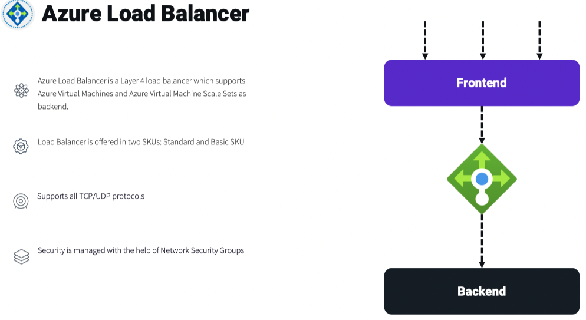
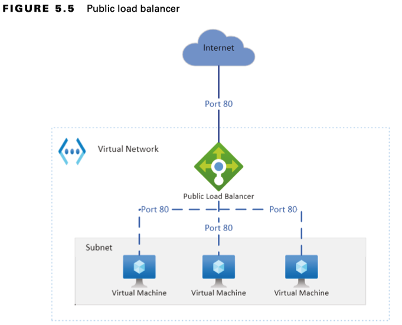
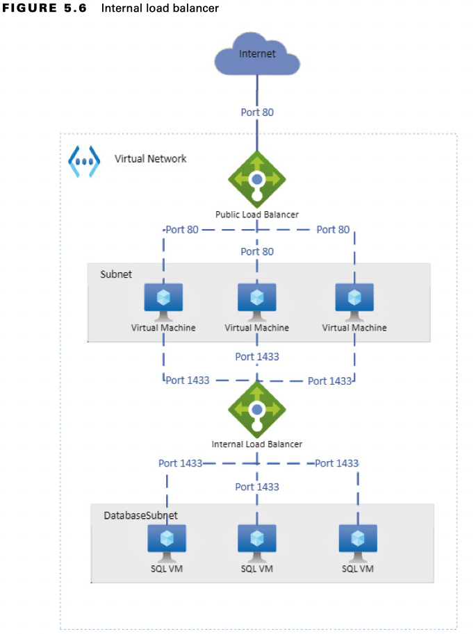
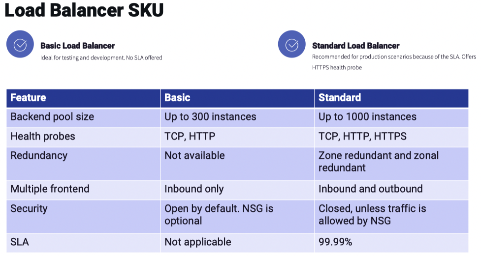
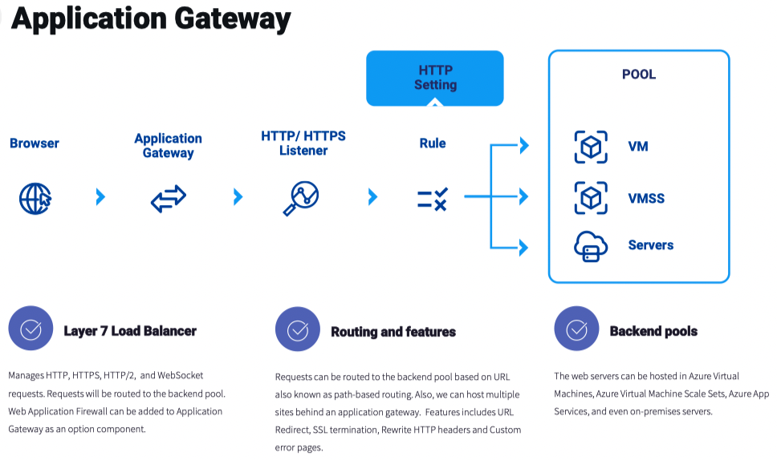
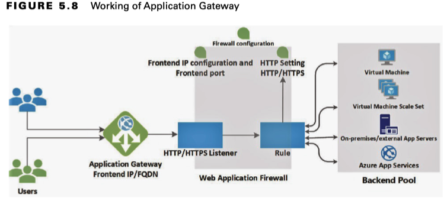
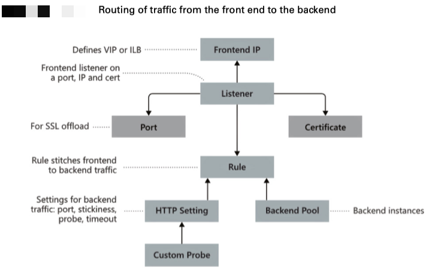
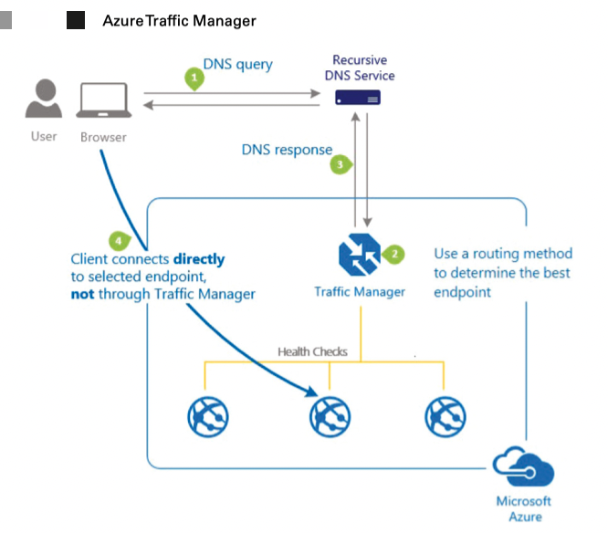
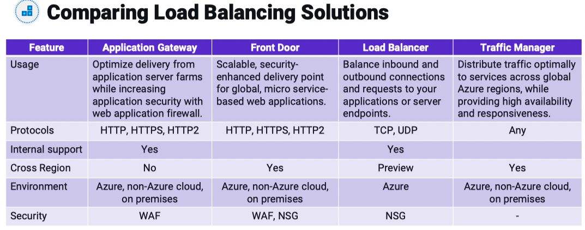

# Network traffic

## Availability Options

#### Availability Sets
In short, an `availability set` is a logical grouping of the VMs hosting our application.

An availability set comprises update domains (UDs) and fault domains (FDs), and every virtual machine that you create will be associated with a UD and a FD. 

You can configure up to three FDs and twenty UDs. UDs represent a group of VMs and the underlying host that can be updated and rebooted at the same time. The default number of UDs is five, and if you are creating more than five VMs, the sixth VM will be placed on the first UD, the seventh will be on the second, and so forth depending upon the number of instances. While a UD is getting rebooted, it’s given 30 minutes to recover before the maintenance task is started on a different domain.

Fault domains represent a set of virtual machines that share a common network switch, power, and air conditioning. FDs can be configured up to a maximum of 3, and this is the default value while setting up availability sets.

#### Availability Zones
In Azure, every region comprises a set of datacenters that are interconnected with a regional low-latency network.

When you are using availability zones, the instances can be spun across multiple zones within the region. If one of the zones goes down due to an outage, the instances deployed in the other zones will be able to serve your customers.

Choosing availability zones and availability sets in your architecture can improve the overall SLA of the application compared to hosting the application in a single VM.

#### Service Level Agreement
The SLA of **single** VM varies with the type of disk you are choosing. The following are the SLAs offered for the single VM:
- At least 99.9 percent VM connectivity for any single instance of VM using Premium SSD or Ultra SSD for all OS disk and data disks
- At least 99.5 percent VM connectivity for any single instance of VM using Standard SSD disks for OS disk and data disks
- At least 95 percent VM connectivity for any single instance of VM using Standard HDD disks for OS disk and data disks

Depending upon the type of disk, the SLA offered varies. If you deploy two or more instances across availability zones or availability sets, then the SLA gets increased as follows:
- At least 99.95 percent VM connectivity when two or more instances are deployed in the same availability set
- At least 99.99 percent VM connectivity when two or more instances are deployed across two or more availability zones

## Azure Load Balancer
Azure Load Balancer is a network load balancer that operates at layer 4 of the OSI layer. As the requests are getting spread across the instances, you can ensure that high availability is achieved.

Both inbound and outbound traffic scenarios are supported by the Azure Load Balancer. The load balancer relies on the load balancing rules and health probes to distribute the traffic to the backend servers. The purpose of the load balancing rules is to determine how the traffic should be distributed across the backend servers.

#### Types of Load Balancers

- **Public Load Balancer**: a public load balancer will have a public IP address, and it will be Internet facing.
  - In a public load balancer, the public IP address and a port number are mapped to the private IP address and port number of the VMs that are part of the backend pool.

  Figure shows how the incoming web requests from the Internet are distributed across the set of web servers added in the backend. You can see that all incoming requests to the front-end public IP address of the load balancer on port 80 are getting distributed to the backend web servers on port 80.

  

- **Internal Load Balancer**: Internal load balancers are deployed to distribute the traffic to your backend servers that cannot be exposed to the Internet. The internal load balancer will not have a public IP address and will be using the private IP address for all communication.
  - This private IP address can be reached by the resources within the same virtual network, within peered networks, or from on-premises over VPN. This is ideal for deploying internal applications without exposing them to the Internet. 
  - Internal load balancer doesn’t have public IP address as frontend
  - Used in internal resources that needs to be accessed from Azure or on-premises via VPN connection.

  

#### Load Balancer SKUs
The two SKUs you have in Azure are `Basic` and `Standard`. The `Standard` SKU is the newer version of the load balancer and offers more features and capabilities than the `Basic` SKU. All features of `Basic` SKU are already included in the `Standard` SKU along with additional features.

Basic SKU supports the following:
- Port forwarding
- Automatic reconfiguration
- Health probes (HTTP, TCP)
- SNAT
- Diagnostics for public-facing load balancers
- Support for VMs in a single availability set and VMSS

Standard SKU supports the following:
- All features of Basic SKU
- HTTPS health probes
- Support for availability zones
- Metrics and analytics using Azure Monitor
- HA ports
- Outbound rules
- SLA of 99.99 percent (for two or more VMs in the backend)
- Support for any VMs or VMSS in a virtual network

#### Configuring Load Balancer
While creating a load balancer, you need to configure several items such as the front-end and backend pools, load balancing rules, session persistence, and health probes.

- **Backend Pools:** The backend pool contains the IP address of the network interface cards that are attached to the set of virtual machines or virtual machine scale set.
  - In the Standard SKU, you can have up to 1,000 instances, and the Basic SKU can have up to 100 instances in the backend pool.
- **Health Probes**: The purpose of a health probe is to let the load balancer know the status of the application. The health probe will be constantly checking the status of the application using an HTTP or TCP probe.
  - In the HTTP probe, the endpoint will be probed every 15 seconds (default value), and if the response is HTTP 200, then it means that the application is healthy. If the application is returning a non-2xx response within the timeout period, the virtual machine will be marked unhealthy.
  - Using the TCP probe will help you verify if the load balancer is able to establish a TCP connection on the specified port. If the connection is successful, then the endpoint is healthy.
- **Load Balancer Rules**: load balancer rule decides how the traffic should be routed from the front-end pool to the backend pool.
  - The backend pool, front-end IP address, and health probe are required before setting the load balancer rule.
- **Session Persistence:** The load balancer will distribute the traffic equally among the backend servers, which is the default behavior.
  - The five tuple hash includes the source IP, source port, destination IP, destination port, and protocol. Session persistence specifies how the traffic from the client should be routed and which backend server will serve the request.

You have three distribution modes available in the load balancer to handle session persistence.
- **None/five tuple**: This is the default value, and any virtual machine can handle the incoming requests. Since the five tuples include the source port in the hash, clients may get redirected to different back-end servers for each session.
- **Client IP/source IP affinity/two-tuple hash**: Requests coming from the same source IP address will be handled by the same backend server. Here the hash between the source IP and the destination IP is used to map the backend servers.
- **Client IP and protocol/three-tuple hash**: Successive requests from the same client IP address and protocol will be handled by the same backend virtual machine. In a threetuple hash, you are taking the hash of the source IP, destination IP, and protocol to map the servers.

## Azure Application Gateway
Since Application Gateway is operating at layer 7, the IP addresses of the backend servers are not considered; rather, hostnames and paths are used for routing. Application Gateway supports virtual machines, VMSS, Azure App Service, and even on-premises servers.

Let’s understand the features of Application Gateway:
- **Supported protocols**: It supports HTTP, HTTPS, HTTP/2, and WebSocket.
- **WAF support**: Web Application Firewall can be incorporated with Application Gateway to protect web applications.
- **Encryption**: It supports end-to-end request encryption.
- **Autoscaling**: You can dynamically scale Application Gateway to handle traffic spikes.
- **Redirection**: Traffic can be redirected to another site or from HTTP to HTTPS.
- **Rewrite HTTP headers**: It allows passing additional information with the request or response.
- **Custom error pages**: Instead of using the default error pages, you can use custom error pages.

#### Request Handling Process
The architecture contains front-end, listener, backend, and WAF (optional).

1. The users will be accessing the web application by sending the request to the fro IP address of the Application Gateway. In real-world scenarios, you would be mapping the IP address of the Application Gateway to a DNS name, and the client reaches the Application Gateway by resolving that DNS name.
2. Once the DNS returns the IP address of the Application Gateway, the request will be sent to the front-end IP address of the application.
3. Application Gateway uses listeners to accept incoming traffic.
4. Optionally, you can add the web application firewall (WAF) to check the request headers of the body (if present) against the WAF rules. WAF can be used to determine if the incoming request is a legitimate one or a security threat.
5. If the request is valid, based on the rules configured, the request will be routed to the backend pool.

#### Routing Methods
Azure Load Balancer uses the five-tuple hash, three-tuple hash, or two-tuple hash for routing the traffic to the backend servers. Application Gateway is a layer 7 load balancer, so the routing mechanism is different from the one that you witnessed in the case of Azure Load Balancer.

**Path-Based Routing**
In path-based routing, Application Gateway inspects the URL paths and routes the traffic to the different backend pools.
- Based on the path in the URL, we can route the request to different backend pools. Ideal for routing requests to different backend pools optimized for different paths.

**Multisite Routing**
Multisite routing or multiple site routing lets you configure more than one web application behind the same Application Gateway. In this configuration, you need to map the front-end IP address of the Application Gateway to multiple CNAMEs.
- Multiple sites can be hosted behind a single application gateway. Based on the domain, the request can be routed to the backend pool hosting the requested domain.

#### Configuring Application Gateway

**Front-End IP Address**
All the client requests will be hitting the front-end IP address of the Application Gateway.

**Listeners**
Listeners are responsible for accepting the incoming traffic based on the combination of protocol, port, host, and IP address.

**Routing Rules**
Routing rules act like a bridge between the listener and the backend pools. Basically, the rule identifies how to interpret the hostname and path elements in the incoming URL request and direct the traffic to the backend pool. HTTP settings imply whether the traffic is encrypted between the Application Gateway and the backend servers.

**Backend Pools**
The backend pool refers to a set or collection of web servers.

**Health Probes**
health probes are used to determine the health of the application and to decide whether the traffic should be routed to the server. If the response code is between 200 and 399, the server is considered as healthy.

If you don’t create a health probe, Application Gateway will create a default probe for checking the health of the server. The default threshold value is 30 seconds.

**Web Application Firewall**
Web Application Firewall (WAF) is an optional component that can be included in the Application Gateway.

## Azure Front Door
You can implement instant global failover and high availability for our web applications by using Azure Front Door. Azure Front Door helps in multiregion load balancing for web traffic.

The only difference is Azure Front Door backend pools can be located in different regions, but Application Gateway is scoped to a single region.

Front Door uses the anycast protocol with split TCP and to improve the global connectivity, and Front Door relies on the Microsoft global network. Front Door is a layer 7 or HTTP/HTTPS load balancer, and you can include WAF if needed.

The following are the features offered by Azure Front Door:
- Enhanced performance
- Heath probes
- URL based routing
- Multiple-site routing
- Session affinity
- TLS termination
- Custom Domains and certificate management
- URL redirection
- URL rewrite
- IPv6 and HTTP/2 support

## Azure Traffic Manager
Azure Traffic Manager is a DNS load balancing or DNS resolver, which helps in distributing the traffic to different endpoints globally based on the routing method you configure.

1. The request from the client reaches the recursive DNS servers, and the request gets forwarded to the Azure Traffic Manager.
2. A recursive DNS server will forward the request to the Azure Traffic Manager, and based on the routing method you have configured, Traffic Manager determines the best endpoint.
3. Once the endpoint is determined, Traffic Manager will return the IP address of the backend server as a DNS response to the client.
4. Since the client knows the IP address to the endpoint, it will directly communicate with the endpoint returned by the Traffic Manager.

The following are the routing methods available for Traffic Manager:
- **Priority routing**: You can set the priority for each endpoint, and the requests will be served by the endpoint that has the highest priority. If the endpoint with high priority is not healthy, then the endpoint with the second highest priority serves the requests.
- **Performance routing**: Requests will be routed to endpoints with the lowest network latency.
- **Geographic routing**: Requests will be routed to endpoints based on the location of the client. This is ideal for serving websites in local language for customers accessing from a country.
- **Weighted routing**: This is ideal for distributing based on weight. If you set the weight equal for all endpoints, the traffic will be evenly distributed.
- **Multivalue**: This is ideal for profiles that can have only IPv4/IPv6 addresses as endpoints.

## Comparing Load Balancing Solutions

