# Azure Storage

## Azure Storage Account
Microsoft offers a cloud storage solution that can be integrated with all modern data storage setups. In Azure, the storage components are aligned to the service called Azure Storage, which is top in its class in terms of the availability and scalability it offers.

Storage accounts can be used to segregate data objects such as blobs, file shares, tables, queues, and disks. Each storage account will have a unique name in Azure and will have endpoints.

The following are the features offered by Azure storage accounts:
- Highly Available and Durable
- Secure
- Scalability
- Tools and Access

We can broadly classify the data that can be stored into three categories:
- Structured Data
  - Structured data can be stored in different Azure services such as Azure Cosmos DB, Azure SQL DB, and other relational databases.
- Unstructured Data
  - This category includes videos, images, text files, and binaries. In Azure Storage you can utilize the blob storage for storing unstructured data.
- Virtual Machine Storage
  - Azure Files and Azure Disks can be used as storage for the virtual machines. Azure Disks represents persistent storage for Azure VMs, and Azure Files contains managed file shares offered by Azure.

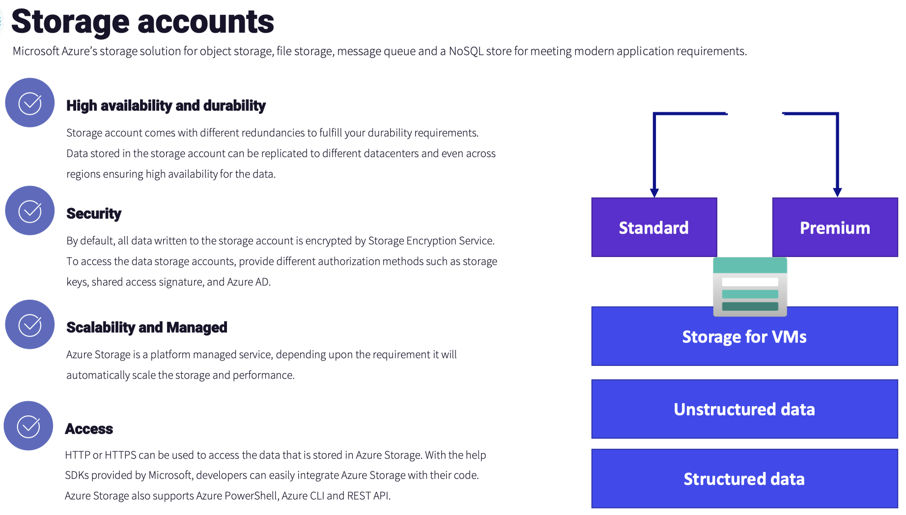

## Azure Storage Services
Five services are part of Azure Storage.

All these services can be consumed from a Standard general-purpose v2 (Standard GPv2) storage account, and some can be consumed individually as the Premium variations (such as Azure Files and Blob Storage), where more performance is required.

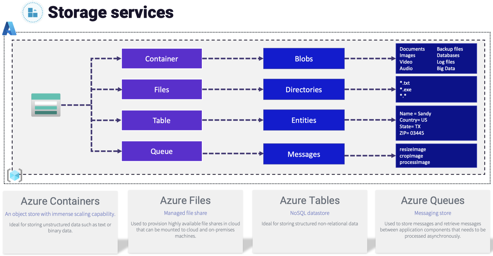

The following figure illustrates the different storage services associated with a storage account. It illustrates the storage accounts split by the various performance type categories with the storage account types contained within them. On the right of the figure, you can see a brief list of use cases for each storage service type:

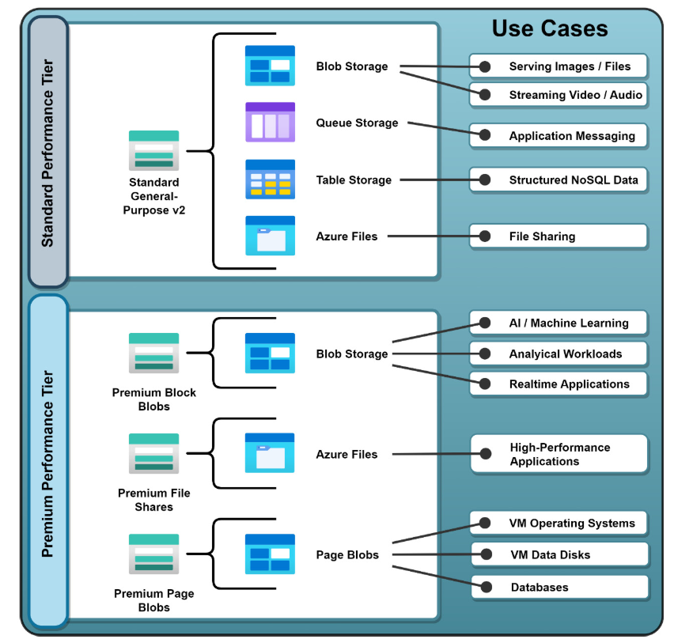

**Azure Blob Storage**
In some documentation, you will see that Azure Blob Storage is referred to as Azure Containers or Azure Container Storage.

Azure Blob Storage is the object storage service offered by Microsoft. This service is similar to the Amazon S3 service. You can leverage Azure Blob Storage to store unstructured data, such as videos, images, text, or binary data.

The following are some of the scenarios where you can use Azure Blob Storage:
- Serving images or documents for a website
- Storing binaries or executables for download
- Streaming video and audio
- Data backup and restore
- Disaster recovery
- Data archiving
- Data store for on-premises data that can be used by analytics solutions in Azure

**Azure Files**
Network file shares can be created using the Azure Files service, which can be accessed via the SMB protocol.

The key difference between Azure Files and an on-premises file share is that you can access the Azure Files share over HTTP or HTPS, and it can be mounted to any server that is connected to the Internet or VPN. The access is enabled via the URL that is pointing to the file share via the **shared access signature (SAS)**. 

Using the SAS, you can control access to the file share:
- In on-premises, you already have file shares; however, you need VPN or complex networking for the Azure VMs to access it. Using Azure Files, you can mount a common file share to both on-premises and Azure VMs.
- Migration from on-premises to Azure Files is easy.
- Azure Files is ideal for storing common files and installation packages that can be accessed from both VMs and on-premises servers.
- Crash dumps, application logs, metrics, and diagnostic logs can be written to file share.

**Azure Queues**
Messages can be stored and retrieved using queues. These stored messages can be up to 64 KB in size and can be accessed from anywhere in the world over HTTP or HTTPS. Queues are appropriate for storing lists of messages that need to be asynchronously processed.

Functions are small chunks of code that can be executed to achieve certain tasks like the one you read about earlier. Azure Functions is an example of serverless technology.

**Azure Tables**
Tables is a NoSQL datastore that is now part of Azure Cosmos DB. Table Storage is suitable for storing nonrelational structured data. Both tables and queues can be tested with application code only.

**Azure Disks**
Azure Disks provides persistent storage to Azure Virtual Machines, Azure Virtual Machine Scale Set, and the Azure VMware solution.

With these four performance tiers, Azure Disks acts as a high-performance durable storage for our applications. The performance tiers are `Standard HDD`, `Standard SSD`, `Premium SSD`, and `Ultra SSD`. These tiers have different IOPS values.

There are two types of disks: unmanaged and managed. 
- In managed disks, Azure takes care of the underlying storage account, and there will be one storage account per region that is used to store the virtual hard disk of our virtual machines. 
- In unmanaged disks, you must create the storage account to hold the virtual machine hard disk. Microsoft recommends that you always use managed disks for better availability.

## Storage Replication
Azure Storage replication will ensure that your data is copied and is protected from the aforementioned impacts. 

Before you start, the selection of replication strategy is a trade-off between the cost and durability.

The Standard GPv2 storage account is a Standard performance tier account. It supports several services as part of its construct: blobs, queues, tables, and file shares. This is the storage account type recommended for most scenarios due to its versatility in storage services and is the default option. It also supports several storage redundancy options: locally redundant storage (LRS), geo-redundant storage (GRS), read-access geo-redundant storage (RA-GRS), zone-redundant storage (ZRS), geo-zone-redundant storage (GZRS), and read-access geo-zone-redundant storage (RA-GZRS).

#### Locally Redundant Storage
Locally redundant storage (LRS) offers the least durability compared to other options you have. Since the durability is less, LRS offers the lowest cost.

Despite the limitations, there are certain scenarios where LRS can be the right candidate:
- If your data can be easily reconstructed in case of a data loss.
- Live feed, where the data constantly changes and there is no need to store data. All data written will be constantly changing.

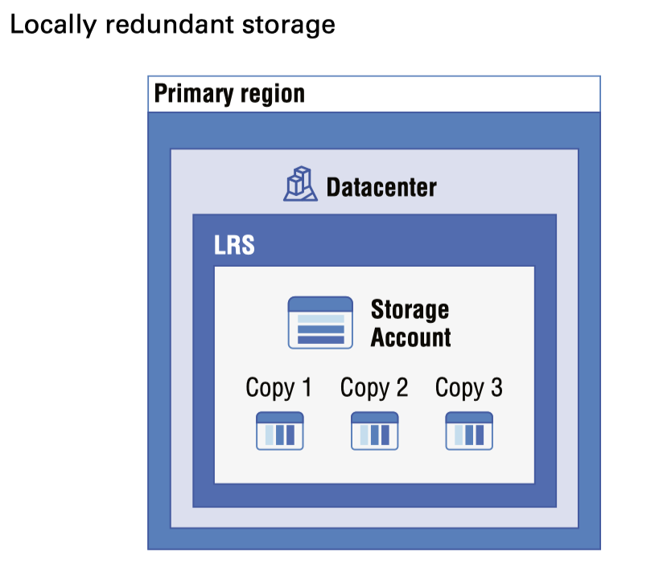

#### Zone Redundant Storage
In the case of zone redundant storage (ZRS), data is synchronously replicated across three storage clusters. These storage clusters are located in different availability zones.

The separation between these zones will overcome the datacenter failure issue that you saw in the case of LRS. Thus, enabling ZRS replication ensures that your data is accessible even if one zone is offline.

There are two downsides:
- ZRS is not available in all regions, however, Microsoft is continually adding more regions to the list.
- If an entire region comes down, ZRS cannot protect your data as all the zones hosting the storage cluster will be offline.

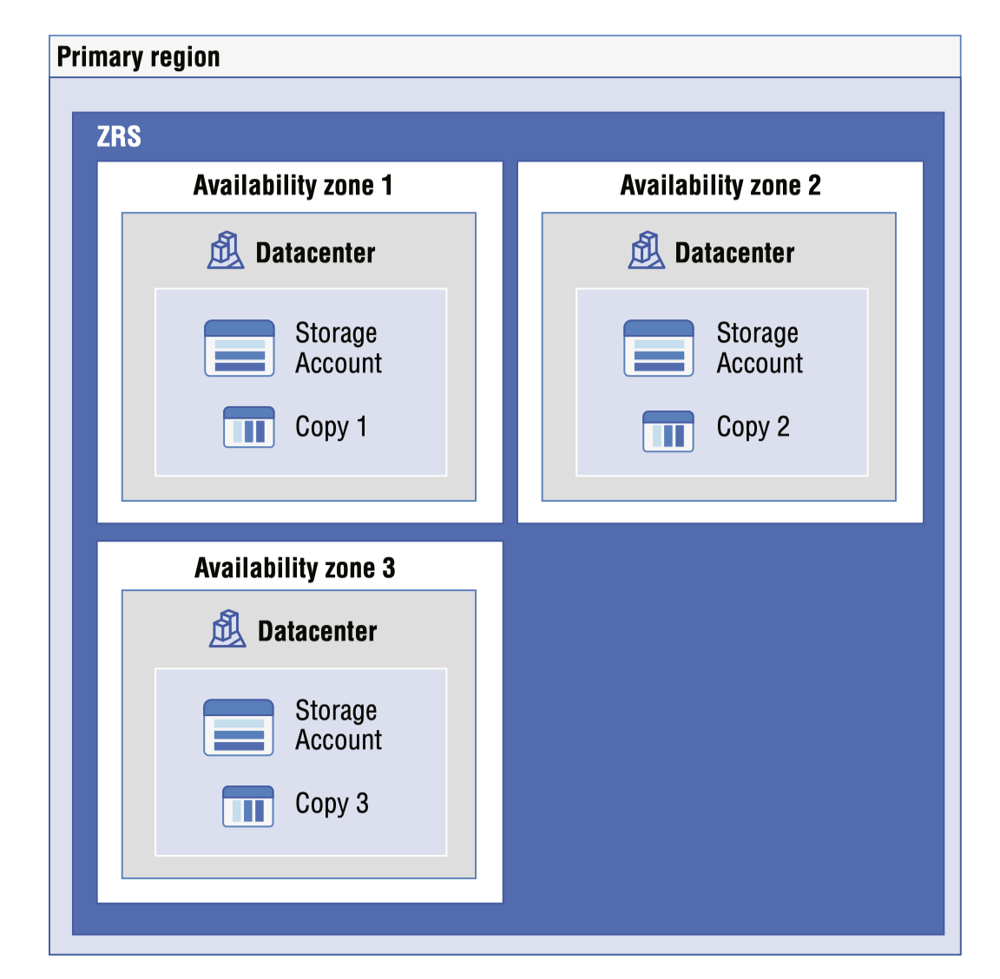

#### Geo redundant Storage
In geo redundant storage (GRS), your data is replicated to a secondary region. Ideally, the secondary region will be hundreds of miles away from the primary region. The secondary region is selected by Azure based on the regional pairs.

Cost-wise, GRS is more expensive than ZRS and LRS; with the increased cost comes more data durability. GRS offers a durability of 99.99999999999 percent (16 nine) over a given year.

GRS offers two variants:
- **GRS** This method replicates the data to the secondary region; however, the data in the secondary is not readable. The data can be read only if a failover is initiated to the secondary region. The failover can be initiated by the customer manually or by Microsoft in the case of a regional outage.
- **Read-Access Geo Redundant Storage (RA-GRS)** The key difference here is that you have the provision to read from the secondary region regardless of whether a failover is initiated. The secondary region is always available for read requests.

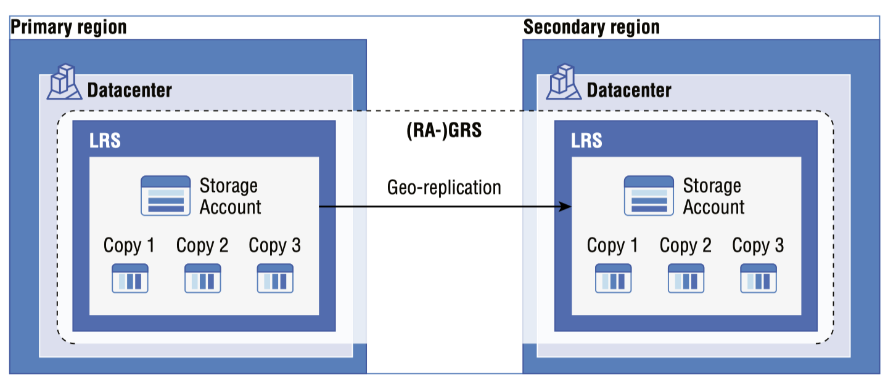

#### Geo-zone-Redundant Storage
In geo-zone-redundant storage (GZRS) data is replicated to the secondary region for protection against regional outages.

With GZRS, your data will be replicated synchronously across three different storage clusters within the same region. This data is then replicated to the secondary region asynchronously and then further replicated across three different storage clusters. The storage clusters are physically separated from the others and reside in their own availability zone.

As the data is distributed across the availability zones, GZRS offers the highest availability and protection from regional disasters. Applications that require maximum consistency, durability, availability, and performance should use GZRS.

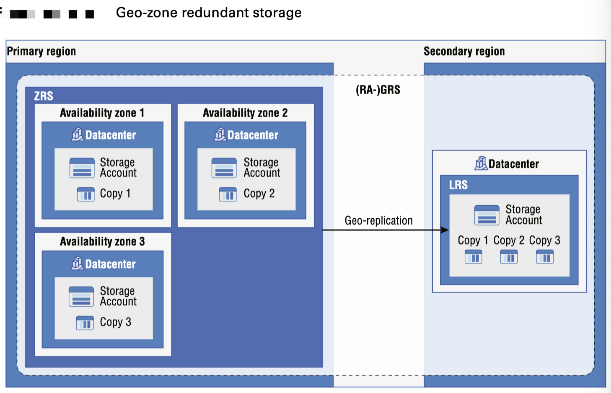

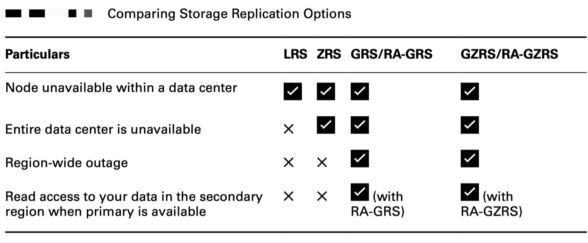

## Storage Account Types
The available tiers are Standard and Premium.

**Standard** Offers the lowest cost per gigabyte and is backed by magnetic drives (hard disk drives [HDDs]). Since you are using HDDs, the performance is lesser compared to Premium. Standard storage is ideal for storing data that is not frequently accessed.

**Premium** Offers low-latency performance and is backed by solid-state drives (SSD). It’s best for I/O-intensive applications.

Each type supports different features, replication options, and performance tiers and has its own pricing model. Despite the differences, Microsoft ensures that account types are encrypted using the `Storage Encryption Service (SSE)`.

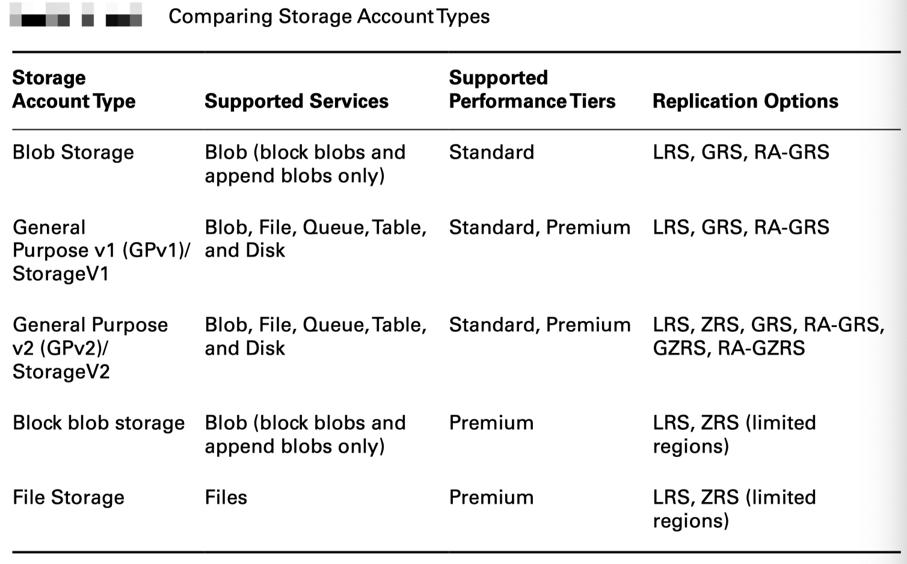

Microsoft recommends that you use `General Purpose v2 (GPv2)` accounts when possible. `General Purpose v1 (GPv1)` is the legacy account for storing blobs, files, queues, tables, and disks. `GPv2` offers more features and redundancy levels compared to `GPv1`.

## Storage Account Endpoints

The name for the storage account is unique across Azure. Each object stored in the storage account is represented using a unique URL. During the creation of the storage account, you need to pass the name of the storage account to the Azure Resource Manager.

#### Accessing Storage
The URL for each service is generated based on the storage account name and the service you want to access. 

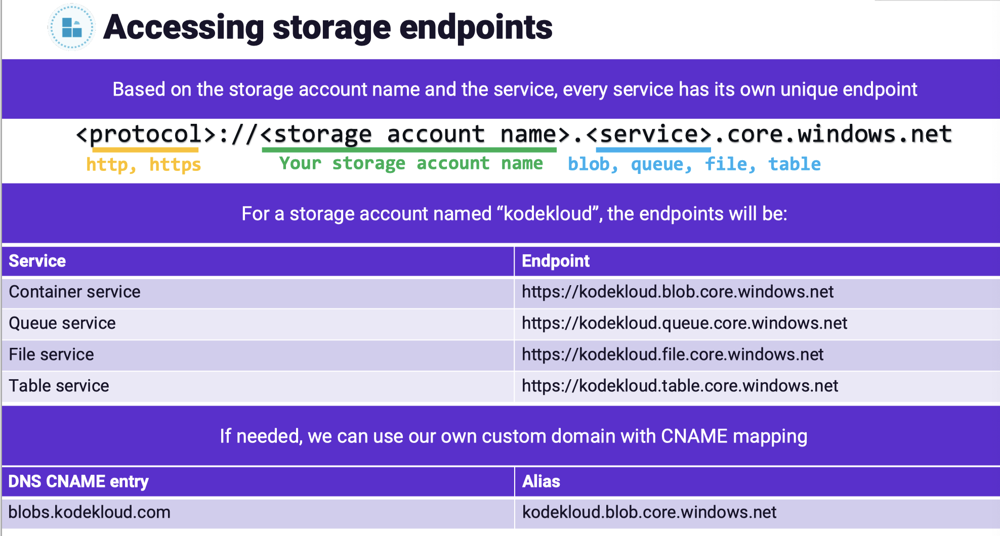

#### Custom Domain Configuration
Custom domains can be configured on Azure Storage account.

The default endpoint for blob storage is `<storage-account-name>.blob.core.windows.net`. You could map this endpoint to your custom domain like `storage.azuretales.com`. Whenever you need to connect to the blob endpoint, you can directly use the custom domain instead of using the default endpoint. There are two ways by which you can map our custom domain.

**1. Direct CNAME Mapping**
In direct CNAME mapping you will be creating a record in our custom domain that will point to the endpoint of the storage service.

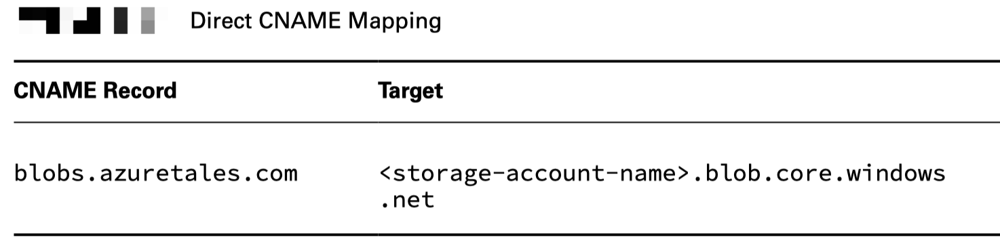

**2. Intermediary Mapping with asverify** A minor downtime will be there when you update a domain that is already in use with Azure. You eliminate this downtime by using the asverify subdomain.

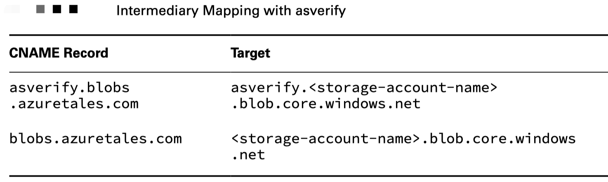

#### Securing Storage Endpoints
The default option is to allow access from all networks; however, you can restrict the access from networks. Using the storage firewall, you can restrict the access to a list of allowed networks.

## Azure Blob Storage
As Azure Blob Storage is for `unstructured data`, you can store any type of text or binary data. Blob storage is also referred to as `object storage`.

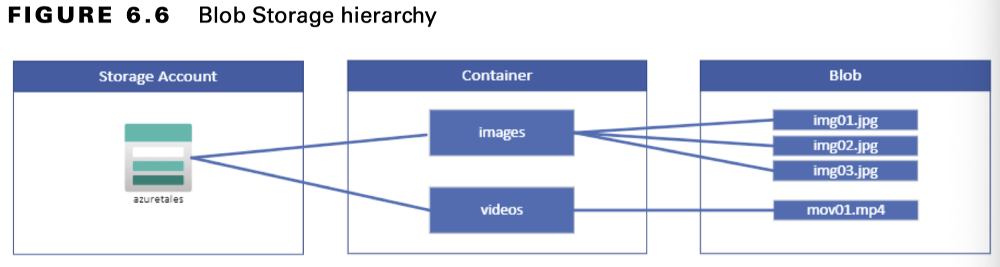

From the figure it’s evident Blob Storage comprises three resources.
- The storage account
- The container in the storage account
- Blobs or objects stored in the container

#### Blob Containers
When you create a container, you need to provide the public access level, which specifies whether you want to expose the data stored in the container publicly. By default, the contents are private.

However, you have the following options to control the visibility:

- **Private**: This is the default option; no anonymous access is allowed to containers and blobs.
- **Blob**: This will grant anonymous public read access to the blobs alone.
- **Container**: This will grant anonymous public read and list access to the container and all the blobs stored inside the container.

#### Blob Access Tiers
Based on the usage patterns, Azure provides different options for accessing the block blob data stored in Azure Blob Storage. The access tiers are defined based on the usage pattern or frequency of access.

Choosing the right access tier will help you optimize the cost of data storage and data access. The following are the access tiers offered by blob storage:
- **Hot** Optimized for frequent access of objects. From a cost perspective, accessing data in the Hot tier is the least expensive compared to the other tiers; however, the data storage costs are higher. When you create a new storage account, this is the default tier.
- **Cool** Optimized for storing data that is not accessed very frequently and is stored for at least 30 days. Storing data in the Cool tier is cheaper than the Hot tier; however, accessing data in the Cool tier is more expensive than Hot tier.
- **Archive** Optimized for storing data that can tolerate hours of retrieval latency and will remain in the Archive tier for at least 180 days. When it comes to storing data, the Archive tier is the most cost-effective tier; however, accessing data is more expensive than accessing data from the Hot or Cool tier.

One thing to note here is if you are setting up the access tier from the storage account level, you will have only two choices: **Hot** and **Cool**.

#### Blob Lifecycle Management

Blob lifecycle management is available for GPv2, Premium Block Blobs, and Blob Storage accounts.

Using lifecycle management, you can do the following:
- The access tier of the blobs can be transitioned automatically (Hot to Cool, Hot to Archive, or Cool to Archive).
- You can optimize costs.
- You can delete blobs after the end of the lifecycle.
- You can configure rules to run once every day at the storage account level.
- You can filter and apply rules to selected containers and blobs.

#### Uploading Blobs

Blobs are unstructured data that can be of any type or size. Azure Storage supports uploading three types of blobs: `block blobs`, `page blobs`, and `append blobs`. During the upload, you can specify the type of the blob.

- **Block Blobs (Default)** This is the default blob type. It is ideal for storing text and binary data such as images, videos, and files in Azure storage.

- **Append Blobs** Optimized for append operations, this is ideal for logging scenarios where the data is constantly appended to the storage.

- **Page Blobs** This is ideal for frequent read/write operations and can be up to 8 TB in size. Azure stores virtual machine OS disks and data disks in page blob format.

## Storage Security
The following are the security capabilities offered by Azure Storage:

- **Encryption** Azure encrypts all data written to Azure Storage automatically using the Storage Encryption Service. SSE is enabled on all new storage accounts and cannot be disabled.

- **Authentication** Azure Storage supports Azure AD–based authentication for Azure Blobs and Azure Queues. Using RBAC, you can control the access to the storage account.

- **Data in Transit** Client-side encryption, SMB, or HTTPS can be used to secure the data

- **Azure Disk Encryption** Using Azure Disk Encryption (ADE), you can encrypt OS disks and data disks of Windows and Linux virtual machines in Azure.

- **Shared Access Signatures (SAS)** You can control fine-grained access to data objects using SAS keys. Also, you can define time-bound access.

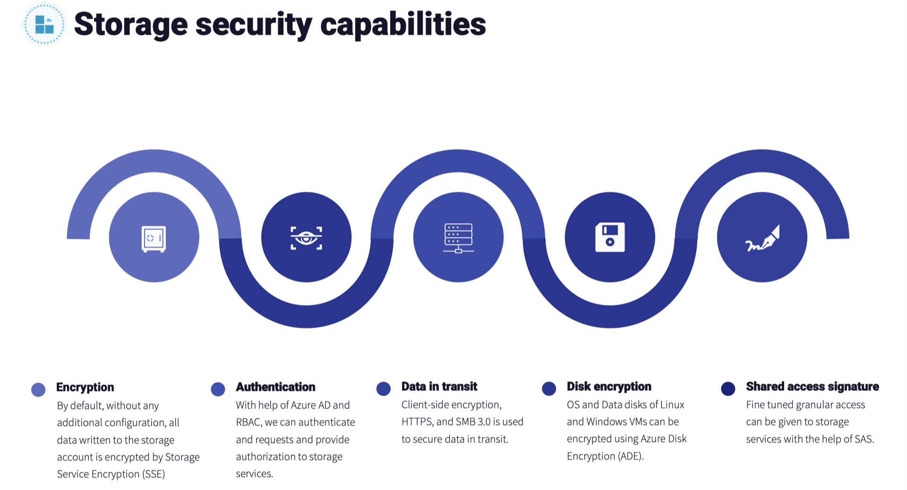

#### Storage security - Authorization

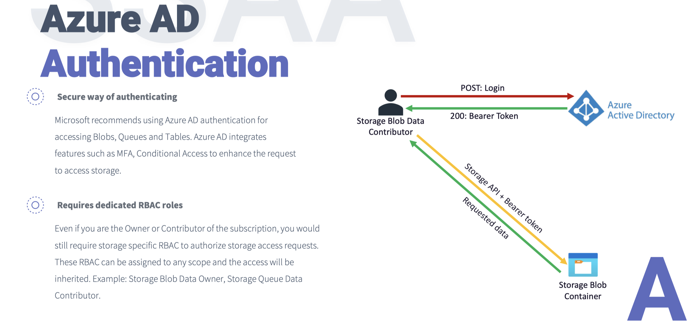

The following are the authorization options available to Azure Storage:

- **Azure AD** Using Azure AD, you can authorize access to Azure Storage via role-based access control (RBAC). With RBAC, you can assign fine-grained access to users, groups, or applications.

- **Shared Key** Every storage account has two keys: primary and secondary. The access keys of the storage account will be used in the Authorization header of the API calls.

- **Shared Access Signatures** Using SAS, you can limit access to services with specified permissions and over a specified timeframe.

- **Anonymous Access to Containers and Blobs** If you set the access level to blob or container, you can have public access to the objects without the need to pass keys or grant authorization. 

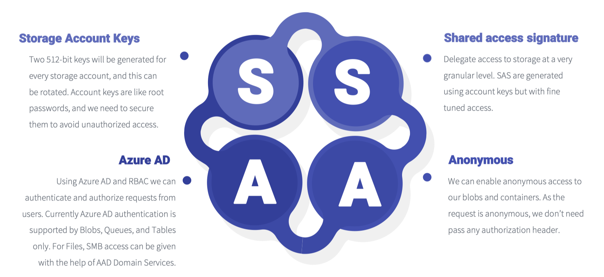

#### Shared Access Signatures
Every storage account has two keys, called the `access keys`. All these concerns are addressed by SAS.

SAS is a URI that is composed of various parameters by which you can restrict access to Azure Storage. With the help of SAS keys, you can grant access to specific services for a specific period of time. SAS reduces the chances of compromising your account keys and adheres to the principle of least privileges.

SAS empowers you with the ability to grant granular access to the objects or services. Using SAS, you can configure the following parameters:
- Control access at the service level.
- Set a time frame during which the SAS is valid. You can specify the start and end time.
- Set permissions like read, write, delete, etc.
- Set IP ranges from which the SAS keys can be accepted.
- Set the protocol: HTTP or HTTPS.

By the way, there are three types of SAS: account level, service level, and user delegation SAS. 
- **Account-level SAS** delegates have access to resources in one or more storage services like blob, table, queue, or file. 
- **Service-level SAS** delegates access a resource in a single storage service. 
- **User delegation SAS** is secured with Azure AD and can be used with Azure Blobs only.

#### Storage Service Encryption
Storage Service Encryption is the encryption provided by the Azure platform to encrypt data at rest. Any data before persisting it to Azure Blob, Azure Queues, Tables, Azure Files, or managed disks will be automatically encrypted by the Storage Service Encryption service.

Another key point here is that the SSE encryption, encryption at rest, decryption, and key management processes are totally transparent to the end users. Azure uses 256-bit AES encryption to encrypt the data before persisting to Azure Storage. This is one of the strongest block ciphers available.

## Azure Files and File Sync

#### Azure Files vs. Azure Blobs
- **Azure Files** This is ideal for applications that are using system APIs to share data between servers. Second, you want to store debugging and crash dumps that need to be accessed from multiple virtual machines.

- **Azure Blobs** This is ideal for video streaming scenarios. It’s a good choice for rendering images in static websites. You want to access the data from anywhere.

  - Azure Blobs uses a flat namespace that includes containers and objects. Azure Files uses directory objects as you have seen with our traditional file shares.
  - Azure Blobs is accessed via containers, and Azure Files is accessed through file shares.
  - Azure Blobs is accessed via an HTTP/HTTPS connection, and Azure Files is accessed via the SMB protocol when mounted to a virtual machine. NFS for Azure Files is available also and is in preview.
  - Azure Blobs doesn’t need to be mounted and can be accessed directly from any client that supports HTTP calls. Azure Files needs to be mounted to virtual machines before working with the data.

#### Managing File Shares
- **Active Directory** For setting up authentication using on-premises AD or Active Directory Domain Services.
- **Soft Delete** Enables you to retain the deleted shares for a specified period of time.
- **Maximum Capacity** The default value for this is 5 TB and can be increased to 100 TB.

There are four tiers offered by file shares:
- Transaction Optimized: This is the default option. It’s ideal for most scenarios where you need a file share as a data store.
- Premium: Premium file shares are backed up by SSDs, and this option will be available only if your storage account is a Premium storage account. 
- Hot: This is optimized for general-purpose file shares such Azure File Sync and team shares.
- Cool: This is ideal for archiving scenarios.

#### Mapping File Shares
Once you click the file share you create, at the top you’ll see an option called Connect.

#### File Share Snapshots
With file share snapshots, you can take a point-in-time, read-only copy of the contents of the file share. Though you can take a snapshot at the file share level, Azure provides retrieval at an individual file level.

You can use snapshots in the following scenarios:
- Protection Against Data Corruption and Application Errors
  - You can use file shares to store files, logs, and crash dumps. This means frequent read write operations will happen. Using snapshots, you can restore to a point in time.
- Accidental Deletions and Overwrite
  - In the last point, you saw application misconfiguration led to deletion and unintended changes. This may happen due to human errors, and accidental changes may happen. You can reverse these changes using snapshots.
- Backup Purposes
  - You can rely on snapshots as a backup. Using a backup, you can maintain different versions of files taken from different timestamps.

#### Azure File Sync
Azure File Share is a cloud-based file share that enables you to access the file share from any computer anywhere in the world.

The service offers versatility when it comes to connectivity, as it allows you to use any protocol that’s available on Windows Server to access your data locally, including Server Message Block (SMB), Network File System (NFS), and File Transfer Protocol over TLS (FTPS).

In simple words, you can synchronize the files you have on-premises with Azure File Share.

The following are the advantages of File Sync:
- Ease of Access
- No Need for Other Replication Methods
- Reduce On-Premises Footprint
- Backup and DR
- Archiving
- Easy to Add New Servers

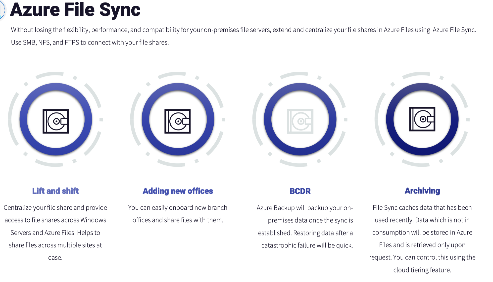

#### Components

**Storage Sync Services**
In File Sync, the Storage Sync service is the top-level resource you have in Azure. The Storage Sync service needs to be deployed in Azure as an independent resource and can be deployed to a resource group like a storage account.

**Sync Group**
Each sync group represents a set of files that you want to synchronize with the file share. The synchronization is done via cloud endpoints, and each group requires its own cloud endpoint to connect with the storage sync service. T

**Registered Server**
This actually represents your on-premises file server. The reason why it’s called registered is because it has a trust relationship established with the storage sync service.

**Azure File Sync Agent**
File Sync Agent will be installed on the on-premises servers that you want to transform to a cache for your Azure file share. The agent can be downloaded and installed on any Windows server. In File Sync Agent, you have three components:
- FileSyncSvc.exe
- StorageSync.sys
- PowerShell cmdlets

**Server Endpoint**
Server endpoints are folders that are residing on the registered server. As long as the namespaces of the server endpoints do not overlap, multiple server endpoints can exist in the same volume such as `D:\locationA` and `D:\locationB`. You can have separate tiering policies for each endpoint.

**Cloud Endpoint**
A file share that is part of a sync group is called a cloud endpoint. An Azure file share can be a member of a single cloud endpoint only.

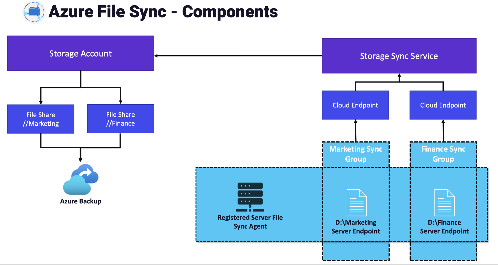

## Managing Storage

**Azure Storage Explorer**
Using Azure Storage Explorer, you can easily manage, upload, and download blobs, queues, tables, and files. Azure Storage Explorer can work with Azure Data Lake Storage and Azure managed disks. You can control the permissions, access, and tiers from the tool.

**AzCopy**
AzCopy is a next-generation command-line tool for copying data from or to Azure Blob and Azure Files. AzCopy is a utility that can be used for copying files to and from Azure Storage accounts through a command-line-based utility.

The AzCopy commands are structured in the following format: `azcopy [command] [source] [destination] [flags]`.

With AzCopy you can copy data in the following scenarios:
- Copy data from a local machine to Azure Blobs or Azure Files
- Copy data from Azure Blobs or Azure Files to a local machine
- Copy data between storage accounts

**Import/Export Service**

The following are some usage cases of the Import/Export service:
- Data migration to cloud: Data can be moved to Azure in a cost-effective and quick manner.
- Content sharing: Share data with customers quickly.
- Backup: Take a backup of your on-premises data and store it in Azure Blob Storage for recovery services.
- Recovery: Data stored in Azure Blob Storage can be moved to on-premises to recover the data.

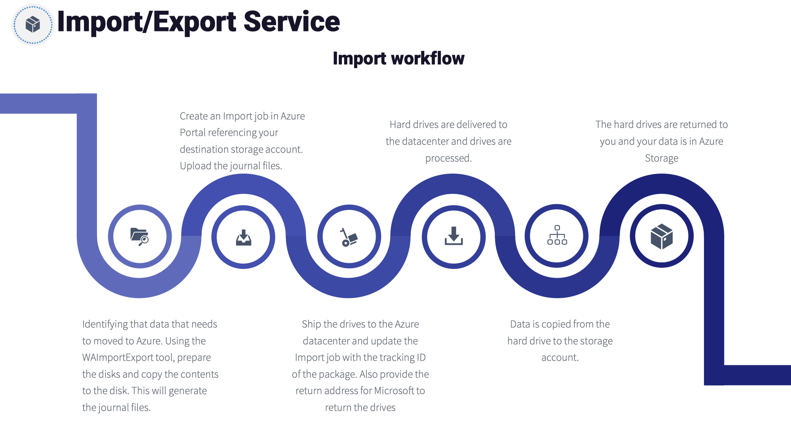

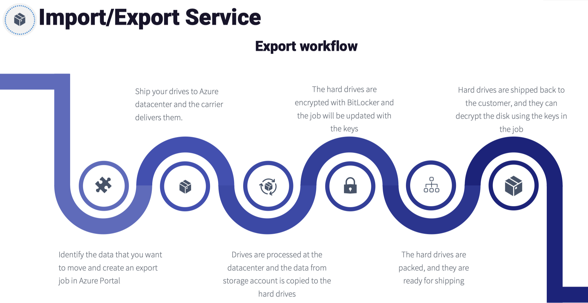

## Notes

#### Difference between Storage Encryption on Azure and Infrastructure Encryption
Azure provides the option to encrypt not only storage on Azure but also the infrastructure. It’s important to understand the differences between these, and it is always advised where possible to maintain the highest levels of security possible. Here, you will learn about encryption for the Azure platform and for storage:

- **Storage encryption on Azure**: This refers to encryption services provided by Azure to protect data stored within its storage services, such as Azure Blob Storage, Azure Files, and Azure Disks. Azure provides several encryption options, including server-side encryption (SSE) using service-managed keys, customer-managed keys (CMK), or customer-provided keys. Azure Storage uses SSE, which is encryption on the host layer of services within Azure and is used to automatically encrypt data when it is persisted to the cloud.
- **Infrastructure encryption**: Infrastructure encryption in Azure storage accounts is an enhanced security feature that offers customers an elevated level of data protection. When this feature is activated, data stored in a storage account undergoes two distinct encryption processes, one at the service level and another at the infrastructure level. This dual encryption approach employs two separate encryption algorithms and keys, ensuring that even in the event of a compromise of one encryption layer, the other layer continues to safeguard the data.

#### Different Encryption Types on a Storage Account
There are two types of encryption key management available for Azure Storage: Microsoft-managed keys (MMK) and customer-managed keys (CMK):
- **MMK**: By default, data in a new storage account is encrypted with MMK.
- **CMK**: Users who prefer to have more control over their encryption keys can opt for CMK.

## Working with SAS Tokens

SAS tokens are secure access tokens that provide delegated access to resources on your storage account. The storage service confirms the SAS token is valid in order to grant access.

#### Types of SAS
There are three types of SAS supported by Azure Storage:
- **User-delegated SAS**: This is a SAS token that is secured by Entra ID credentials.
- **Account SAS**: An account SAS is created and secured using a storage key. The permissions granted can span several services (blob, file, queue, and table), as well as accessing permissions for the chosen services.
- **Service SAS**: A service SAS is identical to an account SAS except that it is limited to a single service. There are limitations to some read, write, and delete operations for a service SAS that the account SAS has higher privileges to allow.

#### Forms of SAS
SAS tokens can take two forms, as detailed here:
- **Ad hoc SAS**: This SAS token is created as needed where permissions are chosen along with accessible services in alignment with the type of SAS used. The configuration is specified in the SAS URI. This is generally used for scenarios where quick access is required for a temporary period. SAS tokens cannot be managed after being issued. User-delegated SAS and account SAS can only be provisioned as an ad hoc SAS.
- **Service SAS with stored access policy**: This form of SAS token is more secure and enhances the functionality upon that which an ad hoc SAS token delivers. Service SAS tokens can be managed after being issued and are manufactured to comply with policies configured in the stored access policy. SAS tokens can be modified and deleted using a stored access policy.