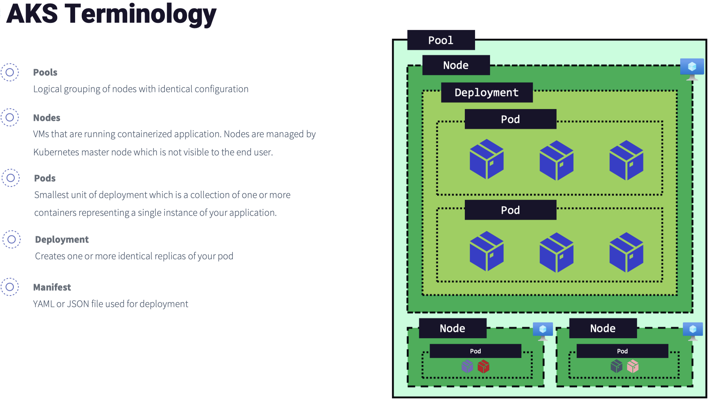
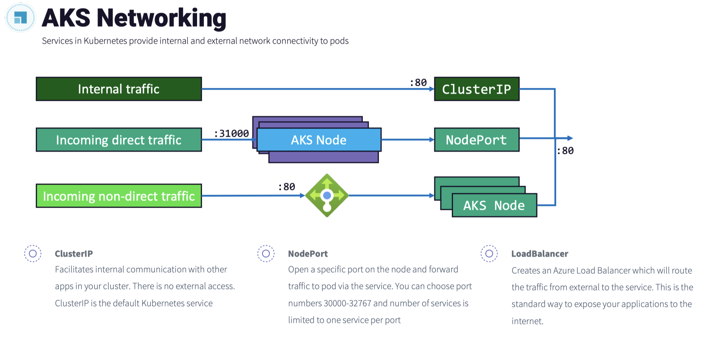
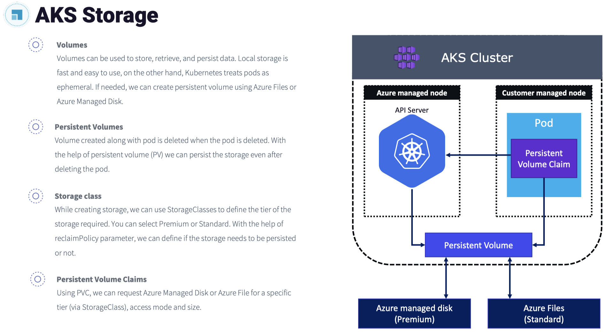
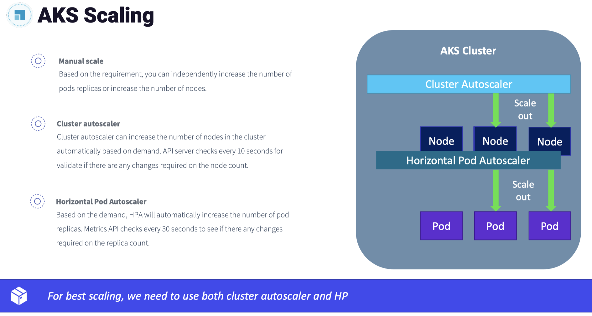
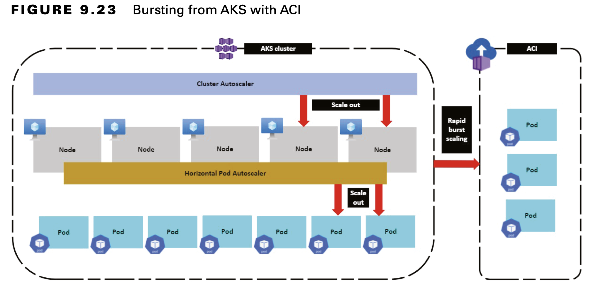

## Azure Kubernetes Service

Kubernetes is a platform that is very popular and is used for managing containers at scale.

AKS is a completely platform-managed cluster, and you can easily create Kubernetes clusters in Azure and deploy your applications. AKS offloads the complex management and configuration tasks to Azure so that developers and administrators can focus on the application deployment.

#### Networking
In Kubernetes, a `service` is responsible for providing different connectivity and load balancing options for the pods. Complex networking configuration can be applied using ingress controllers. Traffic filtering and security can be controlled using network policies. Services in Kubernetes group pods together and provide them with connectivity; there are different types of services available in Kubernetes.

- ClusterIP: Creates internal IP addresses for communication within the AKS cluster. This is ideal for internal communication between components. 

- NodePort: Creates a port mapping from a port in the node to port in the container. Users can access the component by navigating to `<Node IP>:<NodePort>`.

- LoadBalancer: Creates an internal/external Azure Load Balancer and adds the pods to the backend pool. External traffic is routed to the pods based on the load balancing rules.

- ExternalName: Maps the service to a DNS name.

#### Storage
When you run applications, you need to store and retrieve data. For certain applications, you don’t need the data to be persistent. However, in some other cases, you need to persist data and make sure that they are not deleted, even if the container is deleted. Storage is also needed to inject environmental variables and secrets into your pods.

The concepts are implemented in Kubernetes by declaring these in YAML files.

#### Scaling
When you run applications in AKS, you may need to increase or decrease the number of computer instances based on the demand. AKS offers several scaling mechanisms to accommodate the rapidly changing demands. AKS supports both manual and autoscaling options.

**Manually Scale Pods or Nodes**
To manually increase the number of replicas, you can update the manifest file, and the Kubernetes API will increase the number of replicas.

**Horizontal Pod Autoscaler**
In Kubernetes, you have the horizontal pod autoscaler (HPA) to increase the number of replicas based on metrics. By default, every 30 seconds, HPA will check the Metrics API to determine if there is any need to change the replica count.

Based on the output from the Metrics API, the demand is estimated, and the number of replicas is increased or decreased accordingly. AKS clusters with Metrics Server for Kubernetes 1.8+ supports HPA.

**Cluster Autoscaler**
HPA and cluster autoscalers are used to provide optimal scaling. When combined, HPA increases or decreases the number of pods per application demand, and the cluster autoscale will adjust the number of nodes accordingly to run the pods.

#### AKS Bursting
When you are using HPA for accommodating sudden application demand, HPA will increase the replica count. If the number of nodes is not enough to schedule these new pods, the cluster autoscaler will add more nodes. However, it may take a few minutes to bring the new nodes online and schedule the pending pods. Because of the faster startup time offered by Azure Container Instances (ACI), you can create a virtual node quickly. The virtual Kubelet component installed in the AKS cluster can abstract ACI as the node to the cluster. Kubernetes can then schedule pods that run as ACI instances through virtual nodes, not as pods on VM nodes directly in your AKS cluster.

