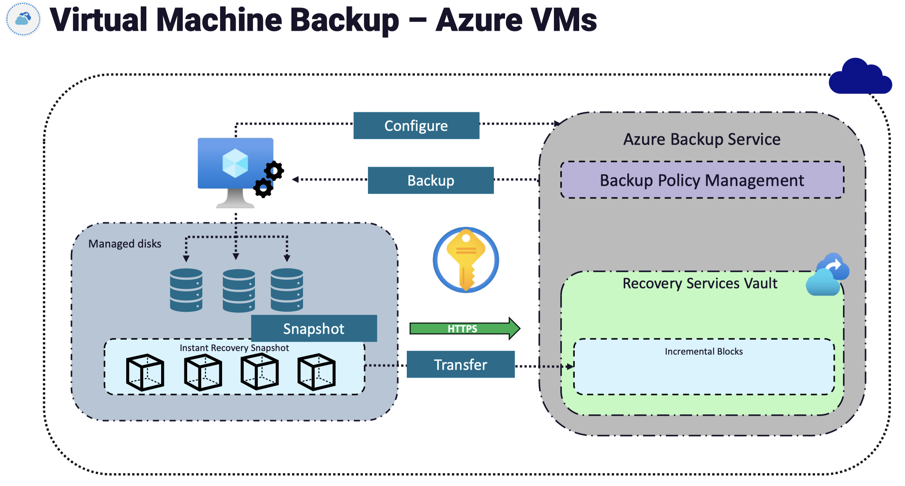
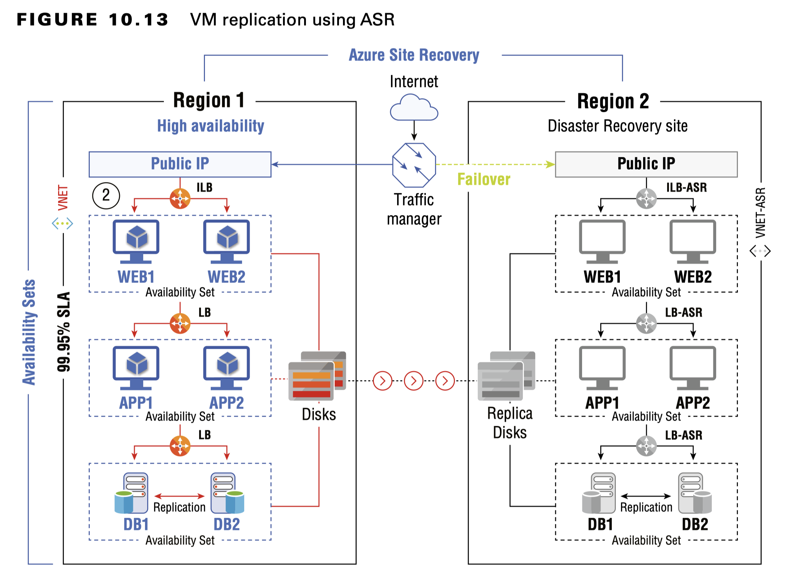

## Virtual Machine Data Protection

- Azure Backup 
  - To back up Azure VMs or servers, you rely on Azure Backup. You can create application-consistent backups for both Windows and Linux computers; then store them in the Recovery Services vault. During the restore process, you can restore the entire VM or specific files.

- Azure Site Recovery (ASR) 
  - Azure Site Recovery is a disaster recovery solution that can be used to replicate your VMs to a secondary region and fire them up during a regional outage. You can fail over from the Azure portal, and the infrastructure will be created in a secondary region within a few minutes.

- Snapshots 
  - Snapshots are independent read-only copies of the managed disk and can be used to create new managed disks.

- Images 
  - Images will contain the OS disk and all the data disks that were part of the VM. Using this custom image, you can create hundreds of VMs. There are two types of images: generalized and specialized.

#### Azure Backup
Azure Backup offers a reliable solution to back up virtual machines that are deployed in Azure and also on-premises servers with the help of MABS. The backed-up data will be stored in the Recovery Services vault.

#### Azure Site Recovery
Azure Site Recovery (ASR) is a business continuity and disaster recovery (BCDR) solution. You have availability sets and availability zones when you want to implement highly available architectures.

In the figure shows an architecture where a three-tier application is getting replicated to a secondary region. During a failover, the replica of the infrastructure will be created in the secondary region.

