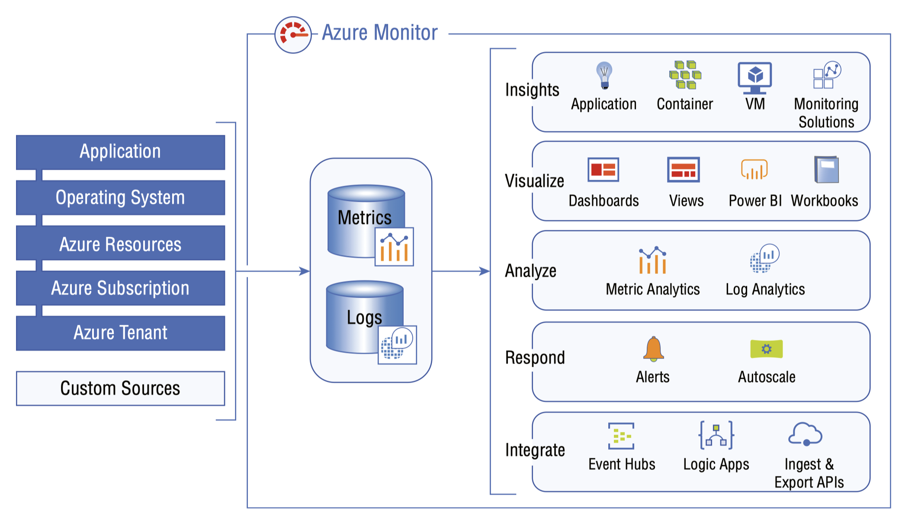

## Azure Monitor

Azure Monitor is the centralized solution for any monitoring requirements in Azure. It offers the following capabilities:

- Monitoring and Visualization 
  - In Azure Monitor, you have metrics. These are numerical values collected from Azure resources automatically without any user configuration to convey the state of the system. The state includes the health, operation, and performance of the system. These values can be monitored and plotted on a time axis in real time.

- Analyze and Query Logs 
  - Logs include various types of logging data from Azure subscriptions, tenants, platforms, and applications. This can be analyzed and queried in Azure Monitor.

- Alerts and Actions 
  - Alerting is crucial in any monitoring system, as you need to have a solution by which you will be able to notify the administrator proactively. With the help of actions, you will be able to automate corrective measures when a particular alert is triggered.

#### Metrics
Metrics are numerical values that are ingested from Azure resources used to represent the state of the system at a particular point in time.

#### Logs
Azure Log Analytics is responsible for storing the log data that you collect from different Azure resources. The stored data can be queried, analyzed, and filtered with the help of a rich query language called the Kusto Query Language (KQL).

#### Data Sources
- Application Monitoring Data 
  - With the help of Application Insights, you will be able to pull the logs from the application level regardless of which platform you are using. The advantage is that you will be able to analyze the issues that are happening at the application level.

- Guest OS Monitoring 
  - Operating system data on which the application is installed can be ingested into Azure Monitor. The scope collection can be expanded to VMs onpremises and other cloud providers as well.

- Resource Monitoring Data 
  - Any operation done on the resource will be logged and can be used for auditing purposes. This can be ingested with the help of diagnostic settings.

- Subscription Monitoring 
  - The activity log works at the subscription level. This pulls all the operations taking place at the subscription level.

- Tenant Monitoring Data 
  - Azure Active Directory–related logs can be ingested into Azure Monitor to log the tenant-level activities including sign-ins, conditional access, and MFA.