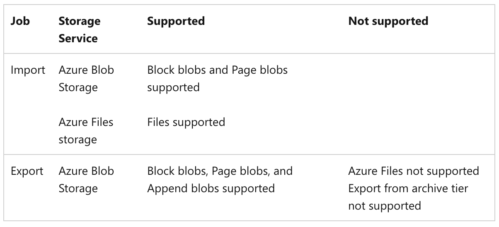

# List 

## Study guide
https://learn.microsoft.com/en-us/credentials/certifications/resources/study-guides/az-104

- **IP flow verify**
   - A Network Watcher feature that checks if traffic is allowed or denied to/from a virtual machine based on current network security group rules. 
   - https://learn.microsoft.com/en-us/azure/network-watcher/ip-flow-verify-overview
- **Azure Event Grid**
   - You can monitor and respond to specific events that happen in Azure resources or external resources by using Azure Event Grid and Azure Logic Apps. 
   - https://learn.microsoft.com/en-us/azure/event-grid/monitor-virtual-machine-changes-logic-app
- **Azure Multi-Factor Authentication**
   - To secure user sign-in events in Microsoft Entra ID, you can require Microsoft Entra multifactor authentication (MFA). The recommendation is to use conditional access policies that can then be targeted to groups of users, specific applications, or other conditions. 
   - https://learn.microsoft.com/en-us/entra/identity/authentication/howto-mfa-userstates
- **Migrate on-premises machines to Azure**
   - We recommend that you migrate machines to Azure using the Azure Migrate service. Azure Migrate is purpose-built for server migration. Azure Migrate provides a centralized hub for discovery, assessment, and migration of on-premises machines to Azure. 
   - https://learn.microsoft.com/en-us/azure/site-recovery/migrate-tutorial-on-premises-azure
- **Create and configure a Recovery Services vault**
   - A Recovery Services vault is a management entity that stores recovery points that are created over time, and it provides an interface to perform backup-related operations. 
   - https://learn.microsoft.com/en-us/azure/backup/backup-create-recovery-services-vault
- **Microsoft Entra  Fundamentals**
   - Microsoft Entra tenants come with an initial domain name like `domainname.onmicrosoft.com`. You can't change or delete the initial domain name, but you can add your organization's DNS name as a custom domain name and set it as primary. By adding your domain name, you can add user names that are familiar to your users, such as `alain@contoso.com`. 
   - https://learn.microsoft.com/en-us/entra/fundamentals/add-custom-domain
- **Microsoft Entra pass-through authentication**
   - Microsoft Entra pass-through authentication allows your users to sign in to both on-premises and cloud-based applications by using the same passwords. Pass-through Authentication signs users in by validating their passwords directly against on-premises Active Directory.
   - https://learn.microsoft.com/en-us/entra/identity/hybrid/connect/how-to-connect-pta-quick-start

- **IdFix tool**
  - IdFix is used to perform discovery and remediation of identity objects and their attributes in an on-premises Active Directory environment in preparation for migration to Azure Active Directory. IdFix is intended for the Active Directory administrators responsible for directory synchronization with Azure Active Directory.
  - https://learn.microsoft.com/en-us/troubleshoot/entra/entra-id/user-prov-sync/objects-dont-sync-ad-sync-tool
  - Run IdFix to check for duplicates, missing attributes, and rule violations: Use the IdFix DirSync Error Remediation Tool to find objects and errors that prevent synchronization to Microsoft Entra ID.

- **Microsoft Entra seamless single sign-on**
  - Microsoft Entra seamless single sign-on (Seamless SSO) automatically signs in users when they're using their corporate desktops that are connected to your corporate network. Seamless SSO provides your users with easy access to your cloud-based applications without using any other on-premises components.
  - https://learn.microsoft.com/en-us/entra/identity/hybrid/connect/how-to-connect-sso-quick-start

- **What is Azure Private DNS**
  - Azure Private DNS provides a reliable and secure DNS service for your virtual networks. Azure Private DNS manages and resolves domain names in the virtual network without the need to configure a custom DNS solution.
  - To resolve the records of a private DNS zone from your virtual network, you must link the virtual network with the zone. Linked virtual networks have full access and can resolve all DNS records published in the private zone.
  - Capabilities
    - Automatic registration of virtual machines from a virtual network that's linked to a private zone with autoregistration enabled.
    - Forward DNS resolution is supported across virtual networks that are linked to the private zone. 
    - Reverse DNS lookup is supported within the virtual-network scope. 
  - https://learn.microsoft.com/en-us/azure/dns/private-dns-overview

- **Back up a virtual machine in Azure**
  - You can protect your data by taking backups at regular intervals. Azure Backup creates recovery points that can be stored in geo-redundant recovery vaults. 
  - https://learn.microsoft.com/en-us/azure/backup/quick-backup-vm-portal

- **Databases architecture design**
  - https://learn.microsoft.com/en-us/azure/architecture/databases/
  
- **What is Azure Table storage?**
  - Azure Table storage is a service that stores non-relational structured data (also known as structured NoSQL data) in the cloud, providing a key/attribute store with a schemaless design.
  - You can use Table storage to store flexible datasets like user data for web applications, address books, device information, or other types of metadata your service requires.
  - https://learn.microsoft.com/en-us/azure/storage/tables/table-storage-overview

- **What is Azure role-based access control (Azure RBAC)?**
  - Here are some examples of what you can do with Azure RBAC:
    - Allow one user to manage virtual machines in a subscription and another user to manage virtual networks
    - Allow a DBA group to manage SQL databases in a subscription
    - Allow a user to manage all resources in a resource group, such as virtual machines, websites, and subnets
    - Allow an application to access all resources in a resource group
  - https://learn.microsoft.com/en-us/azure/role-based-access-control/overview

- **Secure access and data for workflows in Azure Logic Apps**
  - https://learn.microsoft.com/en-us/azure/logic-apps/logic-apps-securing-a-logic-app?tabs=azure-portal
  
  | Role | Description |
  |------|-------------|
  | Logic App Contributor | You can manage logic app workflows, but you can't change access to them. |
  | Logic App Operator | You can read, enable, and disable logic app workflows, but you can't edit or update them. |
  | Contributor | You have full access to manage all resources, but you can't assign roles in Azure RBAC, manage assignments in Azure Blueprints, or share image galleries. |

- **Azure built-in roles**
  - https://learn.microsoft.com/en-us/azure/role-based-access-control/built-in-roles
  
  | Role | Description |
  |------|-------------|
  | Contributor | Grants full access to manage all resources, but does not allow you to assign roles in Azure RBAC, manage assignments in Azure Blueprints, or share image galleries |
  | Owner | Grants full access to manage all resources, including the ability to assign roles in Azure RBAC. |
  | Role Based Access Control Administrator | Manage access to Azure resources by assigning roles using Azure RBAC. This role does not allow you to manage access using other ways, such as Azure Policy. |
  | User Access Administrator | Lets you manage user access to Azure resources. |

- **Create, change, or delete a network interface**
  - A network interface (NIC) enables an Azure virtual machine (VM) to communicate with internet, Azure, and on-premises resources.
  - A VM you create in the Azure portal has one NIC with default settings. You can create NICs with custom settings instead, and add one or more NICs to a VM when or after you create it. You can also change settings for an existing NIC.
  - https://learn.microsoft.com/en-us/azure/virtual-network/virtual-network-network-interface?tabs=azure-portal

- **Generate and export certificates for point-to-site using PowerShell**
  - Generate a client certificate: Each client computer that connects to a VNet using point-to-site must have a client certificate installed. You generate a client certificate from the self-signed root certificate, and then export and install the client certificate. If the client certificate isn't installed, authentication fails.
  - https://learn.microsoft.com/en-us/azure/vpn-gateway/vpn-gateway-certificates-point-to-site

- **Create a virtual machine with a static private IP address**
  - When you create a virtual machine (VM), it's automatically assigned a private IP address from a range that you specify. This IP address is based on the subnet in which the VM is deployed, and the VM keeps this address until the VM is deleted. Azure dynamically assigns the next available private IP address from the subnet you create a VM in. If you want to assign a specific IP address in this subnet for your VM, use a static IP address.
  - https://learn.microsoft.com/en-us/azure/virtual-network/ip-services/virtual-networks-static-private-ip?tabs=azureportal

- **Create, change, or delete a network security group**
  - https://learn.microsoft.com/en-us/azure/virtual-network/manage-network-security-group?tabs=network-security-group-portal

- **Create, Change, or Delete Azure Virtual Network Peering**
  - https://learn.microsoft.com/en-us/azure/virtual-network/virtual-network-manage-peering?tabs=peering-portal
  - A peering is established between two virtual networks. Peerings by themselves aren't transitive. If you create peerings between:
    - VirtualNetwork1 and VirtualNetwork2
    - VirtualNetwork2 and VirtualNetwork3
    1. There's no connectivity between VirtualNetwork1 and VirtualNetwork3 through VirtualNetwork2. If you want VirtualNetwork1 and VirtualNetwork3 to directly communicate, you have to create an explicit peering between VirtualNetwork1 and VirtualNetwork3, or go through an NVA in the Hub network.
  - You can't resolve names in peered virtual networks using default Azure name resolution. To resolve names in other virtual networks, you must use Azure Private DNS or a custom DNS server.
  - Resources in peered virtual networks in the same region can communicate with each other with the same latency as if they were within the same virtual network.
  - You can peer virtual networks in the same region, or different regions. Peering virtual networks in different regions is also referred to as Global Virtual Network Peering.
  - You can't move a virtual network while it's part of a peering. To move a virtual network to a different resource group or subscription, first delete the peering, then move the virtual network, and finally recreate the peering.
  - The virtual networks you peer must have nonoverlapping IP address spaces.
  - **Requirements and constraints**
    - You can peer virtual networks in the same region, or different regions. Peering virtual networks in different regions is also referred to as Global Virtual Network Peering.
    - You can't move a virtual network while it's part of a peering. To move a virtual network to a different resource group or subscription, first delete the peering, then move the virtual network, and finally recreate the peering.
    - A peering is established between two virtual networks. Peerings by themselves aren't transitive. If you create peerings between:
      - VirtualNetwork1 and VirtualNetwork2
      - VirtualNetwork2 and VirtualNetwork3
      There's no connectivity between VirtualNetwork1 and VirtualNetwork3 through VirtualNetwork2. If you want VirtualNetwork1 and VirtualNetwork3 to directly communicate, you have to create an explicit peering between VirtualNetwork1 and VirtualNetwork3, or go through an NVA in the Hub network. 
  - **Update the address space for a peered virtual network using the Azure portal**
    - https://learn.microsoft.com/en-us/azure/virtual-network/update-virtual-network-peering-address-space
  
- **Create an Azure DNS zone and record using the Azure portal**
  - https://learn.microsoft.com/en-us/azure/dns/dns-getstarted-portal

- **Configure Azure Storage firewalls and virtual networks**
  - Azure Storage provides a layered security model. This model enables you to control the level of access to your storage accounts that your applications and enterprise environments demand, based on the type and subset of networks or resources that you use.
  - The Azure Storage firewall provides access control for the public endpoint of your storage account. You can also use the firewall to block all access through the public endpoint when you're using private endpoints. Your firewall configuration also enables trusted Azure platform services to access the storage account.
  - You can grant access to Azure services that operate from within a virtual network by allowing traffic from the subnet that hosts the service instance. You can also enable a limited number of scenarios through the exceptions mechanism that this article describes. 
  - https://learn.microsoft.com/en-us/azure/storage/common/storage-network-security?tabs=azure-portal

- **Network security groups**
  - Security rules
    - 	A number between 100 and 4096. Rules are processed in priority order, with lower numbers processed before higher numbers, because lower numbers have higher priority. 
    - Azure default security rules are given the highest number with the lowest priority to ensure that custom rules are always processed first.
  - https://learn.microsoft.com/en-us/azure/virtual-network/network-security-groups-overview

- **Azure Load Balancer SKUs**
  - Azure Load Balancer has three stock-keeping units (SKUs) - Basic, Standard, and Gateway. Each SKU is catered towards a specific scenario and has differences in scale, features, and pricing.
  - Limitations:
    - A standalone virtual machine resource, availability set resource, or virtual machine scale set resource can reference one SKU, never both.
  - https://learn.microsoft.com/en-us/azure/load-balancer/skus

- **Import and export a DNS zone file using the Azure CLI**
  - A DNS zone file is a text file containing information about every Domain Name System (DNS) record in the zone.
  - Azure DNS supports importing and exporting zone files via the Azure CLI and the Azure portal.
  - Before you import a DNS zone file into Azure DNS, you need to obtain a copy of the zone file. The source of this file depends on where the DNS zone is hosted.

- **Standard load balancer diagnostics with metrics, alerts, and resource health**
  - Azure Load Balancer exposes the following diagnostic capabilities:
    - Multi-dimensional metrics and alerts: Provides multi-dimensional diagnostic capabilities through Azure Monitor for Azure Load Balancer configurations. You can monitor, manage, and troubleshoot your standard load balancer resources.
    - Resource health: The Resource Health status of your load balancer is available in the Resource health page under Monitor.
      - Azure Resource Health alerts can notify you in near real-time when the health state of your Load balancer resource changes. It's recommended that you set resource health alerts to notify you when your Load balancer resource is in a Degraded or Unavailable state.
  - https://learn.microsoft.com/en-us/azure/load-balancer/load-balancer-standard-diagnostics

- **Create a Log Analytics workspace**
  - A Log Analytics workspace is a data store into which you can collect any type of log data from all of your Azure and non-Azure resources and applications. We recommend that you send all log data to one Log Analytics workspace, unless you have specific business needs that require you to create multiple workspaces.
  - https://learn.microsoft.com/en-us/azure/azure-monitor/logs/quick-create-workspace?tabs=azure-portal

- **What is Azure Application Gateway?** 
  - Azure Application Gateway is a web traffic (OSI layer 7) load balancer that enables you to manage traffic to your web applications. Traditional load balancers operate at the transport layer (OSI layer 4 - TCP and UDP) and route traffic based on source IP address and port, to a destination IP address and port.
  - https://learn.microsoft.com/en-us/azure/application-gateway/overview

- **What is Azure Load Balancer?**
  - Load balancing refers to efficiently distributing incoming network traffic across a group of backend virtual machines (VMs) or virtual machine scale sets (VMSS).
  - Azure Load Balancer operates at layer 4 of the Open Systems Interconnection (OSI) model. It's the single point of contact for clients. 
  - A public load balancer can provide both inbound and outbound connectivity for the VMs inside your virtual network. For inbound traffic scenarios, Azure Load Balancer can load balance internet traffic to your VMs. For outbound traffic scenarios, the service can translate the VMs' private IP addresses to public IP addresses for any outbound connections that originate from your VMs.
  - An internal (or private) load balancer can provide inbound connectivity to your VMs in private network connectivity scenarios, such as accessing a load balancer frontend from an on-premises network in a hybrid scenario. Internal load balancers are used to load balance traffic inside a virtual network.

- **Assign Azure roles using the Azure portal**
  - Azure role-based access control (Azure RBAC) is the authorization system you use to manage access to Azure resources.
  - Access control (IAM) is the page that you typically use to assign roles to grant access to Azure resources.
  - https://learn.microsoft.com/en-us/azure/role-based-access-control/role-assignments-portal

- **Understand resource locking in Azure Blueprints**
  - Locking Mode applies to the blueprint assignment and it has three options: Don't Lock, Read Only, or Do Not Delete. The locking mode is configured during artifact deployment during a blueprint assignment. A different locking mode can be set by updating the blueprint assignment. Locking modes, however, can't be changed outside of Azure Blueprints.
  - https://learn.microsoft.com/en-us/azure/governance/blueprints/concepts/resource-locking

- **What is Azure Web Application Firewall on Azure Application Gateway?**
  - The Azure Web Application Firewall (WAF) on Azure Application Gateway actively safeguards your web applications against common exploits and vulnerabilities. As web applications become more frequent targets for malicious attacks, these attacks often exploit well-known vulnerabilities such as SQL injection and cross-site scripting.
  - Application Gateway operates as an application delivery controller (ADC). It offers Transport Layer Security (TLS), previously known as Secure Sockets Layer (SSL), termination, cookie-based session affinity, round-robin load distribution, content-based routing, ability to host multiple websites, and security enhancements.
  - **WAF policy and rules**
    - To enable a Web Application Firewall on Application Gateway, you must create a WAF policy. This policy is where all of the managed rules, custom rules, exclusions, and other customizations such as file upload limit exist.
  - **Features**
    - SQL injection protection.
    - Cross-site scripting protection.
    - Protection against other common web attacks, such as command injection, HTTP request smuggling, HTTP response splitting, and remote file inclusion.
    - Protection against HTTP protocol violations.

    
- **Add your custom domain name to your tenant**
  - After you add your custom domain name, you must return to your domain registrar and add the DNS information from your copied from the previous step. Creating this TXT or MX record for your domain verifies ownership of your domain name.
  - Go back to your domain registrar and create a new TXT or MX record for your domain based on your copied DNS information. Set the time to live (TTL) to 3600 seconds (60 minutes), and then save the record.
  - https://learn.microsoft.com/en-us/entra/fundamentals/add-custom-domain

- **Create DNS records in a custom domain for a web app**
  - You can configure Azure DNS to host a custom domain for your web apps. For example, you can create an Azure web app and have your users access it using either www.contoso.com or contoso.com as a fully qualified domain name (FQDN).
  - https://learn.microsoft.com/en-us/azure/dns/dns-web-sites-custom-domain
  - **To do this, create three records:**
    - A root "A" record pointing to contoso.com
    - A root "TXT" record for verification
    - A "CNAME" record for the www name that points to the A record

- **Lock your Azure resources to protect your infrastructure**
  - https://learn.microsoft.com/en-gb/azure/azure-resource-manager/management/lock-resources?tabs=json
  - As an administrator, you can lock an Azure subscription, resource group, or resource to protect them from accidental user deletions and modifications. The lock overrides any user permissions.
  - **To create or delete management locks,** 
    - you need access to `Microsoft.Authorization/*` or `Microsoft.Authorization/locks/*` actions. 
    - Users assigned to the `Owner` and the `User Access Administrator` roles have the required access.

- **What is a device identity?**
  - A device identity is an object in Microsoft Entra ID. This device object is similar to users, groups, or applications. 
  - https://learn.microsoft.com/en-us/entra/identity/devices/overview

- **Back up Azure Files**
  - Azure Files backup is a native cloud solution that protects your data and eliminates on-premises maintenance overheads. Azure Backup seamlessly integrates with Azure File Sync, centralizing your file share data and backups.
  - https://learn.microsoft.com/en-us/azure/backup/backup-azure-files?tabs=recovery-services-vault
  - Azure Backup supports configuring snapshot and vaulted backups for Azure Files in your storage accounts. You can:
    - Define backup schedules and retention settings.
    - Store backup data in the Recovery Service vault, retaining it for up to 10 years.

- **Get started with AzCopy**
  - AzCopy is a command-line utility that you can use to copy blobs or files to or from a storage account.
  - Use cases for AzCopy
    - Copying data from an on-premises source to an Azure storage account
    - Copying data from an Azure storage account to an on-premises source
    - Copying data from one storage account to another storage account
  - https://learn.microsoft.com/en-us/azure/storage/common/storage-use-azcopy-v10?tabs=dnf

- **Recover files from Azure virtual machine backup**
  - Azure Backup provides the capability to restore Azure virtual machines (VMs) and disks from Azure VM backups, also known as recovery points. 
  - Restoring files and folders is available only for Azure VMs deployed using the Resource Manager model and protected to a Recovery Services vault.
  - https://learn.microsoft.com/en-us/azure/backup/backup-azure-restore-files-from-vm

- **Monitor virtual machines with Azure Monitor**
  - VM insights is a feature in Azure Monitor that allows you to quickly get started monitoring your virtual machines.
  - https://learn.microsoft.com/en-us/azure/azure-monitor/vm/monitor-virtual-machine

- **Action groups**
  - When Azure Monitor data indicates that there might be a problem with your infrastructure or application, an alert is triggered. You can use an action group to send a notification such as a voice call, SMS, push, or email when the alert is triggered in addition to the alert itself.
  - Action groups are a collection of notification preferences and actions.
  - Each action is made up of:
    - Type: The sent notification or performed action. Examples include sending a voice call, SMS, or email. You can also trigger various types of automated actions.
    - Name: A unique identifier within the action group.
    - Details: The corresponding details that vary by type.
  - https://learn.microsoft.com/en-us/azure/azure-monitor/alerts/action-groups

- **Set up disaster recovery to a secondary Azure region for an Azure VM**
  - Azure Site Recovery can orchestrate disaster recovery to a secondary region for your Azure VMs.The Azure Site Recovery service contributes to your business continuity and disaster recovery (BCDR) strategy by keeping your business applications online during planned and unplanned outages. Site Recovery manages and orchestrates disaster recovery of on-premises machines and Azure virtual machines (VM), including replication, failover, and recovery.
  - https://learn.microsoft.com/en-us/azure/site-recovery/azure-to-azure-quickstart

- **Availability options for Azure Virtual Machines**
  - Availability zones expands the level of control you have to maintain the availability of the applications and data on your VMs. An Availability Zone is a physically separate zone, within an Azure region. There are three Availability Zones per supported Azure region.
  - Azure Site Recovery
    - Azure VMs replicating between Azure regions.
    - On-premises VMs, Azure Stack VMs, and physical servers.
  - https://learn.microsoft.com/en-us/azure/virtual-machines/availability

- **Configure Azure CNI networking in Azure Kubernetes Service (AKS)**
  - Azure CNI is a networking plugin that provides network isolation and connectivity between pods and services in AKS.
  - https://learn.microsoft.com/en-us/azure/aks/configure-azure-cni?tabs=configure-networking-portal

- **Scale up an app in Azure App Service**
  - Scale up: Get more CPU, memory, or disk space, or extra features like dedicated virtual machines (VMs), custom domains and certificates, staging slots, autoscaling, and more. You scale up by changing the pricing tier of the App Service plan that your app belongs to.
  - Scale out: Increase the number of VM instances that run your app. Basic, Standard, and Premium service plans scale out to as many as 3, 10, and 30 instances, respectively. App Service Environments in the Isolated tier further increase your scale-out count to 100 instances.
  - https://learn.microsoft.com/en-us/azure/app-service/manage-scale-up

- **Start using Privileged Identity Management**
  - Use Privileged Identity Management (PIM) to manage, control, and monitor access within your Microsoft Entra organization. 
  - To use Privileged Identity Management, you must have a Microsoft Entra ID P2 or Microsoft Entra ID Governance license.
  - https://learn.microsoft.com/en-us/entra/id-governance/privileged-identity-management/pim-getting-started

- **Overview of autoscale in Azure**
  - Autoscale is a service that you can use to automatically add and remove resources according to the load on your application.
  - https://learn.microsoft.com/en-us/azure/azure-monitor/autoscale/autoscale-overview
  - **Best practices for autoscale**
    - Ensure the maximum and minimum values are different and have an adequate margin between them
    - Always use a scale-out and scale-in rule combination that performs an increase and decrease

- **Deploy Azure File Sync**
  - Use Azure File Sync to centralize your organization's file shares in Azure Files, while keeping the flexibility, performance, and compatibility of an on-premises file server. 
  - Azure File Sync transforms Windows Server into a quick cache of your Azure file share. 
  - You can use any protocol that's available on Windows Server to access your data locally, including SMB, NFS, and FTPS.
  - https://learn.microsoft.com/en-us/azure/storage/file-sync/file-sync-deployment-guide?tabs=azure-portal%2Cproactive-portal

- **Use private endpoints for Azure Storage**
  - You can use private endpoints for your Azure Storage accounts to allow clients on a virtual network (VNet) to securely access data over a Private Link. The private endpoint uses a separate IP address from the VNet address space for each storage account service. 
  - Network traffic between the clients on the VNet and the storage account traverses over the VNet and a private link on the Microsoft backbone network, eliminating exposure from the public internet.
  - https://learn.microsoft.com/en-us/azure/storage/common/storage-private-endpoints

- **Transfer data to Azure Files with Azure Import/Export**
  - Modify the dataset.csv file in the root folder where the tool is.
  - Modify the driveset.csv file in the root folder where the tool is.
  - https://learn.microsoft.com/en-us/azure/import-export/storage-import-export-data-to-files?tabs=azure-portal-preview

- **Creating New Storage Containers**
  - First, define the endpoint URL. In this example, the containers will be created in a storage account called storageaccount1207 creating two endpoint URLs:
    - `https://storageaccount1207.blob.core.windows.net/container1`
    - `https://storageaccount1207.blob.core.windows.net/container2`
  - Now that you know the endpoint URLs, use the azcopy make command passing each endpoint URL as a parameter as shown below.
  - https://learn.microsoft.com/en-us/azure/storage/blobs/storage-quickstart-blobs-portal?tabs=azure-portal

- **Copying Files to/from Azure Containers**
  - Using OAuth Authentication
  - When using AzCopy to copy files to blobs, you have a couple of options for authentication. Since it is presumed you’ve already authenticated to Azure Storage (since it was in the prerequisites), you can simply run azcopy copy specifying a local file path followed by a container endpoint URL

- **Cloud tiering overview**
  - Cloud tiering, an optional feature of Azure File Sync, decreases the amount of local storage required while keeping the performance of an on-premises file server.
  - When enabled, this feature stores only frequently accessed (hot) files on your local server. Infrequently accessed (cool) files are split into namespace (file and folder structure) and file content. The namespace is stored locally and the file content stored in an Azure file share in the cloud.
  - https://learn.microsoft.com/en-us/azure/storage/file-sync/file-sync-cloud-tiering-overview

- **What is Azure Import/Export service?**
  - Azure Import/Export service is used to securely import large amounts of data to Azure Blob storage and Azure Files by shipping disk drives to an Azure datacenter. 
  - Azure Import/Export use cases
    - Data migration to the cloud: Move large amounts of data to Azure quickly and cost effectively.
    - Content distribution: Quickly send data to your customer sites.
    - Backup: Take backups of your on-premises data to store in Azure Storage.
    - Data recovery: Recover large amount of data stored in storage and have it delivered to your on-premises location.
  - https://learn.microsoft.com/en-us/azure/import-export/storage-import-export-service

- **Create and manage budgets**
  - Cost and usage data is typically available within 8-24 hours and budgets are evaluated against these costs every 24 hours.
  - If you have a new subscription, you can't immediately create a budget or use other Cost Management features. It might take up to 48 hours before you can use all Cost Management features.
  - https://learn.microsoft.com/en-gb/azure/cost-management-billing/costs/tutorial-acm-create-budgets?tabs=psbudget

- **Planning for an Azure File Sync deployment**
  - Azure File Sync is a service that allows you to cache several Azure file shares on an on-premises Windows Server or cloud VM.
  - https://learn.microsoft.com/en-us/azure/storage/file-sync/file-sync-planning

- **Configure Azure Backup reports**
  - Azure Backup provides a reporting solution that uses Azure Monitor logs and Azure workbooks. 
  - Create a Log Analytics workspace or use an existing one
    - Set up one or more Log Analytics workspaces to store your Backup reporting data. 
    - The location and subscription where this **Log Analytics workspace can be created is independent of the location and subscription where your vaults exist.**
    - By default, the data in a Log Analytics workspace is retained for 30 days. 
  - https://learn.microsoft.com/en-us/azure/backup/configure-reports?tabs=recovery-services-vaults

- **Azure Import/Export system requirements**
  - Supported storage types
    
  - https://learn.microsoft.com/en-us/azure/import-export/storage-import-export-requirements
  

- **Azure Monitor Agent overview**
  - The Azure Monitor Agent collects monitoring data from the guest operating system of Azure and hybrid virtual machines (VMs). 
  - It delivers the data to Azure Monitor for use by features, insights, and other services, such as Microsoft Sentinel and Microsoft Defender for Cloud. 
  - https://learn.microsoft.com/en-us/azure/azure-monitor/agents/azure-monitor-agent-overview

- **Get started with Azure Automation State Configuration**
  - https://learn.microsoft.com/en-us/azure/automation/automation-dsc-getting-started

- **Create an internal load balancer to load balance VMs using the Azure portal**
  - During the creation of the load balancer, you configure:
    - Frontend IP address
    - Backend pool
    - Inbound load-balancing rules
  - https://learn.microsoft.com/en-us/azure/load-balancer/quickstart-load-balancer-standard-internal-portal

- **Configure Microsoft Entra multifactor authentication settings**
  - Report suspicious activity is integrated with Microsoft Entra ID Protection for risk-driven remediation, reporting, and least-privileged administration.
  - MFA service settings
    - Settings for app passwords, trusted IPs, verification options, and remembering multifactor authentication on trusted devices are available in the service settings. 

- **Administer DNS and create conditional forwarders in a Microsoft Entra Domain Services managed domain**
  - https://learn.microsoft.com/en-us/entra/identity/domain-services/manage-dns
  - Create conditional forwarders
    - A conditional forwarder is a configuration option in a DNS server that lets you define a DNS domain, such as contoso.com, to forward queries to. 
    - Instead of the local DNS server trying to resolve queries for records in that domain, DNS queries are forwarded to the configured DNS for that domain. This configuration makes sure that the correct DNS records are returned, as you don't create a local a DNS zone with duplicate records in the managed domain to reflect those resources.

- **How objects and credentials are synchronized in a Microsoft Entra Domain Services managed domain**
  - Synchronization from on-premises AD DS to Microsoft Entra ID and Domain Services
  - https://learn.microsoft.com/en-us/entra/identity/domain-services/synchronizationhttps://learn.microsoft.com/en-us/entra/identity/domain-services/synchronization

- **Create an access review of groups and applications in Microsoft Entra ID**
  - To reduce the risk associated with stale access assignments, administrators can use Microsoft Entra ID to create access reviews for group members or application access.
  - https://learn.microsoft.com/en-us/entra/id-governance/perform-access-review

- **Assign policy definitions for tag compliance**
  - Use Azure Policy to enforce tagging rules and conventions. 
  - By creating a policy, you avoid the scenario of resources being deployed to your subscription that don't have the expected tags for your organization.
  - https://learn.microsoft.com/en-us/azure/azure-resource-manager/management/tag-policies

- **IT Service Management integration**
  - Azure Monitor provides a bidirectional connection between Azure and ITSM tools to help you resolve issues faster. You can create work items in your ITSM tool based on your Azure metric alerts, activity log alerts, and log search alerts.
  - Azure Monitor supports connections with the following ITSM tools:
    - ServiceNow ITSM or IT Operations Management (ITOM)
    - BMC
  - https://learn.microsoft.com/en-us/azure/azure-monitor/alerts/itsmc-overview

- **Grant limited access to Azure Storage resources using shared access signatures**
  - https://learn.microsoft.com/en-us/azure/storage/common/storage-sas-overview
  - A shared access signature (SAS) provides secure delegated access to resources in your storage account. With a SAS, you have granular control over how a client can access your data. For example:
    - What resources the client may access.
    - What permissions they have to those resources.
    - How long the SAS is valid.

- **Azure Storage redundancy**
  - https://learn.microsoft.com/en-us/azure/storage/common/storage-redundancy
  - Redundancy in the primary region
    - Locally redundant storage (LRS) replicates your data three times within a single physical location (datacenter) in the primary region. It does not replicate across availability zones.
    - Zone-redundant storage (ZRS) copies your data synchronously across three Azure availability zones in the primary region. For applications requiring high availability, Microsoft recommends using ZRS in the primary region, and also replicating to a secondary region.
  - Redundancy in a secondary region
    - Geo-redundant storage (GRS) copies your data synchronously three times within one or more Azure availability zones in the primary region using LRS.
    - Geo-zone-redundant storage (GZRS) copies your data synchronously across three Azure availability zones in the primary region using ZRS.

- **Authorize access to blobs and files with AzCopy and Microsoft Entra ID**
  - https://learn.microsoft.com/en-us/azure/storage/common/storage-use-azcopy-authorize-azure-active-directory
  
- **Send Azure Monitor Activity log data**
  - The Azure Monitor Activity Log is a platform log that provides insight into subscription-level events.
  - Create a diagnostic setting to send the Activity Log to one or more of these locations:
    - Log Analytics workspace for more complex querying and alerting
    - Azure Event Hubs to forwarding logs outside of Azure.
    - Azure Storage for cheaper, long-term archiving.
  - https://learn.microsoft.com/en-us/azure/azure-monitor/platform/activity-log?tabs=powershell

- **Monitor a Linux virtual machine in Azure**
  - Enable boot diagnostics on a VM
  - View boot diagnostics
  - View VM host metrics
  - Enable Azure Monitor for VMs
  - View VM performance metrics
  - Create an alert
  - https://learn.microsoft.com/en-us/previous-versions/azure/virtual-machines/linux/tutorial-monitor

- **Automatic Extension Upgrade for virtual machines and scale sets in Azure**
  - https://learn.microsoft.com/en-us/azure/virtual-machines/automatic-extension-upgrade?tabs=RestAPI1%2CRestAPI2
  - Automatic Extension Upgrade has the following features:
    - Azure VMs and virtual machine scale sets are supported.
    - Upgrades are applied in an availability-first deployment model.
    - For a virtual machine scale set, no more than 20% of the scale set VM upgrades are in a single batch. The minimum batch size is one VM.
    - All VM sizes and both Windows and Linux extensions are compatible.
    - Automatic upgrades are optional at any time.
    - Virtual machine scale sets of any size are enabled.
    - Each supported extension is enrolled individually. You can choose which extensions to upgrade automatically.
    - All public cloud regions are supported.

- **Set up staging environments in Azure App Service**
  - Deploying your application to a nonproduction slot has the following benefits:
    - You can validate app changes before you swap the slot into production.
  - https://learn.microsoft.com/en-us/azure/app-service/deploy-staging-slots?tabs=portal

- **Monitor network communication between two virtual machines using the Azure portal**
  - https://learn.microsoft.com/en-us/azure/network-watcher/monitor-vm-communication

- **Connection monitor overview**
  - Use cases
    - Your front-end web server virtual machine (VM) communicates with a database server VM in a multi-tier application. You want to check network connectivity between the two VMs.
    - You want to check the connectivity from single or multiple instances of an Azure Virtual Machine Scale Set to your Azure or non-Azure multi-tier application.
    - You want VMs the East US region to ping VMs in the Central US region to measure and compare cross-region network latencies.
  - https://learn.microsoft.com/en-us/azure/network-watcher/connection-monitor-overview

- **Create and manage a VPN gateway using the Azure portal**
  - A VPN gateway is used when creating a VPN connection to your on-premises network. Route-based VPN devices use any-to-any (wildcard) traffic selectors, and let routing/forwarding tables direct traffic to different IPsec tunnels.
  - Policy-based VPN devices use the combinations of prefixes from both networks to define how traffic is encrypted/decrypted through IPsec tunnels. It is typically built on firewall devices that perform packet filtering.

- **Create, change, or delete a route table**
  - Azure automatically routes traffic between Azure subnets, virtual networks, and on-premises networks. If you want to change Azure's default routing, you do so by creating a route table.
  - Create a route
    - Enter the Address prefix, in Classless Inter-Domain Routing (CIDR) notation, that you want to route traffic to. 
    - The prefix can't be duplicated in more than one route within the route table, though the prefix can be within another prefix.
  - https://learn.microsoft.com/en-us/azure/virtual-network/manage-route-table#create-a-route-table

- **Next hop overview**
  - Next hop is a feature of Azure Network Watcher that gives you the Next hop type, IP address, and Route table ID of a specific destination IP address.
  - An improper configuration of routes, where traffic is directed to an on-premises location or a **network virtual appliance** can lead to connectivity issues.
  - https://learn.microsoft.com/en-us/azure/network-watcher/next-hop-overview

